# 통합 모니터링 솔루션 초기 설계 (v0.13)

> Samsung GMES + SMS + AMS 통합·대체 신규 서비스 초기 설계 문서
> 본개발 진입 준비 baseline
> 작성: 2026-05-24

---

# 통합 모니터링 솔루션 초기 설계 — INDEX

> **버전:** v0.13
> **파일명:** v0.11부터 `docs/master-design.md` — 버전 없는 영어 파일명으로 rename(v0.10 때 예고한 후속 결정 발동), 이후 버전은 이 머리말 표기로만 관리. 경위는 변경 이력 v0.10·v0.11 행 참조.
> **최종 갱신일:** 2026-06-13
> **상태:** 작성 완료 (0~11/12장). 본개발 진입 준비 가능.
> **식별자 범례:** 이 문서의 ID·라벨(ADR #n, β/γ, T/D, §A~§J 등) 읽는 법은 `docs/phase1/ID-GLOSSARY.md` 참조.

---

## 산출물 구성

**통합본 본문은 이 한 파일이다.** v0.8에서 도입했던 분할 파일 구조(`01_개요.md` ~ `13_open.md`, `CHANGELOG.md`, `v0_9_diff.md`)는 단일 파일로 합쳐진 뒤 폐기됐고, 0~13장과 변경 이력이 모두 이 파일 안에 있다. 본문에 남은 `04 §6.7` 같은 "숫자 §x.y" 표기의 앞 숫자는 구 분할 파일 번호의 잔재다 — **§x.y(장.절)만 보면 된다**(잔재는 본문을 고치는 문장부터 함께 정리).

**문서 위계**: 최상위 아키텍처·제품 방향 결정은 **통합본(이 파일)이 기준이며, 충돌 시 통합본이 우선**한다(`docs/envelope.md` 머리말의 위계 선언과 동일). 아래 표의 분가 문서는 각자 맡은 영역 — payload·envelope의 **필드 단위 상세 계약**, ADR의 **결정 기록 전문** — 을 **정의하는 주체**다: 본문은 방향·결정 사유 요약만 담고 필드 단위 상세를 중복 정의하지 않으므로, 상세 내용은 분가 문서에서 읽는다.

| 문서 | 내용 | 성격 |
|---|---|---|
| (이 문서) | 0~13장 + 변경 이력 — Phase 1+ 도달 목표 spec | 최상위 설계 기준 |
| `docs/kafka-payloads.md` | 8토픽 payload·물리/논리 토픽명 계약 | 메시징 계약 기준 문서 |
| `docs/envelope.md` | Kafka 메시지 envelope(공통 헤더) 계약 | 메시징 계약 기준 문서 |
| `adr/` | 결정 기록 — heartbeat protobuf(ADR-0002)·토픽 명명(ADR-0005) 등 | 결정 기록의 진실원 |
| `docs/features/` | 사용자 가시 시나리오의 cross-repo 흐름 안내 | descriptive (규범 아님) |
| `docs/phase1/ID-GLOSSARY.md` | T/D/ADR 식별자 읽는 법 범례 | 범례 |
| `docs/phase1/ROADMAP_PHASE1_v0_3.md` | Phase 1 작업·결정 추적 | 계획 레이어 |
| `docs/phase0-snapshot/monitoring-demo-message-spec-v0.2.1.md` | Phase 0 데모 동작 spec — 회귀 기준(도달 목표 아님) | 회귀 ground truth |

---

## 검토 동선 가이드

**입장별 추천 동선:**

- **결정 사항만 빠르게 합의** → 각 장 시작의 `결정 요약` 박스만. 본문 skip.
- **구현 진입 결정** → 6장(데이터 흐름) + 7장(시스템 아키텍처) 본문
- **운영 환경 결정** → §7.3 (물리) + 8장(기술 스택) + 10장(운영)
- **보안 결정** → 9장(보안) + 관련 어댑터 (§7.6)
- **마이그레이션 / 이중 운영** → 11·12장
- **본개발 ADR 작성 입력** → §8.3 ADR 매핑 + 각 절 결정 사유 + `adr/` 결정 기록
- **보류 사항** → 13장(Open Questions) 한 곳
- **버전별 변경분** → 하단 변경 이력 표. v0.10(표기 전용)은 `handoff/v0-10-notation/`, v0.11(stale 결정 backfill + 파일명 rename)은 `handoff/spec-backfill/`에 작업 기록

**검토 원칙:**

1. 각 절 시작의 `결정 요약` 박스가 결정의 진실원. 본문은 결정 사유·짚을 점·다이어그램.
2. 결정 요약을 보고 의심 있는 절만 본문 진입.
3. Open question은 본문이 아니라 13장에 집중.
4. 결정은 모두 변경 가능. v0.x 갱신 시 결정 사유와 함께 정정.

---

## 산출물 성격

- **v0.x 본 산출물 = 본개발 설계서.** 데모(walking skeleton) + 본개발 ADR + v0.x 본문이 본개발의 단일 진실원.
- **데모 ↔ v0.x 일관성** — §6.9 매트릭스에 명시. 본문 결정과 데모가 어긋나면 데모가 정정 대상.
- **개발자가 이 문서만으로 환경/기술/아키텍처 판단 가능해야 함**이 v0.x의 목적.
- **이 단일 파일이 source of truth다.** v0.8의 "분할 = source of truth, 통합본은 derived artifact" 방침은 폐기 — 분할 파일은 더 이상 존재하지 않으며, 상세 계약(payload·envelope)과 결정 기록(ADR)만 분가 문서로 둔다(위 "산출물 구성" 표).

---

## 변경 이력

전체 이력은 문서 끝 **변경 이력** 표. 최근 버전 요약:

- **v0.13** (2026-06-13) — **AMS 가정 검증 프로세스 전환(가정의 답 무변경)** — "5단계 AMS 피드백"(외부 채널 부재) → 사용자 잠정 확정(pull) + 팀 리뷰 재검증 게이트(마이그레이션/ETL 설계 전·본개발 진입 전). 태그 전환 형식 도입. work-id `ams-assumption-baseline`
- **v0.12** (2026-06-13) — **Open 위상 정리 릴리스(결정 0)** — 6장 Open 절의 기해소 항목 취소선+해소 출처 표시, 13장 §E에 §7.5 baseline 결정 재검토 카드 등재(고아 6건+Agentless 재분류), 13장 도입 선언 현실화. work-id `open-alignment`
- **v0.11** (2026-06-12) — **stale 결정 backfill(내용 변경 릴리스, 신규 결정 0)** — heartbeat protobuf 전환(ADR-0002)·토픽 명명(ADR-0005) 완료 반영, 분가 문서 anchor 추가, 인덱스 현행화. 파일명 `docs/master-design.md`로 rename
- **v0.10** (2026-06-11) — 표기 전용 릴리스 (내용·결정 무변경)
- **v0.9** (2026-05-24) — 9장 보안 / 10장 운영 / 11+12장 마이그레이션·데이터 이관 신설. 본개발 진입 준비 완료
- **v0.8** (2026-05-24) — 7장 시스템 아키텍처 신설, 8장 기술 스택 + ADR 정렬 신설, 분할 구조 도입(이후 단일 파일로 재통합·폐기), 결정 요약 박스, Open question 단일 집중
- **v0.7** (2026-05-24) — 6장 데이터 흐름 신설 (9개 절), OS 1단계 Win/Linux, 옵션 A 확정, Kafka 토픽 8개

---

## 다음 단계 (v0.11 이후)

1. **AMS 분석 가정 — 사용자 잠정 확정 + 팀 리뷰 재검증** — `[AMS 분석 가정 — 검증 필요]` 태그 13장 §J 항목을 차단 시점(pull)마다 사용자가 잠정 확정하고(`handoff/decisions/ams-assumption-decisions.md`에 기록), **팀 리뷰 게이트 = 마이그레이션/ETL 설계 착수 전 + 늦어도 본개발 진입 전**에 재검증. (2026-06-13 결정 — AMS 실무자 외부 채널 부재로 구 "5단계 AMS 피드백" 방식 전환, `handoff/ams-assumption-baseline/`)
2. **모듈 분리 협의 — (β) 모듈러 모놀리스+메시지 처리 분리 vs (γ) 풀 MSA** — 13장 §C 핵심 사안
3. **사이트별 정보 입수** — 13장 §A 카테고리 (운영 환경 정보)
4. **LEGO 호환 PoC** — §8.4
5. **데모 → Phase 1 마이그레이션 계획** — 11·12장 + 데모 정정 11개 항목 (§6.9)

---

## 응답 스타일 · 작성 규칙 (작성자 자체 가이드)

- 한국어 / 자연스러운 문단 위주, 불릿 절제
- 결정 우선, 옵션 비교는 큰 분기에서만
- 자료/추론/추측 구분: 평서문 / [추론] / [추측] / [Open question] / `[AMS 분석 가정 — 검증 필요]`
- 1차 결정 기준은 AMS + SMS, GMES는 참고만
- 데모 ↔ v0.x 일관성은 6.9 매트릭스로 집중
- 결정 사유는 한 줄로 압축 (1차 결정은 모두 변경 가능 전제라 trade-off 깊이 풀지 않음)
- 매번 사용자에게 검증 묻기 절제 — 표준 baseline 자율 박고 큰 분기만 확인

---

# 01. 개요 / 비전·범위 / 가정·제약 / NFR

## 결정 요약

- **1차 통합 대상**: SMS 5.5 + AMS. GMES는 1차 제외
- **OS 범위**: Windows / Linux 한정 (Solaris/AIX/HP-UX 추후 확장)
- **결정 기준**: AMS + SMS 우선, GMES 참고만. 표준 우선 (환경적 부담은 운영 흡수)
- **AMS 분석 가정**: `[AMS 분석 가정 — 검증 필요]` 태그로 분리. 사용자가 차단 시점마다 잠정 확정 — 확정된 항목은 `[AMS 분석 가정 — 사용자 잠정 확정 YYYY-MM-DD, 팀 리뷰 재검증]`으로 태그 전환, 팀 리뷰 게이트(마이그레이션/ETL 설계 전·본개발 진입 전)에서 재검증 (2026-06-13 결정)
- **NFR**: 가용성 99.x %, 응답 시간 정량 미확정 [Open question], 데이터 손실 허용 여부 [Open question], 보안 정책 사이트별 [Open question]

---

## 0. 문서 개요

### 0.1 목적

GMES / SMS / AMS 3개 레거시 모니터링 시스템의 핵심 기능을 통합·대체하는 신규 서비스의 초기 설계 자료. 본 산출물은 본개발 진입 가능한 수준의 기초 자료를 목적으로 한다.

### 0.2 범위

1차 범위는 **SMS 5.5와 AMS의 통합/대체**다. **GMES 기능은 1차 제외**이며 GMES 사이트 마이그레이션 가능성도 본 산출물 범위 외.

### 0.3 작성 원칙

자료 기반 사실과 추론은 분리. 추론은 [추론], 추측은 [추측], 자료는 평서문, 미해결은 [Open question]. AMS 분석 의존 결정은 `[AMS 분석 가정 — 검증 필요]` 태그 — 사용자 잠정 확정 시 `[AMS 분석 가정 — 사용자 잠정 확정 YYYY-MM-DD, 팀 리뷰 재검증]`으로 전환하고, 팀 리뷰 게이트(마이그레이션/ETL 설계 전·본개발 진입 전)에서 재검증 후 갱신 대상.

"통합"이 아니라 "대체". 모든 기능 보존이 아닌 명시적 결정으로 포함/제외/변형/신규 (5장). 레거시 우회/예외 로직(IP-Port 동적 토픽명, 평문 통신, prefix 이원화 등)은 답습 안 함.

---

## 1. 비전과 범위

### 1.1 신규 시스템 미션

SMS의 표준 모니터링 + AMS의 사용자 정의 모니터링 + 외부 사이트 운영성을 결합. **선택적 통합** — 사용 가치 낮은 기능은 명시적으로 제거.

### 1.2 범위

- **1차 통합 대상**: SMS 5.5 풀 + AMS 풀
- **1차 제외**: GMES (5개 모듈 MXIM/MXRE/MXCA/MXEM/ITCA-WEB)
- **운영 환경**: 다중 폐쇄망 (Samsung 사내 HQ + 외부 사이트 Zone들). 토폴로지는 (c) Zone 독립 baseline (상세 §7.1)
- **OS 범위**: **Windows / Linux 한정** (v0.7 결정). Solaris/AIX/HP-UX는 추후 확장
- **사내 표준 일치**: Knox 조직도/Mail, 사내 SMS, 메신저, Teams Webhook, BCMS/CMDB (사이트별)

### 1.3 산출물 성격

- v0.x = 본개발 설계서
- 데모(walking skeleton) + 본개발 ADR + v0.x가 본개발 단일 진실원
- 데모 정정은 v0.x 결정에 따라 — §6.9 매트릭스 참조

---

## 2. 가정과 제약 (Assumptions / Constraints)

### 2.1 환경 가정

- **다중 폐쇄망 운영**. 각 사이트가 독립 폐쇄망이고 사이트 간 직접 통신 보안상 제약 [추론, 사이트 정책 확인 필요]
- **Samsung 사내 운영 표준**: Knox / BCMS / 사내 SMS / 사내 메신저 / Teams 사용
- **K8s 운영 가능**. Zone당 자체 K8s 클러스터 운영 (15~18 노드 baseline, 상세 §7.3)
- **사내 PKI 또는 Vault** 사용 가능 (mTLS 인증서 발급)

### 2.2 기술 제약

- 폐쇄망 환경 — 클라우드 매니지드 서비스 의존 어려움. Zone 내부 자체 운영 (Kafka/PG/OpenSearch/Redis/VM/MinIO 모두 self-host)
- 외부 시스템 연계는 어댑터 패턴으로 사이트별 가변성 흡수 (상세 §7.6)
- 다중 폐쇄망 운영 시 Zone마다 풀 스택 — 운영 부담 ×N

### 2.3 조직 제약

- LEGO (사내 표준 FE 프레임워크) 사용. 신규 컴포넌트 호환성 PoC 필요 (4~6 MM 불확실성)
- 본개발 일정 — Phase 1 → Phase 2 → Phase 3(옵션 HQ 통합) 진화 경로

### 2.4 공수 (참고)

공수산정 v6 + FE 25 MM 조정:

- **Java Agent 옵션 187 MM** / Go Agent 옵션 194 MM
- 영역별: FE 25 MM, BE 112 MM, Agent 32(Java) / 39(Go) MM, QA·DevOps·환경 18 MM

추가 불확실성:

- LEGO ↔ 신규 FE 호환 PoC: +4~6 MM
- Agent Go 선택: +7 MM
- Knox/BCMS 외부 시스템 API 일정 의존

(v0.7 기준 OS 범위 축소로 Solaris/AIX Agent +3~5 MM은 제거됨)

---

## 3. 비기능 요구사항 (NFR)

### 3.1 성능 / 확장성

- **데이터 처리 규모** — Agent 수백~수천 / Zone, Job 수천, 룰 수백, 동시 운영자 수십 [추정 — SMS 트래픽 규모 입수 시 재추산, Open question]
- **응답 시간** — UI 조회 2초 이내, 실시간 push 1초 이내 [추정, Open question]
- **확장 단위** — Kubernetes 수평 확장 + 메시지 처리 인스턴스 분리

### 3.2 가용성

- **목표** — 99.x % [RTO/RPO 구체 미확정, Open question]
- **장애 격리** — Resilience4j Circuit Breaker + Bulkhead (외부 시스템 어댑터 단위)
- **데이터 손실 허용** — 모니터링 메트릭 일시 손실 vs 감사 로그 무손실 — 정책 미확정 [Open question]

### 3.3 보안

- **인증** — JWT + OIDC + Knox 어댑터 (상세 8장)
- **mTLS** — Agent ↔ Kafka, BE 모듈 간 (Service Mesh 미도입 baseline에선 Kafka에 한정)
- **감사 로그** — 사용자 액션·명령 실행·권한 변경 모두 `audit-topic` 추적 (상세 6장)
- **Secret 관리** — K8s Secret + External Secrets Operator + Vault/KMS
- **사내 보안 정책 구체** [Open question] — Samsung 사내 정책 항목 확인 필요

### 3.4 컴플라이언스

- **감사 로그 보관** — 산업 표준 1년 이상 (5~7년 사이트별) [Open question — 보관 기간 운영팀 결정]
- **개인정보 처리** — Knox 사용자/조직도 동기화 영역 [Open question]

### 3.5 운영 관측

- **OTel 표준 적용** — 메트릭 / 트레이스 / 로그
- **자기 모니터링** — Zone 내부 별도 OTel Collector + VictoriaMetrics + Jaeger (상세 §7.5)
- **사내 표준 모니터링 카탈로그 일치** — 사이트별 카탈로그 파일 형식 / 갱신 주기 / 충돌 처리 [Open question]

### 3.6 확장성 — Agent 군

- Script Agent Phase 1 baseline / Infra Agent Phase 2 추가
- Polling Service (Agentless SNMP/IPMI/SAP/VMware) Phase 2
- OTel Collector 별도 서버군 — 수천 대 Agent 대응 백프레셔

---

# 02. 5종 매트릭스 — 기능/데이터/사용자권한/통신/기술스택

## 결정 요약

- **이벤트 처리 위치**: 옵션 A 채택 (BE-side 통일, raw 보존 baseline)
- **시계열 메트릭**: Infra Agent OTLP/gRPC + VictoriaMetrics. Cloud-native는 CSP별 분리 어댑터
- **로그 처리**: Script Agent의 LOG Job 유형, BE-side 매칭, OpenSearch + ILM
- **이벤트 도메인**: AMS+SMS 통합. Drools 8.x. ITU X.733 등급. Alert Dedup + Incident 신규
- **Job 도메인**: AMS 모델 차용. Quartz Clustered. Object Storage. Validation 권한 분리
- **통보**: 어댑터 패턴 (SMS/Email/Messenger/Teams). Knox 조직도 통합. AlertManager OSS 미사용
- **사용자/권한**: AMS 단일 테이블 모델. Knox OIDC. JWT
- **메시징**: Kafka 8 토픽 (`metrics`/`command`/`result-job`/`result-log`/`audit`/`heartbeats`/`alert`/`notification`). envelope 4종 헤더
- **저장소**: PG (도메인 상태) + OpenSearch (검색/이력) + VictoriaMetrics (시계열) + Redis (캐시) + MinIO (파일)
- **기술 스택**: Spring Boot 모듈러 모놀리스 + 메시지 처리 분리, Drools 8.x, Quartz Clustered, OTel, mTLS, LEGO FE, K8s

---

## 4. 3축 매트릭스 (현황 가시화 + 1차 결정 방향)

### 4.0 작성 원칙

이 장은 결정이 아닌 **현황 가시화**다. 다만 공수산정 v6의 아키텍처와 정렬되는 1차 결정 방향은 명시한다.

**1차 결정 기준은 AMS + SMS 통합**이며, GMES는 매트릭스에 가시화하되 1차 결정 기준은 아니다.

5종의 매트릭스:

- **4.1 기능 매트릭스**
- **4.2 데이터/테이블 소유권 매트릭스**
- **4.3 외부 시스템 연동 매트릭스**
- **4.4 메시징/통신 매트릭스**
- **4.5 기술 스택 매트릭스**

### 4.1 기능 매트릭스

#### 4.1.1 모니터링 대상 등록 및 구성 정보 관리

| 세부 기능 | GMES (참고) | SMS (1차) | AMS (1차) | 비고 |
|---|:---:|:---:|:---:|---|
| 자동 디스커버리 (IP/대역 스캔) | — | ● | — | SMS, SSH 포트 차단으로 운영 활용도 낮음 |
| Agent 수동 실행 후 자동 등록 | — | ● | — | 현재 SMS 실제 운영 패턴 |
| 모니터링 대상 수동 등록 | ○ | ● | ● | |
| 구성 정보 CRUD | ○ | ● | ○ | AMS는 서브시스템 단위, SMS는 장비 단위 |
| 구성 정보 변경 이력 | ● | ● | ○ | |
| 유형별 분류 | — | ● | — | |
| 서비스 그룹 관리 | — | ● | ○ | |
| 구성 정보 권한 관리 | — | ● | ○ | |
| CI 관리 | ● | — | ◇ | GMES ITCA가 MXRE Rule 등록에 사용 — 1차 범위 외 |
| DB Instance 관리 | ◇ | ○ | — | GMES MXIM 고유. **1차 흡수 안 함** |
| Multi-cloud 환경 대상 등록 | — | — | — | **신규 (CSP별 분리 어댑터)** |
| SAP/VMware/Storage/HW (Agentless) | — | ● | — | |
| Kubernetes workload | — | ○ | — | SMS v5.8만, 1차 외 |

**1차 결정 방향**:

- 모니터링 대상 도메인 모델 베이스: **AMS 서브시스템 + SMS 장비 속성 통합**.
- 자동 onboarding: SMS 디스커버리 답습 대신 **Agent 자가 등록 + 자동 onboarding**.
- GMES MXIM 흡수: **1차 흡수 안 함**.
- Multi-cloud 환경: CSP별 분리 어댑터.
- AMS Transfer Policy: 폐기.

---

#### 4.1.2 성능 수집 (실시간 / 통계 / 이력)

| 세부 기능 | GMES (참고) | SMS (1차) | AMS (1차) | 비고 |
|---|:---:|:---:|:---:|---|
| 실시간 메트릭 수집 (Agent push) | ○ | ● | × | AMS는 시계열 메트릭 없음 |
| 실시간 메트릭 수집 (Agentless polling) | — | ● | — | |
| 메트릭 raw 단기 저장 | ? | ● | × | SMS Performance DB |
| 통계 데이터 생성 (1분/5분/1시간/1일) | — | ● | — | |
| 메트릭/통계 이력 조회 | — | ● | — | |
| 디스크 사용량 추이 분석 | — | ● | — | |
| 동적 임계치 (BDA) | — | ● | — | **1차 라이선스 회피** |
| 기본 성능 정의/관리 | ? | ● | ○ | |
| 부가 성능 정의 | — | ● | — | |
| Query/SNMP/HW 기반 수집 | — | ● | — | |
| Job 실행 결과 | ● | — | ● | |
| Cloud-native 메트릭 (CSP API) | — | — | — | **신규** |

**1차 결정 방향**:

- 시계열 메트릭 수집: **Infra Agent (OTLP/gRPC)** 표준
- Job 실행 결과: **Script Agent (Kafka)** 표준
- 메트릭 저장소: **VictoriaMetrics**
- 동적 임계치(BDA): 1차 제외
- Cloud-native 메트릭: CSP별 분리 어댑터
- **이벤트 처리 위치: 옵션 A 채택** (모든 처리 BE-side, v0.7 결정. 흐름은 6.1 / 6.3 참조)

---

#### 4.1.3 로그 수집

| 세부 기능 | GMES (참고) | SMS (1차) | AMS (1차) | 비고 |
|---|:---:|:---:|:---:|---|
| 로그 모니터링 대상 등록 | ? | ● | ● | SMS는 mxpLOG로 특정 로그 추출 |
| 실시간 로그 모니터링 (tail) | ? | ● | ● | |
| 로그 패턴 매칭 (정규식) | ? | ● | ● | SMS Agent-side 매칭 |
| 로그 매칭 → 이벤트 발화 | ? | ● | ● | |
| 로그 수집 정책 템플릿 | — | × | — | SMS LM 운영 미사용 |
| 로그 raw 저장 | — | × | ? | |
| 로그 전문 검색 | — | × | ? | **OpenSearch 채택** |
| 로그 메시지 필터링 | — | ● | ● | |
| Windows Event Log | — | ● | ? | SMS 지원 |
| Unix 시스템 로그 | — | ● | ● | |
| 로그 전송 압축 | — | ? | ● | |
| Syslog 수신 (백엔드) | — | × | — | |

**1차 결정 방향**:

- 로그 수집 모델: **Script Agent의 LOG Job 유형**으로 통합
- 로그 처리: **옵션 A — BE-side 통일** (v0.7 결정). Agent는 tail + 압축만, 모든 매칭/룰 평가는 BE에서. 흐름은 6.3 참조
- 로그 저장 + 검색: **OpenSearch + ILM 정책**. raw 로그 보존을 baseline으로 유지

---

#### 4.1.4 이벤트 처리 (정책 / 임계치 / 필터링 / 복합 이벤트 / Alert / Incident)

| 세부 기능 | GMES (참고) | SMS (1차) | AMS (1차) | 비고 |
|---|:---:|:---:|:---:|---|
| **이벤트 / Alert** | | | | |
| 임계치 기반 이벤트 발화 | ● | ● | ● | |
| 룰 엔진 기반 이벤트 평가 | ● | ○ | ● | GMES MXRE / **AMS Drools 7.x** |
| 4단계 이벤트 등급 | ● | ● | ● | 명칭 불일치 |
| 이벤트 라이프사이클 | ● | ● | ● | |
| 자동 이벤트 해제 | ? | ● | ○ | SMS는 상태 복구 시. AMS Daily reset |
| **Alert Dedup (중복 억제)** | ? | — | × | **신규 추가**. SMS 알림 폭발 해결 |
| **이벤트 정책** | | | | |
| 이벤트 정책 등록 | ● | ● | ● | |
| 이벤트 Class별 정책 | ? | ● | — | |
| 복합 이벤트 정책 | ● | ● | ● | |
| Blackout | — | ● | ● | |
| 이벤트 메시지 패턴 필터링 | — | ● | ● | |
| 이벤트 자동실행 정책 | — | ● | × | SMS Auto Run. AMS 실용 부재 |
| **이벤트 조회/관리** | | | | |
| 종합 이벤트 검색 | ● | ● | ● | |
| 이벤트 이력 조회 | ● | ● | ○ | AMS timeout |
| KDB (조치 가이드) | — | ● | ◇ | **1차 placeholder** |
| **Incident** | | | | |
| Incident 그룹핑 | — | — | — | **신규 추가** |
| Incident 상태 전환 | — | — | — | **신규 추가** |

**1차 결정 방향**:

- 이벤트 도메인: **AMS + SMS 통합 우선**
- 룰 엔진: **Drools 8.x 채택**. 7.x → 8.x 재작성
- 이벤트 등급: **ITU X.733 표준 명칭** (Critical / Major / Minor / Warning), 가변 가능
- 이벤트 라이프사이클: SMS 모델(상태 복구 시 자동 해제) + 운영자 ACK 분리. AMS Daily reset 답습 안 함
- **Alert Dedup**: 신규 필수
- **Incident 그룹핑 + 상태 전환**: 신규 도입
- KDB: 1차 placeholder, AI 대체는 별도 트랙
- 이벤트 이력 조회 성능: VictoriaMetrics + OpenSearch
- **이벤트 처리 위치: 옵션 A 채택** (BE-side 통일, v0.7 결정. 흐름은 6.3 / 6.4 참조)

---

#### 4.1.5 Job 모니터링

| 세부 기능 | GMES (참고) | SMS (1차) | AMS (1차) | 비고 |
|---|:---:|:---:|:---:|---|
| Shell 기반 Job 등록 | ? | × | ● | |
| SQL 기반 Job 등록 (사용자 정의) | ? | × | ● | |
| Log 기반 Job 등록 | ? | ○ | ● | |
| Job 유형별 indicator 추출 | ? | — | ● | |
| Job 타임아웃/캐릭터셋 설정 | ? | — | ● | |
| 주기 스케줄링 | ? | — | ● | **Quartz Clustered 재설계** |
| Job 결재 프로세스 | — | — | ● | **옵션화 확정** |
| Validation Check | ? | — | ● | |
| Job 실행 결과 → 이벤트 변환 | ● | — | ● | |
| Job 실행 현황/로그/이력 | ? | — | ● | |
| CI/서브시스템별 Rule 등록 | ● | — | ● | |
| 표준 모니터링 항목 매칭 | — | — | ● | |
| 스크립트 파일 보관 | — | — | ○ | **Object Storage 신규** |
| Validation 권한 분리 (보안) | — | — | × | |
| 임의 부서 프로파일 변경 차단 | — | — | × | |

**1차 결정 방향**:

- Job 도메인 모델: AMS 베이스
- Job 유형: Shell / SQL / Log 3종 (신규 유형 1차 외)
- Job 실행 주체: **Script Agent**
- 스케줄링: **Quartz Clustered (DB-backed JobStore)**
- 스크립트 파일 보관: **Object Storage**
- 결재 프로세스: 옵션화
- Validation 권한 분리, 프로파일 임의 변경 차단

---

#### 4.1.6 통보 (그룹 / 방법 / 정책)

| 세부 기능 | GMES (참고) | SMS (1차) | AMS (1차) | 비고 |
|---|:---:|:---:|:---:|---|
| 통보 그룹 생성/수정/삭제 | ● | ● | ● | |
| 그룹 내 사용자 검색/추가 | ● | ● | ● | |
| 변경 이력 추적 | ? | — | ● | |
| 부서전배 자동 삭제 | — | — | ● | |
| SMS 발송 | ● | ● | ● | |
| 이메일 발송 | ● | × | ● | |
| Messenger 발송 | ? | ● | ● | |
| **Teams Webhook** | — | — | — | **1차 baseline 추가** |
| Alarm Popup / Ticker | ● | ● | — | **후속 단계 보류** |
| 이벤트별 / 대상별 / 유형별 통보 정책 | ● | ● | ● | |
| 다중 채널 동보 | ? | ● | ● | |
| 통보자 일괄 조회 + 변경 추적 | — | — | ● | |
| 통보 이력 (전송 결과) | ● | ? | ? | **신규 강화** |

**1차 결정 방향**:

- 통보 채널 추상화: 어댑터 패턴. 1차 baseline = SMS / Email / Messenger / Teams Webhook
- 통보 그룹: AMS Knox 조직도 + SMS/GMES 자체 그룹 통합
- 사용자 검색: 어댑터 옵션 (Knox API / 자체 사용자 DB)
- 통보 이력: 신규 강화
- 자체 알림 발송 서비스 (BE 모듈): AlertManager OSS 미사용

---

#### 4.1.7 Agent 관리 (Infra Agent + Script Agent 두 종류)

신규 시스템은 Agent를 두 종류로 분화한다.

- **Infra Agent**: OS 메트릭 수집. **OTLP/gRPC + mTLS**로 OTel Collector에 push. OTel Collector → Kafka `metrics-topic`. Collector는 별도 서버 (수천 대 Agent 대응 백프레셔).
- **Script Agent**: Shell/SQL/Log Job 실행. **Kafka command-topic Consumer + result-topic Producer**.

| 세부 기능 | GMES (참고) | SMS (1차) | AMS (1차) | 비고 |
|---|:---:|:---:|:---:|---|
| Agent 상태 조회 | ● | ● | ● | |
| Heartbeat | ● | ● | ● | timeout 기반 오프라인 감지 |
| Agent 자동 복구 | ? | × | × | **신규** |
| Agent 일괄 상태 변경 | ? | ● | ○ | |
| 수동 설치 | ● | ● | ● | |
| Agent 자가 등록 (자동 onboarding) | × | × | × | **신규** |
| Agent 패치/원복 | ? | ● | ● | |
| Agent 자동 업그레이드 + 롤백 | × | × | × | **신규** (SMS 미구현) |
| Agent Config 원격 수정 | ? | ● | ○ | |
| Agent 자체 로그 조회 | ? | ● | ● | |
| 원격 명령/스크립트 실행 | ? | ● | ● | **화이트리스트 + 시간 상한 + 출력 제한** |
| Agentless 메타데이터 그룹 관리 | — | ● | — | KMS/Vault 연동 |
| Agent mTLS 인증서 | × | × | × | **cert-manager 자동 발급/갱신** |
| Agent 패키지 보관 | — | — | — | **Object Storage 신규** |
| 부서 책임 분산 → Unknown 누적 (AMS) | — | — | ● | 권한 모델로 해결 |

**1차 결정 방향**:

- Agent 분화: Infra Agent + Script Agent
- Agent 통신: gRPC + mTLS (Infra) / Kafka 직접 + 인증 (Script)
- Agent 인증서: cert-manager Root CA + 자동 발급/갱신
- 신규 도입: 자가 등록, 자동 복구, 자동 업그레이드 + 롤백
- Agent 일괄 제어 권한 모델: 중앙 운영자 일괄 제어 (AMS 부서 책임 분산 해결)
- 원격 명령 실행: 화이트리스트 + 사전 등록 스크립트 + 시간 상한 + 출력 크기 제한 + 감사 로그

---

#### 4.1.8 사용자 / 권한 / 조직 관리

| 세부 기능 | GMES (참고) | SMS (1차) | AMS (1차) | 비고 |
|---|:---:|:---:|:---:|---|
| 로컬 인증 (ID/PWD) | ● | ● | ○ | |
| SSO 연계 | ● (mySingle) | ○ (Knox 가능) | ● (Knox 강결합) | |
| 세션 관리 | ● | ● | ● | |
| 단계별 권한 체계 | 다단계 | **2단계** | **4단계** | 체계 불일치 |
| 메뉴 기반 권한 | ● | ● | ● | |
| 데이터 접근 권한 (RBAC) | ● | ○ | ● | |
| 부서별 권한 위임 | ? | — | ● | |
| 사용자 등록/수정/삭제 | ● | ● | ● | |
| 회원가입 + 승인 | ? | — | ● | |
| 사용자 접속 이력 | ● | ● | ● | |
| 장기 미접속자 관리 | — | ● | — | |
| 임직원 정보 자동 연동 | ● (ESB) | × | ● (Knox API) | |
| 조직도 / 조직도 자동 동기화 | ● | ● | ● (Knox) | |
| Admin 권한 과다 부여 (SMS) | — | ● | — | 운영 문제 |
| Manager 프로파일 변경 차단 부재 (AMS) | — | — | ● | 운영 문제 |
| QA SQL 실행 (AMS) | — | — | ● | 운영 문제 |

**1차 결정 방향**:

- 권한 체계: **AMS 4단계** (Admin / Manager / QA / User)
- 인증: **JWT + API Gateway + OIDC**. SMS 세션 + AMS SAML 통합
- 인증 어댑터: **Knox + 자체 인증 2종 필수**
- GMES 인증 답습 안 함
- 운영 문제 3가지 명시적 해결

---

#### 4.1.9 대시보드 / 토폴로지 / 리포트

| 세부 기능 | GMES (참고) | SMS (1차) | AMS (1차) | 비고 |
|---|:---:|:---:|:---:|---|
| 메인 대시보드 | ● | ● | ● | |
| 사용자 맞춤 대시보드 (My Page) | — | ● | — | |
| Slide Mode | — | ● | — | |
| 토폴로지 Map/Grid | — | ● | — | **1차 배제** |
| 이벤트 등급별 카운터 | ● | ● | ● | |
| 실시간 성능 뷰 (Live View) | ● (MBoard) | ● | × | |
| 실시간 이벤트 현황 | ● | ● | ● | |
| WebSocket 기반 실시간 갱신 | ● (MBoard) | ● | ? | |
| 성능/통계 이력 조회 | — | ● | — | |
| 이벤트 이력 조회 | ● | ● | ○ | AMS timeout |
| Job 실행 이력 조회 | ? | — | ● | |
| 모니터링 대상/로그/블랙아웃 리포트 | — | ● | ● | |
| Event 발생 통계 리포트 | ● | ● | ● | |
| 디스크 사용 추이 분석 | — | ● | — | |
| Excel 다운로드 | ● | ● | ● | |
| 공지사항 게시판 | ● | ● | ● | |
| 화면 응답 8~10초 (AMS) | — | — | ● | 운영 문제 |
| 일별 이벤트 조회 timeout (AMS) | — | — | ● | 운영 문제 |
| 매번 SDS 전체 조회 (AMS) | — | — | ● | 운영 문제 |
| **다중 폐쇄망 통합 뷰 (Dashboard HQ)** | — | — | — | **신규** |

**1차 결정 방향**:

- 메인 대시보드: 통합 이벤트 대시보드 형태
- My Page: SMS 베이스 + LEGO 공통 컴포넌트
- 실시간 모니터링 뷰: WebSocket 기반
- 토폴로지: 1차 배제
- AMS 화면 부하 3가지 해결: 캐싱 + 쿼리 최적화 + 사용자 컨텍스트 기본값
- 다중 폐쇄망 통합 뷰: 신규 핵심 기능 (7장)

---

#### 4.1.10 외부 시스템 연계

| 외부 시스템 | GMES (참고) | SMS (1차) | AMS (1차) | 1차 결정 방향 |
|---|:---:|:---:|:---:|---|
| Knox (= mySingle) | ● | ○ | ● | **Knox 어댑터 1개 통합** |
| ESB 사원 검색 | ● | — | — | Knox 어댑터 흡수 |
| SmartITSM (REST) | — | — | ● | 어댑터 옵션 |
| MSP+ (신 ITSM) | — | — | ● | 어댑터 옵션 |
| OpenITSM (구) | — | — | × | **폐기** |
| BCMS (SOAP) | — | — | ● | 어댑터 (Axis2 재작성), 외부 비활성 옵션 |
| CMDB (REST) | — | — | ● | 어댑터, 외부 비활성 옵션 |
| KMS / Vault | — | — | ○ | **신규 표준** |
| ITOSS / OASIS / RAPIDANT | — | ● | — | 사이트별 사용 여부 추후 [Open question] |
| External System 연계 정책/대상/매핑 관리 UI | — | ● | — | **SMS 베이스 흡수** |
| 통보 채널 (4.1.6) | ● | ● | ● | 4.1.6 어댑터 |
| 모니터링 대상 DB (JDBC) | — | ● | ○ | 4.1.2 |
| Multi-cloud CSP API | — | — | — | **신규, CSP별 분리 어댑터** |
| 사내 표준 모니터링 카탈로그 (파일) | — | — | — | **신규 파일 import** |
| ACS | — | — | ● | AMS 단독, 검증 필요 |

---

### 4.2 데이터/테이블 소유권 매트릭스

#### 4.2.1 도메인별 핵심 테이블 비교

| 도메인 | GMES (참고) | SMS (1차) | AMS (1차) | 핵심 통합 이슈 |
|---|---|---|---|---|
| **이벤트 / Alert / Incident** | `MX_W_E_EVENTS` | `event_table` | (테이블명 미확정) | AMS + SMS 통합 우선 + Incident 신규 |
| **모니터링 대상 / CI** | `MX_W_C_MASTER` | `mntr_master`, `mntr_info` | `TB_AGENT`, 서브시스템 | AMS 서브시스템 + SMS 장비 속성 통합 |
| **시계열 메트릭** | `MX_CS_STATISTICS*` | `perf_raw`, `perf_stats` | **없음** | **VictoriaMetrics 별도 저장소** |
| **Job 정의 / 실행 결과** | `MX_W_C_BIZ_*` | 없음 | `TB_JOB`, `ams_job` (이중) | AMS 베이스 + prefix 단일화 |
| **Agent 정보** | `MX_CS_AGENT_INFO` | `sa_agent` | `ams_agent`, `ams_agent_status` | SMS + AMS 합집합 속성 |
| **사용자 / 권한 / 조직** | `MX_W_A_USER` + `MX_CS_USERS` | 자체 | `TB_USER` + `tb_user` 이중화 | 단일 사용자 테이블 + 외부 동기화 캐시 분리 |
| **알림 / 통보** | `MX_W_A_INFORM*` + `MX_CS_NM_*` | 통보 그룹 | 통보 그룹 | Knox 조직도 + 자체 그룹 통합 |
| **정책 / 임계치** | `MX_CS_THRESHOLD` 등 | `metric_master` 등 | `ams_bda_threshold` | 사내 표준 카탈로그 + 정책 통합 |
| **로그** | `syslog` | `syslog` | Log Job 결과 | **OpenSearch 저장** |
| **설정 / 마스터** | `MX_W_A_CODE` 등 | `config_master` | `TB_CODE` | 공통 코드 표준화 |
| **시스템 단독 영역** | `MX_IM_*`, `MX_CS_*`, `MB_*` | 라이선스 등 | `TB_KNOX_*`, `TB_APPROVAL`, `TB_BOARD` | GMES는 1차 외, AMS는 옵션화 |

#### 4.2.2 신규 저장소 구조 (공수산정 v6 정렬)

| 저장소 | 용도 | 1차 결정 |
|---|---|---|
| **VictoriaMetrics** | 시계열 메트릭 | 채택. Retention + 고 카디널리티 튜닝 |
| **PostgreSQL** | 관계형 (정책/규칙/사용자/메타데이터) | 채택. 서비스별 스키마 분리. HA. 다중 DB 지원 (Oracle 등) |
| **OpenSearch** | 검색 인덱스 (스크립트 결과, 감사 로그, 이벤트 이력) | 채택. 인덱스 템플릿 + ILM |
| **Object Storage** | 파일 (Agent 패키지, 스크립트 파일) | 신규. 버킷 정책 + 접근 제어 |

#### 4.2.3 시스템별 Prefix 구조 (참고)

| 시스템 | Prefix 패턴 | 1차 통합 관점 |
|---|---|---|
| **SMS** | `mntr_*`, `event_*`, `perf_*`, `sa_*` 등 | 도메인별 분리 깔끔. 신규 컨벤션 참고 |
| **AMS** | `TB_*` + `ams_*` + `tb_*` 혼재 | **prefix 이원화 안티패턴**. 답습 안 함 |
| **GMES** | `MX_W_*`, `MX_IM_*`, `MX_CS_*`, `MB_*` | 1차 직접 통합 대상 아님 |

#### 4.2.4 1차 결정 방향

- 신규 데이터 모델 컨벤션: 단일 prefix 또는 도메인별 스키마 분리 [Open question, 7장]. AMS 이원화 답습 안 함.
- 이벤트 도메인: AMS + SMS 통합 우선. 이벤트 처리 서비스 CRUD 단일 책임. Alert과 Incident 분리.
- 모니터링 대상 도메인: AMS 서브시스템 + SMS 장비 속성 통합.
- Job 도메인: AMS 베이스, prefix 단일화.
- Agent 정보 도메인: SMS + AMS 합집합.
- 사용자 도메인: 단일 사용자 테이블 + 외부 동기화 캐시 분리.
- GMES 단독 영역: 1차 범위 외.
- AMS 단독 영역: 사내 운영 특화. Knox 어댑터 + 결재 옵션화 + 게시판 1차 유지.

---

### 4.3 외부 시스템 연동 매트릭스

#### 4.3.1 외부 시스템 연동 매트릭스 (요약)

(상세는 4.1.10 매트릭스와 일관)

| 카테고리 | 외부 시스템 | 방향 | 프로토콜 | 사이트별 활성화 |
|---|---|---|---|---|
| 인증/조직 | Knox / mySingle | Out | REST | 사내/내부 계열사 |
| 인증/조직 | 자체 사용자 DB | 내부 | 내부 | 대외 |
| ITSM | SmartITSM, MSP+ | Out | REST | 옵션 |
| 장애/구성 | BCMS (Axis 1.4 → Axis2 재작성) | Out | SOAP | 사내 활성, 외부 비활성 |
| 장애/구성 | CMDB | Out | REST | 사내 활성, 외부 비활성 |
| 보안 | KMS / Vault | Out | REST | **신규 표준** |
| 통보 | 사내 SMS, Knox Mail, 사내 메신저, **Teams Webhook**, SMTP | Out | 다양 | 4.1.6 |
| SMS 외부 연계 | ITOSS / OASIS / RAPIDANT | Out | (미상) | 사이트별 [Open question] |
| 모니터링 대상 | DB (JDBC 다중) | Out | JDBC | 사이트별 |
| 모니터링 대상 | Infra Agent | In | **gRPC + mTLS** | 1차 핵심 |
| 모니터링 대상 | Script Agent | In/Out | **Kafka + 인증** | 1차 핵심 |
| 모니터링 대상 | SNMP / IPMI / SAP / VMware | Out | 표준 API | SMS 사이트 |
| Multi-cloud CSP | SCP / AWS / Azure | Out | REST | **신규 CSP별 분리** |
| 데이터 import | 사내 표준 모니터링 카탈로그 | In | File | **신규** |

#### 4.3.2 사이트별 어댑터 활성화 정책

| 사이트 유형 | 인증 | ITSM | 장애/CMDB | 통보 채널 | 사용자/조직 |
|---|---|---|---|---|---|
| 사내 운영 | Knox | SmartITSM + MSP+ | BCMS + CMDB | 사내 SMS + Knox Mail + 메신저 + Teams | Knox 조직도 |
| 내부 계열사 | Knox | (계열사 상황) | (계열사 상황) | 사내 SMS + Knox Mail + Teams | Knox 또는 자체 |
| 대외 사이트 | 자체 사용자 DB | 자체 SR | 자체 또는 없음 | SMTP + (고객사 전용) | 자체 |

---

### 4.4 메시징 / 통신 매트릭스

#### 4.4.1 신규 시스템 Kafka 토픽 (v0.7 갱신)

공수산정 v6 정렬 — AMS 레거시의 IP-Port 동적 토픽 폐기, **역할별 의미 기반 명명**. 6장 데이터 흐름 결정 누적 결과 **8개 토픽**. 자세한 envelope/키 규약은 6.8 참조:

| 토픽 | 생산자 | 소비자 | 메시지 키 | envelope | 데이터 |
|---|---|---|---|:---:|---|
| `metrics-topic` | OTel Collector | Metric Ingest Service → VictoriaMetrics / `rule-engine-metrics` | OTLP 표준 (resource id) | × | OTLP 메트릭 (Infra Agent + Polling 합류) |
| `command-topic` (단일 물리 토픽) | BE Quartz / 정책 발행 | Script Agent (`group.id=agent-N`) | `target_agent_id` (hash partition) | ● | Job 실행 명령 |
| `result-topic-job` | Script Agent (Shell/SQL) | Script Result Service → OpenSearch result index / `rule-engine-script` | `agent_id` | ● | Shell/SQL Job 실행 결과 |
| `result-topic-log` | Script Agent (Log Job) | Script Result Service → OpenSearch log index / `rule-engine-log` | `agent_id` | ● | raw 로그 라인 |
| `audit-topic` | BE 전 모듈 + Agent | Audit Consumer → OpenSearch audit index | `agent_id` / `user_id` / `system` | ● | 사용자 액션, 권한 변경, 명령 실행 감사 |
| `heartbeats-topic` | OTel Collector | Heartbeat Consumer → Redis lastSeen + Agent State Service | OTel 표준 (분배 불보장) | × | Agent heartbeat (OTLP protobuf — ADR-0002 전환 완료) |
| `alert-topic` | Rule Engine 전 인스턴스 + Agent State Service | Alert Processor → Incident Service | `(rule_id, target_id)` 조합 | ● | Rule 평가 결과 + Agent OFFLINE 등 |
| `notification-topic` | Incident Service | Notification Service | `incident_id` | ● | Incident 상태 변경 → 통보 트리거 |

토픽 개수는 고정이 아니라 운영/구현 단계에서 필요에 따라 추가·통합 가능. 위는 v0.7 시점 baseline.

**명명 규칙 확정 (v0.11 backfill — `adr/0005-topic-naming.md` Accepted 2026-06-06)**: `<domain>-topic[-{subtype}][-{zone}]` 의미 기반 규칙(후보 B)이 승인됐고 위 8토픽은 그 규칙의 사례다. `command-topic`은 **단일 물리 토픽으로 확정** — zone 단위 전개(`-{zone}` suffix)는 다중 zone 진입 시의 미래 트리거(D-4(1)-future)로 13장 §A에 Open. `heartbeats-topic`의 복수형 domain은 baseline 호환을 위한 **명시 예외**다(ADR-0005 §2.2.1). 토픽 재명명(T4-1)은 2026-06-07 완료 — 3토픽(`commands`/`audit-events`/`heartbeats` → `*-topic`) 물리명=논리명 일치, `job-results`→`result-topic-job/log` 분리(T4-2)도 2026-06-14 완료(e2e 64/0/0). 8토픽 전부 물리명=논리명 일치. **물리 토픽명·payload 상세 계약은 `docs/kafka-payloads.md`가 기준 문서다.**

**envelope/×** 의 토픽은 OTel Collector 발행으로 OTLP 표준 헤더가 적용되어 v0.7 envelope 4종 헤더(`x-message-id` / `x-message-version` / `x-source` / `x-trace-id`)는 적용되지 않는다.

#### 4.4.2 메시징 / 통신 매트릭스

| 통신 영역 | GMES (참고) | SMS (1차) | AMS (1차) | 1차 결정 방향 |
|---|---|---|---|---|
| **메시징 미들웨어** | ActiveMQ 5.15.16 (EOL) | RabbitMQ + Kafka | Kafka + Redis | **Kafka 단일화**. Redis는 캐시 용도만 |
| **Topic 네이밍** | JMS Topic | 도메인 기반 | IP-Port 동적 (안티패턴) | **의미 기반 명명** (위 표 참조) |
| **메시지 직렬화** | JMS Message | (불명) | JSON | **JSON + Protobuf 혼용** |
| **메시징 인증/ACL** | 무인증 (취약) | (불명) | (Kafka 자체) | **TLS + SASL 인증 + Topic 단위 ACL 필수** |
| **Agent ↔ Backend (Infra)** | RMI | TCP/IP 3포트 | TCP (proxy) | **gRPC + mTLS** |
| **Agent ↔ Backend (Script)** | — | — | TCP | **Kafka 직접** |
| **BE 모듈 간 동기 호출** | JMS | RabbitMQ/Kafka | Redis/Kafka 비동기 | **REST** (변경 여지). 대부분 비동기 |
| **Frontend ↔ Backend** | HTTP (Struts) | HTTP REST | HTTP REST | **REST + OIDC** |
| **실시간 푸시** | WebSocket | (불명) | (불명) | **WebSocket** (5번 정정 참조) |
| **DB 통신** | JDBC | JDBC | JDBC (PostgreSQL) | **JDBC 표준 + 다중 DB 지원** |
| **분산 트레이싱** | 없음 | 없음 | 없음 | **OpenTelemetry** |
| **구조화 로그** | Log4j 1.x | Log4j 1.x | Log4j 1.x | **SLF4J + Logback + JSON** |

#### 4.4.3 실시간 푸시 (WebSocket)의 의미

운영 화면에서 사용자가 새로고침하지 않아도 Backend에서 새 데이터가 발생하는 즉시 화면에 반영되는 기능. HTTP polling 대신 서버가 능동적으로 클라이언트에 데이터 push. **WebSocket**은 양방향 영구 연결, **SSE**는 단방향. 1차에서 WebSocket 우선 검토.

사용 영역:
- 메인 대시보드의 실시간 이벤트 카운터 (등급별 발생 수 즉시 갱신)
- 실시간 메트릭 차트 (Live View)
- 새 Alert 발생 시 화면 알림
- Job 실행 현황 실시간 갱신
- Agent 상태 변경 실시간 반영

GMES MBoard가 이런 패턴을 이미 사용. AMS 사용 여부는 분석에서 불명.

---

### 4.5 기술 스택 매트릭스

#### 4.5.1 기술 스택 매트릭스

| 영역 | GMES (참고) | SMS (1차) | AMS (1차) | 신규 시스템 1차 방향 |
|---|---|---|---|---|
| **언어 / 런타임** | | | | |
| Backend | Java 8 (EOL) | **Java** | Java 8 (EOL) | **Java 17 또는 21 LTS** |
| Agent | C/C++ | C/C++ | C/C++ (VS 8.0 EOL) | **Java 또는 Go 두 옵션** |
| Frontend | - | - | Vue 2.6.11 (EOL) | **LEGO 활용 전제** |
| **프레임워크** | | | | |
| Backend | Struts 1.x (EOL) | (확인 필요) | Spring Boot 2.0~2.2 (EOL) | **Spring Boot 3.x** |
| 빌드 | Ant (Legacy) | (확인 필요) | Maven/Gradle 혼재 | **Gradle 표준** |
| Frontend 빌드 | - | - | Webpack 3 (EOL) | **Vite** (LEGO 빌드 체인 의존 가능) |
| **메시징** | | | | |
| 미들웨어 | ActiveMQ 5.15.16 (EOL) | RabbitMQ + Kafka | Kafka + Redis | **Kafka 단일화** |
| 직렬화 | JMS Message | (불명) | JSON | **JSON + Protobuf 혼용** |
| Schema 관리 | 없음 | 없음 | 없음 | Schema Registry 검토 [Open question, 8장] |
| **저장소** | | | | |
| 시계열 DB | (없음) | (없음) | (없음) | **VictoriaMetrics** |
| 관계형 DB | Oracle/Tibero/MSSQL/DB2 | (확인 필요) | PostgreSQL 단일 | **PostgreSQL baseline + 다중 DB 지원** |
| 검색 인덱스 | 없음 | 없음 | Elasticsearch | **OpenSearch** |
| 오브젝트 스토리지 | 없음 | 없음 | 없음 | **Object Storage** |
| Connection Pool | (확인 필요) | (확인 필요) | HikariCP | **HikariCP** |
| 캐시 | 없음 | 없음 | Redis | **Redis** (캐시 용도만, blpop 폐기) |
| **통신** | | | | |
| Agent 통신 (Infra) | RMI | TCP/IP 3포트 | TCP (proxy) | **gRPC + mTLS** |
| Agent 통신 (Script) | — | — | TCP | **Kafka 직접 + 인증** |
| BE 모듈 간 동기 | JMS | RabbitMQ/Kafka | Redis/Kafka | **REST** (변경 여지) |
| Frontend ↔ Backend | HTTP | REST | REST | **REST + OIDC** |
| 실시간 푸시 | WebSocket | (불명) | (불명) | **WebSocket** |
| **인증 / 보안** | | | | |
| 인증 | mySingle + 자체 | 세션 + 쿠키 | 세션 + 쿠키 + SAML + JWT | **JWT 단일 + API Gateway + OIDC + Knox 어댑터** |
| 통신 암호화 | × (평문) | × (평문) | × (평문) | **mTLS 필수** |
| Agent 인증서 | × | × | × | **cert-manager Root CA + 자동 발급/갱신** |
| 시크릿 관리 | × (하드코딩) | × (평문) | × (DB 평문) | **KMS / Vault** |
| 비밀번호 해싱 | SHA-256 (구) | (확인 필요) | AES256 | **BCrypt 또는 Argon2** |
| **관측성** | | | | |
| 로깅 | Log4j 1.x | Log4j 1.x | Log4j 1.x | **SLF4J + Logback + JSON** |
| 메트릭 수집/전파 | 없음 | 없음 | 없음 | **OpenTelemetry** |
| 메트릭 저장 | 없음 | 없음 | 없음 | **VictoriaMetrics** (Prometheus 호환 API, Prometheus OSS는 미사용) |
| 분산 트레이싱 | 없음 | 없음 | 없음 | **OpenTelemetry** |
| 알림 | 자체 | 자체 | 자체 | **자체 BE 알림 발송 서비스 + 사내 통보 채널 어댑터** (AlertManager OSS 미사용) |
| **룰 엔진** | | | | |
| 룰 평가 | MXRE (자체) | SM ComplexEventHandler | Drools 7.x | **Drools 8.x** (재작성) + 대안(cel 등) 8장 비교 |
| **스케줄링** | | | | |
| 스케줄링 | 자체 | Quartz | Quartz In-Memory | **Quartz Clustered (DB-backed JobStore)** |
| **배포 / 인프라** | | | | |
| 컨테이너화 | × | × | × (추정) | **Docker 표준** |
| 오케스트레이션 | × | × | × | **Kubernetes + Helm + ArgoCD (GitOps)** |
| HA | (운영 차원) | (운영 차원) | (운영 차원) | **Active-Active 또는 Active-Passive** |
| CI/CD | × | × | × | **GitOps 파이프라인** |

#### 4.5.2 영역의 본질

3축 모두 EOL/Legacy 기술 부채 + 보안 부채. 신규 시스템은 재작성 수준. 1차 결정의 큰 흐름:

- 현대화: Java 17/21 + Spring Boot 3.x + Vite + Gradle
- 메시징 단일화: Kafka 표준 + Protobuf 우선
- 저장소 4종 분리: VictoriaMetrics + PostgreSQL (다중 DB) + OpenSearch + Object Storage
- Agent 분화: Infra (gRPC + OTel) + Script (Kafka 직접)
- 보안 베이스라인: mTLS + cert-manager + OIDC/JWT + KMS/Vault + BCrypt
- 관측성 표준: **OpenTelemetry + VictoriaMetrics + 자체 BE 알림 발송 서비스**
- 룰 엔진: Drools 8.x
- 배포: Kubernetes + Helm + GitOps

#### 4.5.3 1차 통합 결정 방향

확정 항목:

- Backend: Java 17/21 + Spring Boot 3.x + Gradle
- 메시징: Kafka 단일화
- 저장소: VictoriaMetrics + PostgreSQL (다중 DB) + OpenSearch + Object Storage
- Frontend: LEGO 공통 컴포넌트 활용 전제
- Agent 통신: gRPC + mTLS (Infra) / Kafka 직접 (Script)
- 인증: OIDC + JWT + Knox 어댑터 + 자체 인증 어댑터
- 보안: mTLS + cert-manager + KMS/Vault + BCrypt + SLF4J
- 관측성: OpenTelemetry + VictoriaMetrics + 자체 BE 알림 발송 서비스
- 룰 엔진: Drools 8.x (재작성)
- 검색/로그: OpenSearch + ILM
- 스케줄링: Quartz Clustered (DB-backed JobStore)
- 컨테이너: Docker + Kubernetes + Helm + ArgoCD

미결정 [Open question, 8장]:

- Agent 구현 언어 (Java vs Go — 둘 다 유효, +7 MM 차이)
- Frontend 프레임워크 — LEGO 호환 PoC (+4~6 MM 불확실성)
- Schema Registry 도입 여부
- 단순 DB 다중 지원 범위
- 실시간 푸시 WebSocket vs SSE (WebSocket 우선)

#### 4.5.4 검증 필요

- SMS Backend Java 구체 버전 / Spring 사용 여부 / 빌드 [Open question].
- Solaris/AIX/HP-UX Agent 지원 부담 (+3~5 MM 불확실성).
- 단순 DB 다중 지원의 실제 운영 부담 [Open question, 9장 + 12장].
- LEGO ↔ 신규 FE 호환 PoC 결과 [Open question, +4~6 MM].

---


---

# 03. 기능 분류 (포함 / 제외 / 변형 / 신규 + 근거)

## 결정 요약

- **포함**: 약 80개 영역 — SMS+AMS 검증된 기능 다수
- **변형**: 약 40개 영역 — 운영상 문제 해결, 도메인 모델 통합, 통신/저장소 재설계
- **신규**: 약 15개 영역 — Agent 분화 / 자가 등록 / 자동 복구 / Multi-cloud / Object Storage / Alert Dedup / Incident / Dashboard HQ / Teams Webhook / 자체 알림 발송 서비스
- **제외**: 약 15개 영역 — 활용도 낮음 / 라이선스 / 구버전 / 1차 범위 외

신규 시스템은 기존 검증된 기능 위에 변형/신규를 얹는 형태. 제외 항목은 명확한 근거(활용도/라이선스/구버전/보고용 분리).

---

## 5. 기능 목록 (포함 / 제외 / 변형 / 신규 + 근거)

### 5.0 작성 원칙

이 장은 4장 매트릭스를 근거로 모든 기능을 **포함 / 제외 / 변형 / 신규** 4가지로 분류한다. 팀이 신규 개발 착수 시 "무엇을 만들고 무엇을 만들지 않을지"를 명시화하는 것이 목적이다.

분류 정의는 0.5 표기 규약 참조.

분류 결정 기준:
- 4.1 기능 매트릭스의 1차 결정 방향이 직접 근거
- 운영상 식별된 문제 해결은 "변형"으로 분류
- 4.5 기술 스택 결정에 따른 변경(예: Vue 2 → LEGO)은 자연스러운 현대화로 분류 외

5장은 4.1의 10개 영역을 1:1로 따라가며 분류.

---

### 5.1 모니터링 대상 등록 및 구성 정보 관리

| 기능 | 분류 | 출처 | 근거 |
|---|---|---|---|
| **모니터링 대상 entity 모델** | 변형 | SMS + AMS | AMS 서브시스템 + SMS 장비 속성 통합 (4.1.1) |
| **Agent 자가 등록 + 자동 onboarding** | 신규 | — | 3축 모두 없음. 현대 모니터링 표준 패턴 (4.1.1, 4.1.7) |
| **Multi-cloud 환경 대상 등록** | 신규 | — | SCP/AWS/Azure 등 CSP별 분리 어댑터 (1.2) |
| 모니터링 대상 수동 등록 | 포함 | SMS + AMS | |
| 구성 정보 CRUD | 포함 | SMS + AMS | |
| 구성 정보 변경 이력 | 포함 | SMS + AMS | |
| 유형별 구성 정보 분류 | 포함 | SMS | |
| 서비스 그룹 관리 | 포함 | SMS + AMS | |
| 구성 정보 권한 관리 | 포함 | SMS | |
| SAP / VMware / Storage / HW (Agentless) | 포함 | SMS | |
| **자동 디스커버리 (IP/대역 스캔)** | 제외 | SMS | SSH 포트 차단으로 운영 활용도 낮음. Agent 자가 등록으로 대체 |
| **AMS Transfer Policy** | 제외 | AMS | OpenITSM→MSP+ 일회성 마이그레이션 도구 |
| **DB Instance 관리** | 제외 | GMES MXIM | 1차 흡수 안 함 |
| **Kubernetes workload 등록** | 제외 | SMS v5.8 | 1차 범위 외 |

---

### 5.2 성능 수집

| 기능 | 분류 | 출처 | 근거 |
|---|---|---|---|
| **시계열 메트릭 수집 모델** | 변형 | SMS mxpPERF | Infra Agent + OTLP/gRPC로 재설계 |
| **Job 실행 결과 모델** | 변형 | AMS Job | Script Agent + Kafka로 재설계 |
| **시계열 메트릭 저장소** | 신규 | — | VictoriaMetrics |
| **Cloud-native 메트릭 수집** | 신규 | — | CSP별 분리 어댑터 |
| **OS 메트릭 표준화** | 신규 | — | Linux/Windows/Solaris 메트릭명/단위 표준화 |
| 실시간 메트릭 수집 (Agentless polling) | 포함 | SMS PO | |
| 통계 데이터 생성 | 포함 | SMS PerfStat | VictoriaMetrics native 다운샘플링 |
| 메트릭/통계 이력 조회 | 포함 | SMS | |
| 디스크 사용량 추이 분석 | 포함 | SMS | |
| 기본 성능 정의/관리 | 포함 | SMS + 사내 표준 | |
| 부가 성능 정의 | 포함 | SMS | |
| 메트릭 수집 주기 / timeout | 포함 | SMS | |
| Query 기반 DB 메트릭 (SQL Mapping) | 포함 | SMS | 시스템 정의 메트릭 (5.5 사용자 정의와 구분) |
| SNMP / HW (IPMI) 메트릭 | 포함 | SMS | |
| **동적 임계치 (BDA)** | 제외 | SMS | 라이선스 비용 |

---

### 5.3 로그 수집

| 기능 | 분류 | 출처 | 근거 |
|---|---|---|---|
| **로그 수집 모델 (Script Agent의 LOG Job 유형)** | 변형 | SMS + AMS | AMS Log Job 베이스 + SMS mxpLOG Agent-side 매칭 통합 |
| **로그 raw 저장 + 전문 검색** | 변형 | AMS | ES 폐기, OpenSearch + ILM |
| Windows Event Log 모니터링 | 포함 | SMS | Script Agent의 LOG Job 유형으로 흡수 |
| Unix 시스템 로그 파일 | 포함 | SMS + AMS | |
| 로그 패턴 매칭 (정규식) | 포함 | SMS + AMS | |
| 로그 매칭 결과 → 이벤트 발화 | 포함 | SMS + AMS | |
| 로그 메시지 필터링 | 포함 | AMS | |
| 로그 전송 압축 | 포함 | AMS | GZIP |
| **SMS LM 백엔드 모듈** | 제외 | SMS | 운영 미사용 |
| **로그 수집 정책 템플릿 (LM)** | 제외 | SMS | LM 미사용 의존 |
| **Syslog 백엔드 수신 (SMS RCM)** | 제외 | SMS | SMS RCM 미사용 |

---

### 5.4 이벤트 처리 (Alert / Incident 포함)

| 기능 | 분류 | 출처 | 근거 |
|---|---|---|---|
| **이벤트 도메인 모델 통합** | 변형 | SMS + AMS | AMS Job 결과 + SMS 시계열 임계치 두 이벤트 모델 통합 |
| **이벤트 등급 명칭 표준화** | 변형 | SMS + AMS | ITU X.733 (Critical / Major / Minor / Warning), 가변 |
| **이벤트 라이프사이클** | 변형 | SMS | 자동 해제 + 운영자 ACK 분리. AMS Daily reset 답습 안 함 |
| **룰 엔진 (Drools 8.x 재작성)** | 변형 | AMS | 7.x → 8.x API 차이로 재작성 |
| **Alert Dedup (중복 억제)** | 신규 | — | SMS 알림 폭발 문제 해결 |
| **Incident 그룹핑 + 상태 전환** | 신규 | — | 연관 Alert을 Incident로. Open→Ack→Resolved→Closed |
| 임계치 기반 이벤트 발화 | 포함 | SMS + AMS | |
| 룰 엔진 기반 이벤트 평가 | 포함 | AMS | Drools 8.x |
| 이벤트 정책 등록 | 포함 | SMS + AMS | |
| 복합 이벤트 정책 | 포함 | SMS + AMS | |
| Blackout (시간 기반 차단) | 포함 | SMS + AMS | |
| 이벤트 메시지 패턴 필터링 | 포함 | SMS + AMS | |
| 종합 이벤트 검색 | 포함 | SMS + AMS | |
| 이벤트 이력 조회 | 포함 | SMS + AMS | OpenSearch + VictoriaMetrics 활용 |
| 자동실행 정책 (Auto Run) | 포함 | SMS | SMS 베이스 |
| 이벤트 Class별 정책 | 변형 | SMS | 신규 정책 체계 흡수 검토 [Open question] |
| **KDB (Knowledge DB)** | 변형 | SMS | 1차 placeholder. AI 대체 별도 트랙 |
| **상황정보 (System Self Event)** | 제외 | SMS | 거의 사용 안 됨 |
| **AMS Daily reset 일괄 ACK** | 제외 | AMS | 알람 피로 위험 |
| **AMS 자동실행 메뉴 (실용 부재)** | 제외 | AMS | |

---

### 5.5 Job 모니터링

| 기능 | 분류 | 출처 | 근거 |
|---|---|---|---|
| **Job 실행 주체** | 변형 | AMS | Script Agent로 분화 |
| **스케줄링 (Quartz Clustered)** | 변형 | AMS | AMS In-Memory → DB-backed JobStore |
| **결재 프로세스 옵션화** | 변형 | AMS | 사내/내부 계열사 활성, 대외 비활성 |
| **Validation 권한 분리** | 변형 | AMS | QA 권한자 SQL 실행 제한 |
| **임의 부서 프로파일 변경 차단** | 변형 | AMS | Manager 권한자 자기 부서 이하만 |
| **스크립트 파일 보관** | 신규 | — | Object Storage |
| Shell 기반 Job 등록 | 포함 | AMS | |
| SQL 기반 Job 등록 (사용자 정의) | 포함 | AMS | |
| Log 기반 Job 등록 | 포함 | AMS | 4.1.3과 통합 |
| Job indicator 추출 | 포함 | AMS | |
| Job 타임아웃 / 캐릭터셋 | 포함 | AMS | |
| 주기 스케줄링 | 포함 | AMS | |
| Job 실행 결과 → 이벤트 변환 | 포함 | AMS | result-topic 경유 |
| Job 실행 현황 / 로그 / 이력 | 포함 | AMS | |
| CI / 서브시스템별 Rule 등록 | 포함 | AMS | |
| 표준 모니터링 항목 매칭 | 포함 | 사내 표준 + AMS | |
| **신규 Job 유형 (HTTP/gRPC/TCP port)** | 제외 | — | 1차 범위 외 |

---

### 5.6 통보

| 기능 | 분류 | 출처 | 근거 |
|---|---|---|---|
| **통보 채널 추상화 (어댑터 패턴)** | 변형 | SMS + AMS | 1차 baseline = SMS / Email / Messenger / Teams Webhook |
| **통보 그룹 모델 통합** | 변형 | SMS + AMS | AMS Knox 조직도 + 자체 그룹 통합 |
| **사용자 검색 어댑터** | 변형 | SMS + AMS | Knox API / 자체 사용자 DB |
| **통보 이력 강화** | 변형 | SMS + AMS | 전송 시도/성공/실패/재시도 |
| **Teams Webhook** | 신규 | — | 1차 baseline 추가 |
| **자체 알림 발송 서비스 (BE 모듈)** | 신규 | — | AlertManager OSS 미사용, 자체 개발 |
| 통보 그룹 CRUD | 포함 | SMS + AMS | |
| 그룹 내 사용자 검색/추가 | 포함 | SMS + AMS | |
| 통보 그룹 변경 이력 추적 | 포함 | AMS | |
| 부서전배 자동 삭제 | 포함 | AMS | |
| SMS / 이메일 / 메신저 발송 | 포함 | SMS + AMS | |
| 이벤트별 / 대상별 / 유형별 정책 | 포함 | SMS + AMS | |
| 다중 채널 동시 발송 (동보) | 포함 | SMS + AMS | |
| 통보자 일괄 조회 / 변경 추적 | 포함 | AMS | |
| **Alarm Popup (SMS) / Ticker (GMES)** | 제외 | SMS + GMES | 후속 단계 보류 |
| **상황정보 통보 정책** | 제외 | SMS | 상황정보 자체 제외 |

---

### 5.7 Agent 관리

| 기능 | 분류 | 출처 | 근거 |
|---|---|---|---|
| **Agent 두 종류 분화 (Infra + Script)** | 변형 | SMS + AMS | 두 종류로 재설계 |
| **Agent 통신 프로토콜** | 변형 | SMS + AMS | Infra: gRPC + mTLS. Script: Kafka 직접 |
| **Agent mTLS 인증서 관리** | 변형 | — | cert-manager Root CA + 자동 발급/갱신 |
| **원격 명령/스크립트 실행 보안** | 변형 | SMS + AMS | 화이트리스트 + 시간 상한 + 출력 제한 + 감사 로그 |
| **Agent 일괄 제어 권한 모델** | 변형 | AMS | 중앙 운영자 일괄 제어 |
| **Agent 자가 등록 (자동 onboarding)** | 신규 | — | |
| **Agent 자동 복구** | 신규 | — | AMS 매주 월요일 Unknown 문제 해결 |
| **Agent 자동 업그레이드 + 롤백** | 신규 | — | SMS 미구현 |
| **Agent 패키지 보관** | 신규 | — | Object Storage |
| Agent 상태 조회 | 포함 | SMS + AMS | |
| Agent Heartbeat | 포함 | SMS + AMS | timeout 기반 오프라인 감지. 흐름은 6.7 참조 |
| Agent 수동 설치 | 포함 | SMS + AMS | RPM/DEB/MSI |
| Agent 패치 / 원복 | 포함 | SMS + AMS | |
| Agent Config 원격 수정 | 포함 | SMS | 감사 로그 + 자가 검증 |
| Agent 자체 로그 조회 | 포함 | SMS + AMS | |
| Agent 리소스 점유 모니터링 | 포함 | SMS + AMS | OTel 메트릭 노출 |
| Agent 설치 이력 / 버전 관리 | 포함 | SMS + AMS | |
| 원격 파일 업/다운로드 | 포함 | SMS | |
| Agentless 메타데이터 그룹 관리 | 포함 | SMS | KMS/Vault 연동 |
| **Agent 바이너리 배포 (.dll 등)** | 제외 | SMS | 신규 패키지 모델로 대체 |

---

### 5.8 사용자 / 권한 / 조직

| 기능 | 분류 | 출처 | 근거 |
|---|---|---|---|
| **권한 체계 (4단계)** | 변형 | AMS | Admin/Manager/QA/User. SMS 사용자 재분류 |
| **인증 어댑터 패턴** | 변형 | AMS + 신규 | Knox + 자체 인증 2종 필수 |
| **인증 메커니즘 (JWT + OIDC)** | 변형 | SMS + AMS | SMS 세션 + AMS SAML 통합 |
| **SMS Admin 과다 해소** | 변형 | SMS | 4단계로 재분류 |
| **AMS Manager 프로파일 변경 차단** | 변형 | AMS | 자기 부서 이하만 변경 |
| **AMS QA SQL 실행 차단** | 변형 | AMS | Validation 권한 분리와 연계 |
| 사용자 등록/수정/삭제 | 포함 | SMS + AMS | |
| 회원가입 + 승인 프로세스 | 포함 | AMS | 옵션화 |
| 사용자 접속 이력 | 포함 | SMS + AMS | |
| 장기 미접속자 관리 | 포함 | SMS | SMS 단독 흡수 |
| 임직원 정보 자동 연동 | 포함 | AMS | Knox API (어댑터 옵션) |
| 조직도 / 자동 동기화 | 포함 | AMS | Knox 어댑터 옵션 |
| 그룹관계사 / 해외법인 지원 | 포함 | SMS + AMS | |
| 메뉴 기반 권한 | 포함 | SMS + AMS | |
| 데이터 접근 권한 (RBAC) | 포함 | AMS | |
| 부서별 권한 위임 | 포함 | AMS | Manager 권한 |
| **GMES 인증 체계 (RSA → SHA-256)** | 제외 | GMES | 구버전, 답습 안 함 |

---

### 5.9 대시보드 / 리포트

| 기능 | 분류 | 출처 | 근거 |
|---|---|---|---|
| **메인 대시보드 (통합 이벤트)** | 변형 | SMS + AMS | 이벤트 등급별 + Job 실행 현황 + 실시간 메트릭 + Alert/Incident |
| **AMS 화면 부하 3가지 해결** | 변형 | AMS | 캐싱 + 쿼리 최적화 + 사용자 컨텍스트 |
| **사용자 맞춤 대시보드 (My Page)** | 변형 | SMS | LEGO 공통 컴포넌트 |
| **실시간 모니터링 뷰 (WebSocket)** | 변형 | SMS + GMES | GMES MBoard 패턴 참고 |
| **다중 폐쇄망 통합 뷰 (Dashboard HQ)** | 신규 | — | 다중 폐쇄망 환경 핵심 요구 |
| 실시간 이벤트 현황 | 포함 | SMS + AMS | |
| 이벤트 등급별 카운터 | 포함 | SMS + AMS | |
| 성능 / 통계 성능 이력 조회 | 포함 | SMS | |
| 이벤트 이력 조회 | 포함 | SMS + AMS | OpenSearch + VictoriaMetrics |
| Job 실행 이력 조회 | 포함 | AMS | |
| 모니터링 대상 / 로그 / 블랙아웃 리포트 | 포함 | SMS + AMS | |
| Event 발생 통계 리포트 | 포함 | SMS + AMS | |
| 디스크 사용 추이 분석 | 포함 | SMS | |
| Excel 다운로드 | 포함 | SMS + AMS | |
| 공지사항 게시판 | 포함 | SMS + AMS | |
| Slide Mode | 포함 | SMS | |
| **토폴로지 (Map / Grid)** | 제외 | SMS | 활용도 낮음, 추후 |
| **부서별 모니터링 수준 그래프 (BCS 평가)** | 제외 | AMS | BCS 평가 보고용 |
| **AMS AI 응답** | 제외 | AMS | 활용도 매우 낮음 |
| **AMS 추천 키워드** | 제외 | AMS | 활용도 낮고 부하 |
| **GMES MBoard 모델링** | 제외 | GMES | 비-모니터링 영역 |

---

### 5.10 외부 시스템 연계

| 기능 | 분류 | 출처 | 근거 |
|---|---|---|---|
| **통합 어댑터 계층** | 변형 | SMS + AMS | 모든 외부 연계 어댑터 패턴 |
| **어댑터 일반 관리 UI** | 변형 | SMS | External System Linkage 베이스 흡수 |
| **Knox 단일 어댑터** | 변형 | AMS | SSO + 사용자/조직 정보 + 메일 + SMS 발송 통합 |
| **BCMS 어댑터 (SOAP)** | 변형 | AMS | Axis 1.4 → Axis2 재작성 |
| **Multi-cloud CSP 어댑터** | 신규 | — | CSP별 분리 어댑터 |
| **KMS / Vault** | 신규 | — | 시크릿 관리 표준 |
| **사내 표준 모니터링 카탈로그 파일 import** | 신규 | — | baseline 데이터 공급 |
| SmartITSM (REST) | 포함 | AMS | 사이트별 옵션 |
| MSP+ (신 ITSM, REST) | 포함 | AMS | 사이트별 옵션 |
| CMDB (REST) | 포함 | AMS | 사내 활성, 외부 비활성 |
| ITOSS / OASIS / RAPIDANT | 포함 | SMS | 사이트별 사용 여부 추후 |
| 모니터링 대상 DB (JDBC, 다중 DB) | 포함 | SMS + AMS | Oracle/MySQL/PostgreSQL/MSSQL/Tibero/DB2 |
| SNMP / IPMI / SAP / VMware | 포함 | SMS | |
| **OpenITSM (구)** | 제외 | AMS | 폐기 |
| **ACS (Access Control System)** | 제외(잠정) | AMS | 역할 검증 후 결정 |

---

### 5장 요약

10개 영역의 기능 분류 통계 (대략):

- **변형**: 약 40개 영역 — 운영상 문제 해결, 도메인 모델 통합, 통신/저장소 재설계 대부분
- **신규**: 약 15개 영역 — Agent 분화/자가 등록/자동 복구/Multi-cloud/Object Storage/Alert Dedup/Incident/Dashboard HQ/Teams Webhook/자체 알림 발송 서비스 등
- **포함**: 약 80개 영역 — SMS와 AMS의 검증된 기능 대다수
- **제외**: 약 15개 영역 — 활용도 낮음/라이선스/구버전/1차 범위 외

**확인된 사실**:

1. 포함이 압도적 다수. 신규 시스템은 기존의 검증된 기능 위에 변형/신규를 얹는 형태.
2. 변형 항목의 대부분은 운영상 문제 해결. 단순 현대화가 아님.
3. 신규 항목은 두 부류 — (a) 인프라/통신 표준화, (b) 모니터링 진화.
4. 제외 항목은 명확한 근거. 활용도/라이선스/구버전/보고용 분리 등.

---


---

# 04. 데이터 흐름

## 결정 요약

- **이벤트 처리 위치**: 옵션 A (BE-side 통일, raw 보존 baseline)
- **메트릭**: Infra Agent + Polling → OTel Collector → `metrics-topic` → Metric Ingest + `rule-engine-metrics`
- **Job**: 등록 시 PG+Object Storage, 결재 webhook 비동기, Validation sandbox 모드, Quartz Clustered, command-topic 단일 물리 토픽(ADR #5 — zone 전개는 다중 zone 진입 시)
- **로그**: Script Agent의 LOG Job 유형, Agent tail+압축만, BE에서 매칭, raw 보존
- **이벤트**: Rule Engine stateless + Alert Processor가 state machine (Redis Dedup, PG 도메인, OpenSearch 이력, WebSocket push)
- **통보**: notification-topic, 어댑터 패턴 4종 (SMS/Email/Messenger/Teams), Knox 조직도 통합
- **감사·관측**: audit-topic 단일, actor=AGENT+USER+SYSTEM, 자기 모니터링 별도 OTel/VM/Jaeger 인스턴스
- **Heartbeat**: OTel Collector → heartbeats-topic, Redis lastSeen, Agent OFFLINE을 Alert로 발화
- **Envelope/ID**: 4종 헤더 (`x-message-id`/`x-message-version`/`x-source`/`x-trace-id`), 10종 ID
- **Kafka 토픽 8개**: metrics / command / result-topic-job / result-topic-log / audit / heartbeats / alert / notification

각 절 Open question은 13장에 단일 집중. 본문엔 결정 + 흐름 + 짚을 점만.

---

## 6. 데이터 흐름

### 6.0 작성 원칙

이 장은 4장(매트릭스)과 5장(기능 분류)의 결정을 데이터 흐름 관점에서 풀어낸다. 7장(시스템 아키텍처)에서 컴포넌트 배치를 확정하기 전에, **각 도메인 데이터가 어디서 발생해 어디로 흘러 어디에 저장되고 어떻게 조회되는지**를 그린다. 이 그림이 7장 결정의 입력이 된다.

다루는 9개 절: 6.1 메트릭, 6.2 Job 실행 결과, 6.3 로그, 6.4 이벤트(Alert/Incident), 6.5 통보, 6.6 감사·관측, 6.7 Heartbeat 및 Agent 상태, 6.8 메시지 envelope 및 ID 컨벤션, 6.9 데모 일관성 매트릭스.

표기 규약: Kafka 토픽은 백틱(`metrics-topic` 등), 저장소는 굵게 표기(**VictoriaMetrics** 등), 외부 시스템은 둥근 사각형, 컴포넌트는 사각형. 다이어그램은 Mermaid `flowchart` 사용.

이벤트 처리 위치 결정: v0.7 시점 **옵션 A 채택** (BE-side 통일). 4.1.2 / 4.1.3 / 4.1.4의 옵션 A vs C 보류는 옵션 A로 확정. raw 로그 보존은 baseline 기능으로 결정.

데모 일관성: 본 장의 각 절은 데모 spec v0.2.1과 매핑된다. 매핑 매트릭스는 6.9에 정리.

---

### 6.1 메트릭 데이터 흐름

**수집 출처**는 두 갈래다. **Push 경로**(Infra Agent)와 **Pull 경로**(Agentless polling). 두 갈래는 운반 단계에서 합류해 같은 토픽으로 흘러가고, 그 뒤 처리는 동일하다.

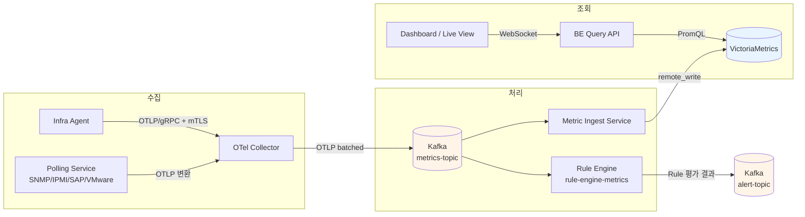

**수집 단계.** Infra Agent는 OS 메트릭(CPU/Memory/Disk/Network 등)을 OTLP/gRPC + mTLS로 OTel Collector에 push (4.1.7, 4.4.1). 수천 대 Agent 대응 백프레셔를 위해 Collector는 별도 서버군(2.4, 3.6). Agentless polling(SNMP/IPMI/SAP/VMware 등 4.1.10)은 BE의 Polling Service가 대상 장비를 주기적으로 조회한 뒤, 결과를 OTLP 형식으로 변환해 같은 Collector로 보낸다 — 두 갈래를 한 토픽으로 합류시키는 이유는 그 이후 처리 코드를 단일화하기 위함.

**운반 단계.** Collector는 OTLP를 batch로 묶어 `metrics-topic`에 produce. Schema는 OTLP 표준 — Schema Registry 도입 여부는 4.5의 Open question이지만, OTLP 자체가 Protobuf 표준이라 Schema Registry 없이도 호환성 관리가 가능하다.

**처리 단계가 두 가지 컨슈머로 분기**한다 (v0.7 결정 — 6장 옵션 2 패턴).

- **Metric Ingest Service**: `metrics-topic` consume → VictoriaMetrics remote_write 또는 OTLP native ingestion. 저장만 담당.
- **Rule Engine (`rule-engine-metrics` 인스턴스)**: 같은 토픽을 별도 컨슈머 그룹으로 consume → 임계치/복합 이벤트 룰 평가 → 매칭 시 `alert-topic` produce.

같은 Rule Engine 모듈 이미지를 메트릭/스크립트/로그 도메인별로 인스턴스 분리. 룰 정의는 공유, 부하는 격리. (6.2, 6.3과 같은 패턴.)

**저장 단계.** VictoriaMetrics에 raw 시계열로 저장. 통계 데이터(1분/5분/1시간/1일 다운샘플링, 4.1.2)는 VictoriaMetrics native downsampling 활용. SMS의 PostgreSQL 이중 구조(perf_raw + perf_stats) 답습 안 함.

**조회 단계.** UI는 BE Query API를 통해 PromQL로 VictoriaMetrics 조회. 실시간 갱신(Live View, 4.1.9)은 BE가 WebSocket으로 push.

#### 6.1.1 짚을 점

- Agentless Polling Service의 결과 합류 방식이 자료 기반이 아닌 추론. SMS에서는 PollingManager가 별도 처리 경로로 들어갔을 가능성이 높지만(SMS 자료 확인 필요), 신규에서 OTLP 합류 형태로 단일화하는 게 표준 일치. 사이트별 polling 주기 차이가 큰 경우 별도 토픽 분리 검토 [Open question].
- CSP별 어댑터에서 들어오는 cloud-native 메트릭은 인스턴스 식별자가 많아 카디널리티 폭발 위험. label 정리 정책 필요 [Open question].

#### 6.1.2 Open question

- Agentless polling 결과의 OTLP 변환·합류 방식 — **baseline 결정됨**: 단일 `metrics-topic`(§7.5 「기타 결정 일괄」). 사이트별 polling 주기 차이가 큰 경우의 별도 토픽 분리 재검토는 13장 §E 카드로 잔존 (v0.12 위상 정리 — 신규 결정 아님)
- 메트릭 label 카디널리티 정책
- ~~VictoriaMetrics 단일 인스턴스 vs cluster 모드 (7장)~~ → **해소**: 1차 단일(§7.5 「기타 결정 일괄」). cluster 전환 재검토는 13장 §E 카드 (v0.12 위상 정리)

---

### 6.2 Job 실행 결과 데이터 흐름

Job 도메인은 두 흐름으로 나눠야 그림이 깔끔해진다.

#### 6.2.1 Job 등록 및 스케줄링

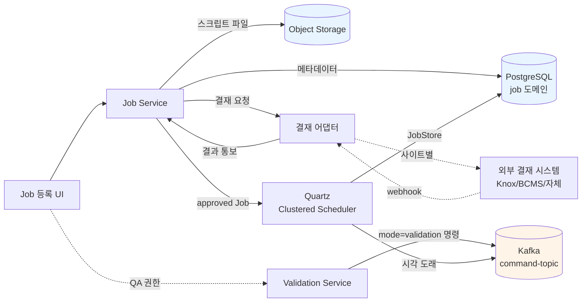

**등록 단계.** Job 메타데이터는 PostgreSQL의 job 도메인, 스크립트 본문은 Object Storage(5.5). **결재 어댑터는 옵션화 + 비동기 webhook** (v0.7 결정). Job Service가 결재 요청 후 상태 `pending_approval`로 PG에 저장. 결재 시스템이 webhook으로 결과 통보 → Job Service가 `approved`/`rejected`로 갱신, approved면 Quartz JobStore 등록. webhook 불가 사이트는 1차 baseline 외, 사이트별 검토.

**Validation 흐름.** Validation Service는 운영 Agent의 **sandbox 모드**(SQL ROLLBACK / Shell 임시 디렉토리)로 시험 실행. mode 플래그를 명령에 포함하여 동일 `command-topic`을 사용. QA 권한자가 직접 운영 Agent에서 SQL/Shell을 실행하는 경로는 차단 (5.5).

**스케줄링.** Quartz Clustered (DB-backed JobStore, 5.5). 시각 도래 시 Quartz가 `command-topic`에 실행 명령 produce. AMS의 In-Memory JobStore 답습 안 함.

#### 6.2.2 Job 실행 및 결과 처리

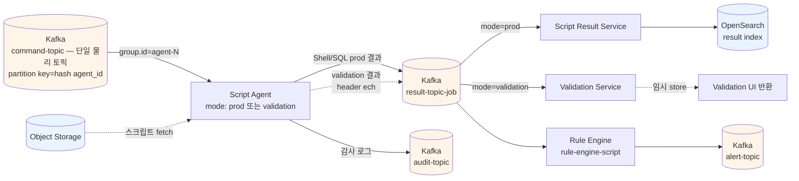

**명령 수신.** Script Agent는 `command-topic`을 consume해 자기 명령을 받는다. **routing 패턴**: **단일 물리 토픽**(`adr/0005-topic-naming.md` Accepted — zone 단위 분리는 다중 zone 진입 시 `-{zone}` suffix로 전개하는 미래 트리거, 13장 §A Open), partition key = `hash(agent_id)`, Agent당 단일 `group.id`, 메시지 header의 `target_agent_id` 필터링. AMS의 IP-Port 동적 토픽 안티패턴 답습 안 함.

**스크립트 본문 fetch.** 명령 메시지에 스크립트 본문을 통째로 싣지 않고 Object Storage URL 참조 — Kafka 메시지 크기 한계 회피.

**실행 후 결과 produce.** Script Agent는 결과를 `result-topic-job`에 produce (Shell/SQL). LOG Job 결과는 별도 토픽(`result-topic-log`, 6.3).

**두 컨슈머 그룹이 같은 토픽을 직접 consume** (v0.7 옵션 2 결정 일치).

- **Script Result Service**: `result-topic-job` consume → OpenSearch result index write. 저장만 책임.
- **Rule Engine (`rule-engine-script`)**: 같은 토픽 별도 컨슈머 그룹으로 consume → Drools 평가 → 임계치 위반 시 `alert-topic` produce.

**감사 로그.** Script Agent는 실행 시작/종료를 `audit-topic`에 별도 produce (5.5의 보안 결정). 감사 흐름은 6.6.

#### 6.2.3 Script Agent ↔ BE 통신 후보 (v0.7 보류)

v0.7 시점에 두 후보 살아 있음. 7장에서 결정.

- **후보 (a) Kafka 직접** (v0.7 baseline, 데모 검증 완료). 명령은 `command-topic` produce → Agent consume. 짚을 점: `__consumer_offsets` 토픽이 Agent 수에 비례 누적, Kafka가 command dispatch용 설계가 아님.
- **후보 (b) gRPC stream**. BE Command Dispatcher가 Agent와 long-lived bidirectional stream 유지. 결과 경로는 (b-1) Kafka `result-topic-job` 유지 / (b-2) 같은 stream으로 회신 두 변형. 짚을 점: BE 측 connection 수 폭증, in-flight 명령 복구 로직 필요.

baseline은 (a), 7장에서 운영 검증 결과 따라 (b) 재고 가능.

#### 6.2.4 짚을 점

- **`command-topic` Agent별 routing은 표준이 사실상 부재한 상태에서 절충안.** Kafka 직접 채택 시 운영 검증 필요.
- **`result-topic-job` 메시지 크기**: Shell Job stdout이 클 경우 상한(예: 1MB) + 초과 시 Object Storage separate write + 메시지에는 reference만. 1차 적용 필요.

#### 6.2.5 Open question

- ~~`command-topic`의 Agent별 routing 방식 (7장)~~ → **해소**: §6.8 routing 패턴 확정(단일 물리 토픽 + `target_agent_id`, ADR #4 소속·`adr/0005-topic-naming.md` Accepted). zone 전개만 다중 zone 진입 시 미래 트리거로 13장 §A에 잔존 (v0.11 cross-ref 정정 — 신규 결정 아님)
- ~~Script Agent ↔ BE 통신 — Kafka 직접 vs gRPC stream (7장)~~ → **7장에서 처리됨**: (a) Kafka 직접 = Phase 1 baseline / (b) gRPC stream = Phase 2/3 재검토 옵션 (§7.5 — v0.11 cross-ref 정정)
- gRPC stream 채택 시 BE Command Dispatcher 설계 — (b) 재검토(Phase 2/3) 채택 시에만 발생하는 조건부 Open
- `__consumer_offsets` 운영 부담 검증 (Kafka 직접 채택 시)
- ~~Validation 임시 store 형태 — Redis 단기 캐시 vs in-memory~~ → **해소**: Redis 단기 TTL(§7.5 「기타 결정 일괄」). 재검토 카드는 13장 §E (v0.12 위상 정리)
- Script 실행 결과 stdout 크기 상한 정책 — 1차 적용 필요
- 결재 통과 전 Job의 Quartz JobStore 등록 시점

---

### 6.3 로그 데이터 흐름

v0.7 결정: **옵션 A 채택** (BE-side 통일). 로그는 Script Agent의 LOG Job 유형으로 통합 (5.3 유지). raw 로그 보존은 baseline.

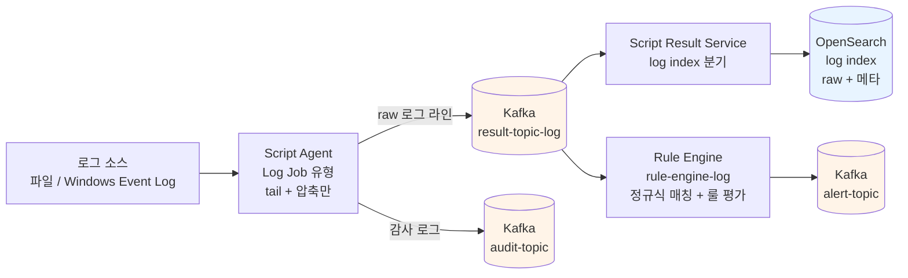

Job 결과 흐름(6.2.2)과 같은 토대 공유, 차이는 (a) 데이터가 raw 로그 라인이고 (b) Rule Engine이 정규식 매칭부터 수행. Agent는 tail + 압축만, 매칭은 BE에서 — 옵션 A의 핵심.

**옵션 A 채택 근거** (표준 우선 원칙 적용):

- OTel Logs 표준 / ELK 중앙 grok 모델과 일치 (Agent를 얇게 두고 중앙에서 처리)
- raw 로그 보존이 자연스러움 (OpenSearch 전문 검색의 본질 기능)
- 룰 변경 hot-reload가 BE 단일 위치
- Agent OS 호환성 부담 최소화 (Windows/Linux 1차 한정과 일치)
- BE 부하 증가는 Kubernetes 수평 확장 + Rule Engine 인스턴스 분리로 흡수

옵션 C-strict (SMS mxpLOG 모델)와 옵션 C-loose는 1차 채택 안 함. 향후 운영 부하·트래픽 측정 후 재고 카드만 살아 있음.

#### 6.3.1 짚을 점

- **Rule Engine 인스턴스 분리 (`rule-engine-log`)** 가 부하 격리 핵심. 메트릭/스크립트 룰 평가와 분리 배포.
- **AMS BE-side 통일 모델**은 이미 검증된 운영 패턴. 옵션 A 채택의 안전성 근거.

#### 6.3.2 Open question

- `result-topic-log` 부하 격리 — 인스턴스 분리만으로 충분한지 운영 검증
- raw 로그 OpenSearch 보관 기간 정책 (NFR 3.1과 연동)

---

### 6.4 이벤트 데이터 흐름 (Alert / Incident)

5.4의 핵심 신규 결정(Alert Dedup, Incident 분리)이 여기서 가시화.

#### 6.4.1 컴포넌트 책임 분리

**Alert Processor** — `alert-topic` consume. Dedup, Alert 도메인 저장, 자동 해제 판정. Alert 신규 생성/상태 변경 시 Incident Service에 위임.

**Incident Service** — Alert을 Incident로 그룹핑, 상태 전환(Open → Ack → Resolved → Closed), 통보 트리거. AMS Daily reset 답습 안 함.

**Redis** — Dedup 캐시. `(rule_id, target_id, severity)` 키 + TTL 윈도우 (baseline 5분).

**PostgreSQL** — Alert / Incident 구조화 상태.

**OpenSearch** — Alert / Incident 이력 인덱스.

**`notification-topic`** — Incident 상태 변경 이벤트를 별도 토픽으로 produce. 통보 발송 책임은 6.5.

#### 6.4.2 흐름 다이어그램

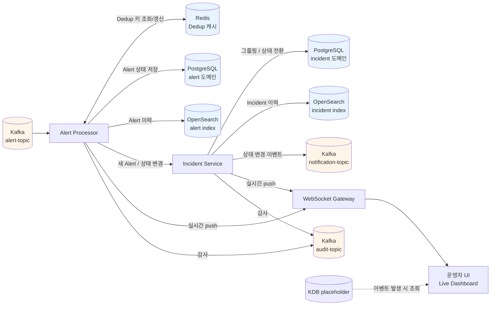

#### 6.4.3 Alert Dedup 흐름

Rule Engine은 stateless하게 매 위반을 `alert-topic`에 produce. State machine은 Alert Processor 단일 책임. Rule Engine을 stateful로 만들면 인스턴스 수평 확장의 일관성이 깨진다.

메시지 수신 시 Redis Dedup 키 조회. 캐시 hit → 기존 Alert 카운트 증가 + 마지막 시각 갱신. 캐시 miss → 신규 Alert 생성 + TTL 윈도우 등록 (baseline 5분). SMS의 알림 폭발 문제(5.4)가 여기서 차단.

#### 6.4.4 자동 해제 / 운영자 ACK 분리

5.4의 "임계치 정상화 자동 해제 + 운영자 ACK 분리" — PagerDuty / Opsgenie / Grafana Alerting 표준 패턴.

- **자동 해제**: Rule Engine이 정상 복귀 감지 → `alert-topic`에 `event_type=resolved` produce → Alert Processor가 `auto_resolved` 상태로 전이 → Incident Service가 연관 Alert 전체 resolved면 Incident `Resolved`.
- **운영자 ACK**: UI에서 "조치 확인" → BE → Incident Service가 `Acknowledged` 기록. 자동 해제와 별개 트랙. 자동 해제됐어도 ACK 미처리 라벨 남음.

Rule Engine의 "정상 복귀" 감지 방식 (stateful Drools vs 별도 State Tracker)은 7장 결정.

#### 6.4.5 Incident 그룹핑 정책

baseline 후보:

- **시간 윈도우 + 룰 그룹 기반**: 같은 `rule_group_id`의 Alert이 짧은 시간 윈도우(예: 10분) 내 발생 시 같은 Incident.
- **대상 그룹 기반**: 같은 모니터링 대상 그룹(예: 같은 서브시스템)의 Alert 시간 윈도우 그룹핑.

PagerDuty 등 표준 패턴은 두 차원 조합. baseline은 둘 다 지원하되 룰 정의 시 선택. 알고리즘 7장에서 확정.

#### 6.4.6 실시간 UI 반영 (WebSocket)

Alert Processor와 Incident Service가 상태 변경 즉시 WebSocket Gateway에 push. Gateway가 운영자 세션별 권한 필터링 후 클라이언트 전달. v0.6 4.4.3의 결정 핵심 사용처. 다중 폐쇄망에서 Gateway 단의 권한 필터링이 핵심 보안 경계.

#### 6.4.7 KDB placeholder

5.4 결정에 따라 KDB 도메인 자리는 두되 구현 보류. UI 측에서 Alert 발생 시 KDB 조치 가이드 조회 슬롯만 정의. AI 대체 트랙에서 향후 채움.

#### 6.4.8 짚을 점

- Rule Engine stateful/stateless 결정이 자동 해제 감지 방식에 영향 (7장).
- Incident 그룹핑 알고리즘 baseline (7장).
- Alert 도메인 PG/OpenSearch 이중 저장 일관성 — 단순 이중 write로 시작, 일관성 이슈 발생 시 Outbox/CDC 보완.

#### 6.4.9 Open question

- Dedup TTL 윈도우 baseline (5분?) 운영팀 검증
- ~~Rule Engine stateful vs stateless (7장)~~ → **해소**: stateless + Alert Processor가 Redis state machine(§7.5 서술 결정). 재검토 카드는 13장 §E (v0.12 위상 정리)
- ~~Incident 그룹핑 알고리즘 baseline (7장)~~ → **해소**: 시간 윈도우 + 룰 그룹(§7.5 서술 결정). 재검토 카드는 13장 §E (v0.12 위상 정리)
- Alert 도메인 이중 저장 일관성 (7장)
- ~~WebSocket Gateway 권한 필터링 구현 위치 — Gateway 모듈 단일 vs 도메인 BE별 분산~~ → **해소**: Gateway 단일 모듈(§7.5 「기타 결정 일괄」). ※ 13장 §D의 "WebSocket Gateway 자체 vs 모듈"은 **별개 사안**(배포 형태 — 모듈 분리 결정(D-2) β/γ 의존)이라 그대로 Open (v0.12 위상 정리)

---

### 6.5 통보 데이터 흐름

#### 6.5.1 흐름 다이어그램

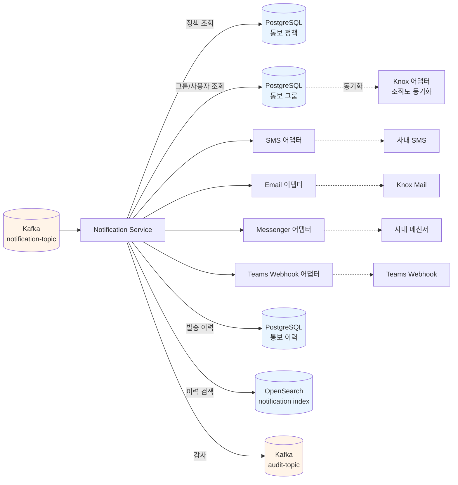

#### 6.5.2 흐름 요약

6.4의 Incident Service가 상태 변경 시(Open 발생, 등급 상승, Closed 등) `notification-topic`에 메시지 produce. Notification Service가 consume → 통보 정책 조회로 발송 대상자 결정 → 통보 그룹 조회로 사용자 목록 확정 → 채널별 어댑터에 위임. 어댑터는 외부 시스템 호출 + 재시도 + 결과 보고. 발송 이력은 PostgreSQL(현재 상태)과 OpenSearch(검색 이력) 이중 저장. 감사 로그는 `audit-topic`.

통보 그룹은 v0.6 5.6 결정대로 **Knox 조직도 동기화 + 자체 그룹 통합**. Knox 어댑터가 주기적으로 또는 변경 webhook으로 조직도를 PostgreSQL에 캐시. 사용자 검색 시 두 출처 통합 조회.

채널 어댑터는 v0.6 5.6 결정대로 **SMS / Email / Messenger / Teams Webhook 4종 baseline**. Teams Webhook은 1차 신규. AlertManager OSS 미사용 — 자체 BE 모듈 (Spring Boot + 어댑터 패턴).

#### 6.5.3 짚을 점

- **재시도 정책 baseline**: 지수 백오프 + 최대 5회 (SMS/Email/Messenger), Teams Webhook은 단순 재시도 3회. 채널 어댑터 인터페이스가 재시도 정책을 자체 결정 — Notification Service는 발송 요청 한 번만, 결과 통보 받음. baseline 값은 운영팀 검증 [Open question].
- **외부 시스템 장애 격리**: 채널별 thread pool 격리 (Bulkhead) + Circuit Breaker (Resilience4j). 한 어댑터 장애가 Notification Service 전체 막지 않음.
- **다중 폐쇄망에서 통보 발송 위치**: 외부 통보 시스템은 사내망 위치라 폐쇄망 Zone에서 직접 접근 불가 가능성. **baseline 잠정 — HQ에서 통보 발송, 각 Zone은 `notification-topic`만 HQ로 전달**. 7장 토폴로지와 함께 확정.

#### 6.5.4 Open question

- 재시도 정책 baseline 값 운영팀 검증 (5회 / 백오프 간격)
- ~~통보 정책 평가 엔진 — 단순 규칙 매칭 vs Rule Engine 재활용 (7장)~~ → **해소**: 단순 규칙 매칭(PG 정책 + Java, §7.5 「기타 결정 일괄」). 재검토 카드는 13장 §E (v0.12 위상 정리)
- ~~다중 폐쇄망에서 통보 발송 위치 — HQ vs Zone (7장 토폴로지와 연동)~~ → **해소**: Zone 자체 발송(§7.5 「기타 결정 일괄」). 재검토 카드는 13장 §E (v0.12 위상 정리)
- Knox 조직도 동기화 주기 — **방식 baseline 결정됨**: webhook 우선 + polling fallback(§7.5 「기타 결정 일괄」, fallback 재검토는 13장 §E 카드). 사이트별 webhook 지원 여부는 외부 정보 입수 사안으로 13장 §A에 정당 잔존 (v0.12 위상 정리 — 신규 결정 아님)
- 통보 이력 PG/OpenSearch 이중 저장 일관성 (6.4와 동일 패턴)

---

### 6.6 감사·관측 데이터 흐름

두 영역이 한 자리에 묶임. **감사 로그**는 사용자 액션·명령 실행·권한 변경 기록 (보안·컴플라이언스용). **시스템 자체 관측**은 신규 시스템 자체의 건강도 (성능·오류·트레이스).

#### 6.6.1 흐름 다이어그램

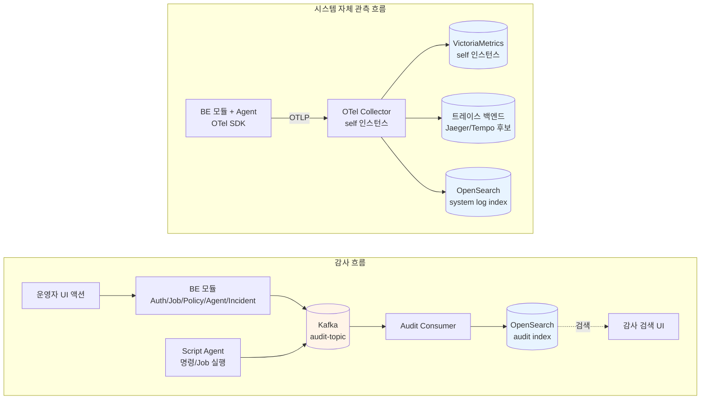

#### 6.6.2 감사 흐름

데모 spec § 5.5.3의 `audit-events` 모델 흡수 + actor 범위 확장. 데모는 `actor.type=AGENT` 단일, 본개발에서 `USER`(운영자 액션) + `SYSTEM`(자동 처리) 추가. action 종류도 데모 3종(`AGENT_STARTED` / `AGENT_STOPPED` / `JOB_EXECUTED`)에서 본개발 진입 시 사용자 액션 종류(`POLICY_CREATED`, `USER_ROLE_CHANGED`, `INCIDENT_ACKNOWLEDGED` 등) 추가.

발행 주체는 BE 전 모듈 + Script Agent. 모두 `audit-topic`. Audit Consumer가 단일 OpenSearch audit index 저장 — 도메인별 분리 안 함 (감사는 시계열 단방향 추적 본질이라 단일 인덱스 + 필터 검색이 표준). 검색 UI는 OpenSearch 직접 질의.

데모의 Kafka envelope 헤더 규약(6.8)을 그대로 사용.

#### 6.6.3 시스템 자체 관측 흐름

v0.6 3.5의 "자기 모니터링 외부 시스템 위임 검토"는 7장 결정 사안이지만, 6.6에선 **별도 OTel Collector 인스턴스 + 별도 백엔드 인스턴스**를 baseline. 이유 — "감시자는 누가 감시하나" 문제. 모니터링 대상용과 시스템 자체용을 같은 인스턴스에 두면 시스템 장애 시 자기 진단 불가. 표준 패턴은 인스턴스 분리.

세 종류 데이터:

- **메트릭**: OTel SDK emit, Collector 경유, VictoriaMetrics self 인스턴스. 표준 메트릭(요청 처리량/지연/오류율, JVM/Go runtime, Kafka consumer lag 등).
- **트레이스**: OTel SDK + Kafka context propagation. `audit-topic` 메시지에 `x-trace-id` 헤더 포함 (데모 적용). 백엔드는 Jaeger / Tempo 후보 — 8장 결정.
- **로그**: BE/Agent application log. JSON 구조화 (Logback / Go slog) → OpenSearch system log index. 모니터링 **대상**의 로그(6.3, `log` index)와 별도 인덱스.

#### 6.6.4 짚을 점

- 시스템 자체 관측 별도 인스턴스 vs 외부 도구 위임 (7장 결정 사안)
- 감사 로그 보관 기간 — v0.6 3.4 Samsung 보안 정책과 연동. 일반 1년 이상 (산업별 5~7년). OpenSearch ILM + Object Storage 장기 보관 조합 표준.
- 트레이스 context propagation: HTTP/gRPC 자동, Kafka 수동 (헤더 처리). `x-trace-id` 데모 적용 일치 — Phase 1에서 BE consume 시 trace context 복원 코드 필요 (ADR #15 트랙).

#### 6.6.5 Open question

- ~~시스템 자체 관측 별도 인스턴스 vs 외부 도구 위임 (7장)~~ → **해소**: Zone 내부 별도 인스턴스(§7.5 서술 결정) (v0.12 위상 정리)
- 감사 로그 보관 기간 + ILM 정책 (3.4 컴플라이언스, 8장)
- 트레이스 백엔드 선정 — Jaeger / Tempo / Zipkin (8장)
- ~~시스템 자체 OpenSearch 인스턴스 분리 vs 인덱스 분리만 (7장)~~ → **해소**: 인덱스 분리만(§7.5 「기타 결정 일괄」). 재검토 카드는 13장 §E (v0.12 위상 정리)

---

### 6.7 Heartbeat 및 Agent 상태 흐름

데모 학습 흡수가 핵심. 데모 spec § 5.4 + § 7.5.4 모델 + AGENT_STARTED/STOPPED audit 조합을 v0.7에 명시화.

#### 6.7.1 흐름 다이어그램

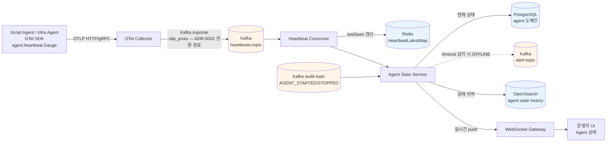

#### 6.7.2 흐름 요약

Agent는 OTel SDK로 `agent.heartbeat` Gauge 메트릭(value=1)을 주기 push. 데모 baseline 주기 10초, timeout 30초. Collector가 OTLP 메시지를 `heartbeats-topic`에 재발행. 직렬화는 **protobuf(`otlp_proto`) 전환 완료** — heartbeat protobuf 전환(ADR #2, `adr/0002-heartbeat-otlp-proto.md` Accepted 2026-05-31, A-1 wire=OTLP 표준 protobuf / B-1 표준 라이브러리 / C-1 빅뱅 컷오버)이 infra Collector 설정과 hub 디코더에 적용·e2e 검증됐다(데모 단계의 `otlp_json`은 과거 상태).

Heartbeat Consumer는 OTLP 트리에서 metric name `agent.heartbeat` 찾고 `agent_id` + `timeUnixNano` 추출. lastSeen은 Redis(`HeartbeatLatestMap`)에 갱신. 데모 in-memory map → Phase 1 Redis로 이동 (영속 + HA).

Agent 상태 판정 — **세 입력의 조합**:

1. `AGENT_STARTED` audit → ONLINE (Agent 등록 겸함)
2. `AGENT_STOPPED` audit → OFFLINE (의도된 종료)
3. heartbeat timeout 초과 → OFFLINE (비정상 종료/네트워크 단절)

Agent State Service가 세 입력 받아 PostgreSQL agent 도메인 갱신. 상태 변경은 OpenSearch에 이력으로 누적, WebSocket Gateway로 운영자 UI 실시간 push.

#### 6.7.3 Agent OFFLINE을 Alert로 발화

v0.7 신규 결정. 데모는 OFFLINE 마킹만, Alert 발화 안 함. 수천 대 Agent 중 일부가 OFFLINE이면 모니터링 자체가 침묵하는 위험이라 baseline으로 Alert 발화가 표준.

**baseline 결정 — Agent OFFLINE을 Alert로 발화**. severity는 운영 정책상 가변(Warning ~ Major). Alert 생성 흐름은 6.4와 동일 — Agent State Service가 `alert-topic`에 직접 produce, Rule Engine 거치지 않음 (룰 평가가 아닌 상태 머신 변화 기반).

#### 6.7.4 짚을 점

- **heartbeat 토픽 분리가 표준 일치.** metrics-topic과 합치는 옵션 있지만 책임 다름 (heartbeat은 상태 판정, metric은 시계열 저장). 별도 토픽 유지. v0.6 4.4.1에 `heartbeats-topic` 추가됨.
- **lastSeen 영속화 — Redis 단독.** heartbeat은 본질적으로 휘발성 캐시. PG는 Agent의 "현재 상태(ONLINE/OFFLINE)"만. lastSeen 자체는 Redis 죽어도 다음 heartbeat에서 재갱신.
- **protobuf 전환 incompatibility — 해소됨.** OTel Collector exporter encoding `otlp_json` → `otlp_proto` + Heartbeat Consumer 디코더 동시 변경(C-1 빅뱅 컷오버)이 완료됐다(`adr/0002-heartbeat-otlp-proto.md`). 흐름 안내는 `docs/features/heartbeat-collection.md`.

#### 6.7.5 Open question

- Agent OFFLINE Alert severity baseline (Warning vs Major) 운영팀 검증
- heartbeat 주기/timeout baseline (10초/30초) 운영 검증
- ~~Agent State Service vs 데모 AgentRegistry — Phase 1 확장 방향 (7장)~~ → **해소**: Agent State Service 격상(§7.5 「기타 결정 일괄」) (v0.12 위상 정리)
- ~~`heartbeats-topic` 메시지 키 — 데모는 OTel 기본(분배 불보장), Agent 단위 ordering 필요 여부 (8장)~~ → **해소**: OTel 기본 유지=ordering 불필요(§8.2 결정 — `adr/0002-heartbeat-otlp-proto.md`가 "§6.7.5의 [Open]은 §8.2에서 해소"로 명시) (v0.12 위상 정리)

---

### 6.8 메시지 envelope 및 ID 컨벤션

데모 spec § 2.2, § 2.3, § 2.4 흡수해서 명시화. 4.4.1 토픽 표가 무엇을 운반하는지에 더해 그 운반의 **수반 정보(envelope) + 식별자 규약**을 정렬.

> **기준 문서 anchor (v0.11 backfill)**: envelope 헤더의 확정 계약은 `docs/envelope.md`, 토픽별 payload·물리/논리 토픽명 계약은 `docs/kafka-payloads.md`가 **세부 규약을 정의하는 기준 문서**다. 이 절은 방향·결정 사유를 담고 필드 단위 상세를 중복 정의하지 않는다. 위계는 인덱스 "문서 위계"와 같다 — 방향·결정 충돌 시 통합본(이 절 6.8/6.9)이 상위 근거(`docs/envelope.md` 머리말과 동일 선언).

#### 6.8.1 Envelope 헤더 규약

도메인 데이터가 아닌 메타데이터는 payload가 아니라 **Kafka 헤더**로 분리:

| 헤더 | 필수 | 발급 | 용도 |
|---|:-:|---|---|
| `x-message-id` | ● | 발행자 | 메시지 자체 식별 (UUID). 중복 감지 — Phase 1부터 검사 도입 (ADR #15) |
| `x-message-version` | ● | 발행자 | payload 스키마 버전. 데모 `1` 고정. Schema Registry (ADR #1) 도입 시 정책 확장 |
| `x-source` | ● | 발행자 | `script-agent` / `infra-agent` / `monitoring-be` / `otel-collector` / `rule-engine` 등 |
| `x-trace-id` | ○ | 발행자 | OTel trace context propagation. Phase 1부터 BE consume 시 trace 복원 |

**예외 — `heartbeats-topic` + `metrics-topic`**: OTel Collector 발행이라 envelope 규약 적용 안 됨, OTLP 표준 헤더 그대로. trace context는 OTLP resource attribute 자연 포함.

신규 발행자(Rule Engine, Alert Processor, Incident Service, Notification Service 등)도 `x-source` 값에 자기 식별자.

#### 6.8.2 메시지 키 정책

Kafka partition 키는 **데이터 ordering 보장 단위**를 결정. v0.7 8개 토픽 키 규약:

| 토픽 | 키 | ordering 단위 |
|---|---|---|
| `command-topic` | `target_agent_id` | Agent 단위 |
| `result-topic-job` | `agent_id` | Agent 단위 |
| `result-topic-log` | `agent_id` | Agent 단위 |
| `audit-topic` | `agent_id` / `user_id` / `system` | actor 단위 |
| `metrics-topic` | OTel Collector 기본 (resource id) | Resource 단위 분배 |
| `heartbeats-topic` | OTel Collector 기본 (분배 불보장) | 보장 없음 — Agent State Service가 lastSeen 비교로 처리 |
| `alert-topic` | `(rule_id, target_id)` 조합 | Rule × 대상 단위 — Dedup 키와 일치 |
| `notification-topic` | `incident_id` | Incident 단위 |

`alert-topic` 조합 키가 v0.7 신규 결정. 6.4 Dedup 키 `(rule_id, target_id, severity)`와 거의 일치 — partition 분배에 severity 제외, 같은 Rule×대상의 모든 severity 메시지가 한 partition으로 모임 (severity 전이 처리 유리).

#### 6.8.3 ID 컨벤션

데모 spec § 2.4 4종 + 본개발 추가 ID:

| ID | 발급 시점 | 발급자 | 형식 | 비고 |
|---|---|---|---|---|
| `agent_id` | Agent 첫 실행 | Agent | UUIDv4 | Agent 로컬 파일 저장. 재실행 시 동일 |
| `job_id` | Job 정의 등록 | BE | UUIDv4 | "무엇을 실행할지" 정의 |
| `schedule_id` | Schedule 등록 | BE | UUIDv4 | "어떤 Job을 언제, 어떤 Agent" |
| `execution_id` | Schedule 트리거 | BE Quartz | UUIDv4 | 1회 실행. commands/result/audit 상관 키 |
| `rule_id` | Rule 정의 등록 | BE | UUIDv4 | **v0.7 신규** — Rule Engine 룰 식별 |
| `alert_id` | Alert 생성 | Alert Processor | UUIDv4 | **v0.7 신규** |
| `incident_id` | Incident 생성 | Incident Service | UUIDv4 | **v0.7 신규** |
| `notification_id` | 통보 발송 시도 | Notification Service | UUIDv4 | **v0.7 신규** — 발송 이력 식별 |
| `user_id` | 사용자 등록 | BE Auth | UUIDv4 | **v0.7 신규** — 본개발 인증 도입 |
| `trace_id` | OTel context 생성 | OTel SDK | OTel 표준 (16바이트 hex) | envelope `x-trace-id`와 동일 |

`execution_id`가 commands/result/audit 상관 키라는 점이 데모 검증된 패턴. 본개발에서 alert/incident까지 trace_id로 묶이도록 chain — `(execution_id, trace_id)`가 한 Job 실행의 알람·인시던트·통보까지 가는 단방향 추적 가능.

#### 6.8.4 Timestamp 규약

도메인 timestamp는 **RFC3339** (예: `2026-05-19T14:00:00Z`). UTC 권장. Heartbeat / metrics 영역만 **OTLP UnixNano** (envelope 규약 예외와 같은 이유).

토픽별 timestamp 의미:

- `result-topic-job` / `result-topic-log`의 `started_at` / `finished_at` — Agent 작업 시간 (로그 라인 발생 시각과 별개)
- `audit-topic`의 `occurred_at` — 사건 발생 시각 (JOB_EXECUTED는 종료 시각)
- `alert-topic`의 `triggered_at` / `resolved_at` — Rule 평가 시각
- `notification-topic`의 `sent_at` — 발송 시도 시각

LOG_JOB의 로그 라인 발생 시각 추출은 데모 범위 외 (ADR #10), Phase 1 추가 예정.

#### 6.8.5 짚을 점

- `x-message-id` 중복 검사 도입 시점 — Phase 1, Redis TTL 윈도우 (6.4 Dedup과 같은 패턴 재사용).
- Schema Registry 도입 여부(ADR #1, 8장)에 따라 `x-message-version` 정책 변동.

#### 6.8.6 Open question

- `x-message-id` 중복 검사 도입 정확한 시점 — Phase 1 baseline (ADR #15)
- Schema Registry 도입과 `x-message-version` 정책 연동 (ADR #1, 8장)
- `alert-topic` 조합 키 partition 분배 효율성 — Rule×대상 편향 시 hot partition 위험

---

### 6.9 데모 일관성 매트릭스

6.1~6.8 결정을 데모 spec v0.2.1과 매핑. v0.7과 데모/ADR 사이 단일 진실원 관계를 명시.

#### 6.9.1 (가) 데모 검증 완료

v0.7 결정이 데모로 동작 검증됨. 본개발 진입 시 별도 검증 불필요.

| 결정 항목 | v0.7 위치 | 데모 위치 | ADR |
|---|---|---|---|
| Script Agent ↔ Kafka 직접 통신 | 4.4.1, 6.2 | spec § 1, code | — (단 gRPC stream 재검토 Open) |
| Consumer group — Agent별 unique `group.id` | 6.2 | spec § 1.1, code | ADR #4 |
| 메시지 키 = `agent_id` / `target_agent_id` | 6.8 | spec § 2.3 | ADR #6 |
| Envelope 4종 헤더 | 6.8 | spec § 2.2 | — |
| ID 컨벤션 4종 (`agent_id`/`job_id`/`schedule_id`/`execution_id`) | 6.8 | spec § 2.4 | — |
| RFC3339 timestamp 표준 | 6.8 | spec § 2.5 | — |
| Quartz cron + misfire 정책 | 6.2 | spec § 5.1.3 | ADR #17 |
| 명령 `valid_until` 정책 | 6.2 | spec § 5.1.3 | ADR #16 |
| `audit-topic` 모델 | 6.6 | spec § 5.5.3 | — |
| AGENT_STARTED/STOPPED + 등록·OFFLINE 마킹 | 6.7 | spec § 3, § 5.5.3 | — |
| `heartbeats-topic` + OTel Collector 재발행 | 6.7 | spec § 5.4.2, infra | — |
| heartbeat timeout 기반 OFFLINE 판정 | 6.7 | spec § 3.2, code | — |
| `heartbeats` 토픽 envelope 예외 | 6.8 | spec § 2.2 | — |
| LOG_JOB의 file_state는 Agent local | 6.2, 6.3 | spec § 7.5.2 | ADR #14 |
| Agent at-least-once 보장 (offset commit) | 6.2 | code | — |

#### 6.9.2 (나) 데모 정정 대상

v0.7 결정과 데모가 어긋났던 항목 목록. 본개발 Phase 1 진입 시 데모/spec/코드 갱신 대상이며, **정정 시점 컬럼이 "완료"인 행은 정정이 이미 끝난 항목이다(이력 보존용 잔류 — Phase 1 잔여 작업은 "완료"가 아닌 행만)**.

| 결정 항목 | v0.7 결정 | 데모 현재 | 정정 시점 |
|---|---|---|---|
| `job-results` 토픽 분리 | `result-topic-job` + `result-topic-log` 2개 | ~~`job-results` 단일~~ → 2토픽 분리 완료 | **완료** (T4-2, 2026-06-14 — 동시 컷오버·e2e 64/0/0, payload 위상 `adr/0019`) |
| Heartbeat 직렬화 | protobuf (OTLP) | ~~`otlp_json`~~ → `otlp_proto` 전환 완료 | **완료** (ADR #2 Accepted 2026-05-31, 컷오버·e2e 검증 — `adr/0002-heartbeat-otlp-proto.md`) |
| `x-message-id` 중복 검사 | BE consumer dedup 윈도우 | 발행만, 검사 없음 | Phase 1 (ADR #15) |
| 영속 저장소 | PG + OpenSearch + VictoriaMetrics + Object Storage | in-memory | Phase 1 (ADR #12) |
| 인증/인가 | JWT + OIDC + Knox 어댑터 | 없음 | Phase 1 (ADR #7) |
| Frontend | LEGO + WebSocket | Thymeleaf 단일 페이지 | Phase 1 (ADR #8) |
| Agent 자가 등록 | 사전 토큰 또는 관리자 승인 | AGENT_STARTED가 등록 겸함 | Phase 1 (ADR #11) |
| Quartz JobStore | DB-backed Clustered | in-memory | Phase 1 |
| LOG_JOB 로그 라인 발생 시각 | `sample_lines[].occurred_at` 추가 | 추출 안 함 | Phase 1 (ADR #10) |
| audit actor.type 범위 | `AGENT` + `USER` + `SYSTEM` | `AGENT` 단독 | Phase 1 (확장) |
| `command-topic` routing | 단일 물리 토픽 + hash partition (ADR #5 확정 — zone 전개는 다중 zone 진입 시 미래 트리거) | ~~`commands`~~ → `command-topic` 재명명 완료(T4-1) | **명명 완료** (ADR #5 Accepted 2026-06-06) / zone 전개는 13장 §A Open |

#### 6.9.3 (다) v0.7 신규

데모에 없음. Phase 1/2에서 추가될 영역.

**Phase 1:**

| 결정 항목 | v0.7 위치 | 새로 추가될 컴포넌트 |
|---|---|---|
| Rule Engine (Drools 8.x) | 4.5, 6.2, 6.3, 6.4 | `rule-engine-script`, `rule-engine-log` |
| Alert Processor + Dedup | 6.4 | Alert Processor, Redis Dedup, PG alert |
| Incident Service + 그룹핑/상태 전환 | 6.4 | Incident Service, PG incident |
| `alert-topic` | 4.4.1, 6.4 | Kafka 토픽 추가 |
| `notification-topic` | 4.4.1, 6.5 | Kafka 토픽 추가 |
| Notification Service + 채널 어댑터 4종 | 6.5 | Notification Service, SMS/Email/Messenger/Teams 어댑터 |
| 통보 그룹 — Knox + 자체 통합 | 5.6, 6.5 | Knox 어댑터, 통보 그룹 도메인 |
| Validation Service + sandbox 모드 | 6.2 | Validation Service, Agent mode 플래그 |
| 결재 어댑터 (webhook 비동기) | 6.2 | 결재 어댑터, 외부 결재 시스템 통합 |
| Script 파일 보관 + Object Storage | 5.5, 6.2 | 신규 인프라 |
| Agent OFFLINE → Alert 발화 | 6.7 | Agent State Service alert-topic produce |
| Agent State Service | 6.7 | AgentRegistry → 별도 서비스 격상 |
| WebSocket Gateway + 권한 필터링 | 6.4, 6.7 | 신규 모듈 |
| KDB placeholder | 5.4, 6.4 | UI 슬롯 + 도메인 자리 (구현 보류) |

**Phase 2:**

| 결정 항목 | v0.7 위치 | 새로 추가될 컴포넌트 |
|---|---|---|
| Infra Agent (OS 메트릭) | 4.1.7, 6.1 | 신규 Agent 군 |
| Polling Service (Agentless) | 4.1.10, 6.1 | 신규 BE 모듈 |
| OTel Collector (메트릭용 별도) | 6.1 | 데모 heartbeat 인스턴스와 별개 |
| `metrics-topic` | 4.4.1, 6.1 | Kafka 토픽 추가 |
| Metric Ingest Service | 6.1 | 신규 BE 모듈 |
| VictoriaMetrics (모니터링 대상용) | 4.5, 6.1 | 신규 인프라 |
| `rule-engine-metrics` 인스턴스 | 6.1 | Rule Engine 인스턴스 확장 |
| Cloud-native 메트릭 어댑터 (CSP별) | 4.1.10, 6.1 | 신규 어댑터 |
| 시스템 자체 관측 — 별도 인스턴스 | 3.5, 6.6 | self-monitoring 인프라 |
| 트레이스 백엔드 | 6.6 | 신규 인프라 |
| `system log` 인덱스 분리 | 6.6 | 인덱스 정책 |

**범위 외 / 미확정:**

| 결정 항목 | v0.7 위치 | 비고 |
|---|---|---|
| 다중 폐쇄망 토폴로지 — 단일 vs HQ+Zone | 2.1, 7장 | 7장 결정 |
| 통보 발송 위치 — HQ vs Zone | 6.5, 7장 | 토폴로지와 연동 |
| AI 대체 (KDB 채움) | 5.4 | 별도 트랙 |

#### 6.9.4 (라) 데모 학습 흡수

데모에서 식별된 것을 v0.7이 받아 명시화. 본개발 시 추가 변경 없이 spec과 v0.7이 동일 결정.

| 결정 항목 | v0.7 위치 | 데모 원본 |
|---|---|---|
| Envelope 헤더 4종 규약 | 6.8 | spec § 2.2 |
| 메시지 키 정책 (Agent ordering 단위) | 6.8 | spec § 2.3 |
| 4종 ID 컨벤션 + 발급자 분리 | 6.8 | spec § 2.4 |
| RFC3339 + OTLP UnixNano 예외 | 6.8 | spec § 2.5 |
| 메시지 흐름도 (Agent 시작 → audit + heartbeat → 명령 → 실행 → 결과 → audit) | 6.2, 6.7 | spec § 1.1 |
| BE → Agent 명령 envelope + 메시지 키 분리 | 6.2, 6.8 | spec § 5.1 |
| Agent 등록 메커니즘 (UUID 로컬 저장) | 6.7 | spec § 3.1 |
| heartbeat-timeout 기반 OFFLINE 로직 | 6.7 | spec § 3.2 |

#### 6.9.5 토픽 일관성 한눈에

| 데모 토픽 (현재) | v0.7 토픽 (목표) | 일치 분류 |
|---|---|---|
| ~~`commands`~~ → `command-topic` | `command-topic` (단일 물리 토픽 — ADR #5) | (가) 검증 + **재명명 완료**(T4-1) |
| ~~`job-results`~~ → `result-topic-job` + `result-topic-log` | `result-topic-job` + `result-topic-log` | (나) 정정 + **분리 완료**(T4-2, 2026-06-14) |
| ~~`audit-events`~~ → `audit-topic` | `audit-topic` | (가) 검증 + **재명명 완료**(T4-1) |
| ~~`heartbeats`~~ → `heartbeats-topic` | `heartbeats-topic` | (가) 검증 + **재명명 완료**(T4-1) + **protobuf 정정 완료**(ADR #2) |
| — | `metrics-topic` | (다) v0.7 신규 (Phase 2) |
| — | `alert-topic` | (다) v0.7 신규 (Phase 1) |
| — | `notification-topic` | (다) v0.7 신규 (Phase 1) |

데모 4개 → v0.7 8개. **토픽 재명명(T4-1)은 2026-06-07 완료**(3토픽 물리명=논리명 일치, e2e 회귀 0 — `adr/0005-topic-naming.md`), **토픽 분리(T4-2)는 2026-06-14 완료**(`job-results` → 2개, 컷오버·e2e 64/0/0). Phase 1 잔여는 신규 2개(`alert-topic`, `notification-topic`), Phase 2 신규 1개(`metrics-topic`). 토픽 개수는 고정이 아니며 운영/구현 필요에 따라 추가 가능. 물리 토픽명·payload 계약은 `docs/kafka-payloads.md` 기준.

---


---

# 05. 시스템 아키텍처

## 결정 요약

- **토폴로지**: (c) Zone 독립 baseline — 각 사이트가 자체 K8s 클러스터 + 풀 스택. (b) HQ 통합은 Phase 3 옵션
- **모듈 분리**: (β) 잠정 baseline — 모듈러 모놀리스 + 메시지 처리 분리. 약 9개 deployment. (γ) 풀 MSA는 **협의 필요**
- **K8s namespace**: 4개 (`monitoring-app` / `monitoring-data` / `monitoring-self` / `ingress`)
- **인프라**: Strimzi(Kafka) / CloudNativePG / OpenSearch Operator / VM Operator / MinIO Operator / OTel Operator
- **노드**: 15~18대/Zone baseline (Phase 1, SMS 트래픽 규모 입수 시 재추산)
- **Phase 진화**: 0(데모) → 1(영속+인증+Alert+통보+LEGO) → 2(메트릭+VM) → 3 옵션(HQ 통합)
- **Rule Engine**: stateless + Alert Processor가 state machine
- **Script Agent ↔ BE**: Kafka 직접 (Phase 1), gRPC stream은 Phase 2/3 옵션
- **자기 모니터링**: Zone 내부 별도 인스턴스 (OTel/VM/Jaeger)
- **외부 연계**: 어댑터 패턴 + 사이트별 ConfigMap

Open question은 13장 단일 집중.

---

## 7.1 다중 폐쇄망 토폴로지

### 결정

**(c) Zone 독립 baseline**. 각 폐쇄망 사이트가 자체 K8s 클러스터 + 풀 스택 BE + Agent. Zone 간 / HQ 연계 없음. **(b) HQ 통합 채널은 Phase 3 옵션**으로 살아있음.

### 후보 비교

| 평가 축 | (a) 단일 HQ 집중 | (b) HQ+Zone 분산 | (c) Zone 독립 단독 |
|---|---|---|---|
| 폐쇄망 경계 보존 | × | ✓ | ✓ |
| 데이터 격리 (raw) | × HQ로 흐름 | ✓ | ✓ |
| 운영팀 부담 | 1세트 | Zone × N + HQ | Zone × N |
| 단일 장애점 | HQ | HQ는 통합만 | 각 Zone 독립 |
| 통합 대시보드 | 자연스러움 | 구현 필요 | 없음 (별도) |
| 표준 모니터링 일치 | 사내 단일 환경 | multi-tenant 표준 | multi-tenant 표준 |
| 1차 baseline 적합도 | × (외부 사이트 충돌) | △ (운영 부담 큼) | ✓ |

### 짚을 점

- **1차 운영 사이트 분포** [Open question] — Samsung 사내 단독이라면 (a) 단일이 합리적일 수 있음. 정보 입수 후 baseline 재검토 카드 살아있음.
- **사이트별 권한 모델** [Open question, 4.1.8] — (b) HQ 통합 시 권한 통합 모델 별도 설계 필요. 9장에서 다룸.
- **데모 성격** — 데모는 Hub BE 단일이라 (a)에 가까움. Phase 1에서 (c)로 진화하려면 Helm Chart + 멀티 zone 배포 파이프라인 정리 필요.

---

## 7.2 논리 아키텍처 (Phase 1 baseline)

### 전체 그림 — 한 Zone

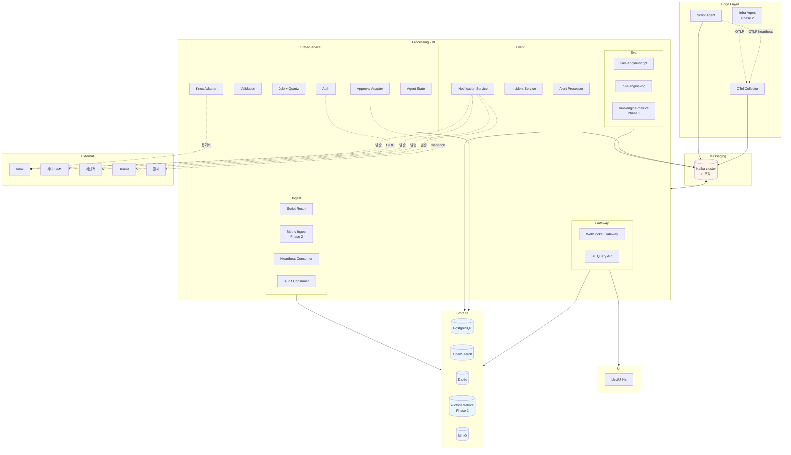

### 모듈 분리 정책 — 결정 보류, 협의 필요

**잠정 baseline = (β) 모듈러 모놀리스 + 메시지 처리 분리**. 약 9개 deployment.

**(β) 구성**: 메인 BE 1개 (Auth/Job/Approval/Knox/Validation/Agent State/Heartbeat Consumer/Audit Consumer/BE Query API) + 메시지 처리 5~7개 분리 (rule-engine × N, Script Result, Alert/Incident, Notification, Metric Ingest) + WebSocket Gateway 1개

**(γ) 풀 MSA 협의 시 입력 (8개 항목)**:

| 입력 | β 유리 | γ 유리 |
|---|---|---|
| K8s 운영 인력 | 1~2명 가능 | 전담 SRE 팀 |
| CI/CD 파이프라인 성숙도 | 묶음 배포 | 서비스별 자동 배포 필수 |
| 자체 관측성 | 단순 | 서비스 간 trace 필수 |
| 개발 팀 구조 | 한 팀 전체 책임 | 팀별 서비스 오너십 |
| 1차 운영 규모 | 수백~수천 Agent | 수만 대 이상 |
| Phase 1 일정 압박 | 초기 구축 빠름 | 초기 구축 6+ 개월 |
| 향후 독립 진화 | 같은 속도 | 서비스별 다름 |
| 장애 격리 요구 | 도메인 격리 충분 | 서비스 단위 완전 격리 |

표준 진화 경로 — 모듈러 모놀리스로 시작 → 규모 커진 후 분해 (Netflix/Datadog/Splunk도 같은 경로). 메시지 처리 컴포넌트는 (β)에서도 자연스럽게 별도 deployment.

### 컴포넌트 책임

| 그룹 | 컴포넌트 | 1차 책임 |
|---|---|---|
| Edge | Script Agent | Shell/SQL/Log Job 실행 + mode=prod/validation |
| Edge | Infra Agent (Phase 2) | OS 메트릭 OTLP push |
| Edge | OTel Collector | OTLP 수신 → Kafka 재발행 |
| Ingest | Script Result Service | result-topic-job/log → OpenSearch |
| Ingest | Metric Ingest (Phase 2) | metrics-topic → VictoriaMetrics |
| Ingest | Heartbeat Consumer | heartbeats-topic → Redis lastSeen |
| Ingest | Audit Consumer | audit-topic → OpenSearch audit |
| Evaluation | rule-engine-script/log/metrics | Drools 평가 → alert-topic |
| Event | Alert Processor | Dedup + Alert state machine |
| Event | Incident Service | 그룹핑 + 상태 전환 + notification-topic |
| Notification | Notification + 어댑터 4종 | 외부 시스템 발송 |
| State | Agent State Service | heartbeat + audit 종합 → 상태 머신 |
| State | Validation Service | mode=validation 명령 발행 |
| Service | Job Service + Quartz | Job 등록/스케줄링 |
| Service | Approval Adapter | 외부 결재 시스템 webhook |
| Service | Auth + Knox Adapter | JWT + OIDC + 조직도 동기화 |
| Gateway | WebSocket Gateway | 실시간 push + 권한 필터링 |
| Gateway | BE Query API | UI 조회 라우팅 |

---

## 7.3 물리 아키텍처 (Phase 1 baseline)

### Namespace 구성

| Namespace | 내용 | 분리 이유 |
|---|---|---|
| `monitoring-app` | 애플리케이션 Deployment | RBAC + Resource 격리 |
| `monitoring-data` | 인프라 StatefulSet (Kafka/PG/OpenSearch/Redis/MinIO) | 인프라 보호 |
| `monitoring-self` | self-monitoring (OTel/VM/Jaeger) | 감시자 격리 |
| `ingress` | Ingress Gateway + TLS termination | 보안 경계 |

### 인프라 컴포넌트 운영

| 컴포넌트 | 운영 방식 |
|---|---|
| Kafka | **Strimzi Operator** (broker 3) |
| PostgreSQL | **CloudNativePG** (primary + replica) |
| OpenSearch | **OpenSearch Operator** (node 3) |
| Redis | **Sentinel** (3 node) — Cluster는 부하 큰 경우 |
| VictoriaMetrics (Phase 2) | **VM Operator** |
| MinIO | **MinIO Operator** (4 node) — 사이트 storage 있으면 외부 |
| OTel Collector | **OpenTelemetry Operator** |
| Ingress | **Nginx Ingress** (Service Mesh 1차 미도입) |

### 노드 사이징 baseline (Phase 1)

가정: Agent 수백~수천 / Zone, Job 수천, 룰 수백. SMS 트래픽 규모 입수 시 재추산.

| 노드 유형 | 수 | 사양 | 용도 |
|---|---|---|---|
| Application | 3~4 | 8 vCPU / 16 GB | BE pods |
| Data — Kafka | 3 | 8 vCPU / 32 GB / SSD 500GB | Kafka broker |
| Data — PG | 2 | 8 vCPU / 32 GB / SSD 200GB | PostgreSQL |
| Data — OpenSearch | 3 | 16 vCPU / 64 GB / SSD 1TB | OS master+data |
| Data — VM/Redis/MinIO | 2~3 | 8 vCPU / 32 GB / SSD 500GB | 공유 |
| Self-monitoring | 1~2 | 4 vCPU / 16 GB | self stack |
| Ingress | 2 | 4 vCPU / 8 GB | Nginx |

총 **15~18대 / Zone**. Phase 2 진입 시 VM 노드 분리 + 사양 증가.

### 네트워크 경계

- **Edge** — Script Agent (K8s 외부) ↔ Kafka broker (NodePort/LoadBalancer + mTLS + SASL). cert-manager + 사내 PKI/Vault로 인증서 발급. Agent 첫 등록 시 사전 토큰 사용 (ADR #11)
- **Zone 내부** — ClusterIP + NetworkPolicy로 namespace 간 명시적 허용
- **Egress** — Knox / 사내 SMS / 메신저 / Teams Webhook / 결재. 외부 IP/포트 허용 정책 사이트별
- **Ingress** — UI / API / WebSocket / 결재 webhook 수신 (Nginx Ingress)

### 짚을 점

- **Kafka broker 외부 노출 사이트별 보안 정책** [Open question] — 직접 노출 어려운 사이트는 BFF Kafka Gateway 패턴 필요, 7.5.3 재고 입력
- **MinIO 자체 운영 vs 사이트 storage** [Open question] — 사이트 NetApp/EMC/사내 S3 호환 활용 가능성, 어댑터 패턴으로 추상화
- **노드 사이징 검증** [Open question] — SMS 트래픽 규모 입수 후 재추산
- **Service Mesh (Istio/Linkerd)** — Phase 2/3 도입 시점, 1차 미도입

---

## 7.4 Phase별 진화

각 Phase는 **이전 Phase를 깨지 않고 컴포넌트 추가**.

### Phase 0 (데모 — 현재)

walking skeleton. Spring Boot Hub BE + Go Script Agent + Kafka 4 토픽 (commands/job-results/audit-events/heartbeats) + OTel Collector + in-memory. Thymeleaf UI, 인증 없음.

### Phase 1 (본개발 1단계)

**신규 컴포넌트**: Auth + JWT/OIDC + Knox 어댑터, 영속 저장소(PG/OpenSearch/Redis/MinIO + self stack), Job Service + Quartz + Approval + Validation, Script Result Service, rule-engine-script/log + Alert Processor + Incident Service, Notification Service + 4 어댑터, Agent State Service, Heartbeat/Audit Consumer, WebSocket Gateway, LEGO FE.

**정정 사항**: Hub BE → 모듈러 모놀리스 + 메시지 처리 분리, in-memory → 영속, ~~`commands` → `command-topic`~~(재명명 완료 T4-1 — 단일 물리 토픽, ADR #5), `job-results` → `result-topic-job/log` 분리(T4-2 잔여), `audit-events` actor 확장, ~~`heartbeats` → protobuf~~(전환 완료 — ADR #2), Agent 등록 → 사전 토큰.

총 ~9개 deployment + 인프라 6종 + Kafka 토픽 7개.

### Phase 2 (시계열 메트릭)

**신규**: Infra Agent, Polling Service, Metric Ingest, rule-engine-metrics, VictoriaMetrics, CSP 메트릭 어댑터, `metrics-topic`.

총 ~12개 deployment + 인프라 7종 + Kafka 토픽 8개.

### Phase 3 (HQ 통합 — 옵션)

7.1 (b) 부활. Zone 독립 위에 HQ 통합 채널 신설. Zone → HQ는 Incident 요약만 (raw 격리 유지). HQ가 통합 대시보드 + 외부 시스템 연계 단일화. 진입 트리거 — 운영 사이트 수 증가 + 통합 요구 명확화.

### Phase 간 마이그레이션 비용

| 전환 | 핵심 변경 | 비용 |
|---|---|---|
| **0 → 1** | 모놀리스 → 모듈러 + 영속 + 인증 + LEGO + 신규 도메인 다수 | **큼** — ADR 19개 결정 + 데모 재구조화 |
| **1 → 2** | 메트릭 영역 컴포넌트 추가 (기존 구조 유지) | 중간 |
| **2 → 3** | HQ 시스템 신규 + Zone↔HQ 채널 | 중간 (운영 부담 +1) |

---

## 7.5 6장 보류 결정 풀기

### Rule Engine state — stateless + Alert Processor가 state machine

Rule Engine은 매 평가마다 Drools KieSession 생성·해제 (stateless). 인스턴스 수평 확장 자유. 자동 해제 감지는 **Alert Processor가 Redis로 `(rule_id, target_id)` 상태 보유**. 정상→위반 신규 Alert, 위반→정상 auto_resolved. Drools stateful + Kafka consumer group 결합 복잡도 회피.

### Incident 그룹핑 알고리즘

**baseline = 시간 윈도우 + 룰 그룹 기반**. 같은 `rule_group_id`의 Alert이 10분 윈도우 내 발생 시 같은 Incident. 대상 그룹 차원은 후속 옵션 — 룰 정의에 `grouping_dimension` 필드 두어 확장 가능, 1차는 `rule_group`만.

### Script Agent ↔ BE 통신

**(a) Kafka 직접 = Phase 1 baseline** (데모 검증). **(b) gRPC stream = Phase 2/3 재검토 옵션**. `__consumer_offsets` 운영 부담 실측 후 (b) 전환 판단.

### 시스템 자체 관측 위치

**Zone 내부 별도 인스턴스**. OTel Collector self + VictoriaMetrics self + 트레이스 백엔드 (Jaeger). OpenSearch는 인스턴스 공유 + `system log` 인덱스 분리. 사내 도구가 있는 사이트는 보조 push (사내 표준 메트릭 export).

### alert-topic hot partition

**1차 baseline = partition 수 운영 환경 조정**. 키 정책 `(rule_id, target_id)` 조합 유지. partition 수를 sufficient하게 잡으면 hash 분배 균등화. hot partition 관찰 시 키 정책 변경 또는 hot 토픽 분리.

### 기타 결정 일괄

| 6장 Open | baseline | 근거 |
|---|---|---|
| Agentless polling 합류 | 단일 `metrics-topic` | 처리 코드 단일화 |
| VictoriaMetrics 단일 vs cluster | **1차 단일** | Zone당 부하 작음 |
| Validation 임시 store | **Redis 단기 TTL** | Dedup과 같은 Redis |
| 결재 통과 전 Job Quartz 등록 | **approved 후** | 추론 유지 |
| Script stdout 크기 상한 | **1MB + Object Storage separate** | Kafka 안정 운영 |
| `result-topic-log` 부하 격리 | **인스턴스 분리만 baseline** | 운영 측정 후 |
| Alert/Notification 이중 저장 일관성 | **단순 이중 write baseline** | 일관성 이슈 시 Outbox |
| WebSocket 권한 필터링 | **Gateway 단일 모듈** | 책임 단일화 |
| 통보 정책 평가 엔진 | **단순 규칙 매칭** (PG 정책 + Java) | Drools 재활용 과잉 |
| Knox 조직도 동기화 주기 | **webhook 우선 + polling fallback** | 사이트별 |
| 시스템 자체 OpenSearch 분리 | **인덱스 분리만** | 인스턴스 분리 부담 |
| heartbeat lastSeen 영속화 | **Redis 단독** | 휘발성 캐시 |
| Agent State Service vs AgentRegistry | **State Service 격상** | 6.7 일치 |
| 다중 폐쇄망 통보 발송 위치 | **Zone 자체 발송** | 7.1 (c) 일치 |

---

## 7.6 외부 시스템 연계

### 연계 시스템 목록

| 시스템 | 용도 | 방향 | 어댑터 | 사이트별 가변성 |
|---|---|---|---|---|
| Knox (OIDC) | 사용자 인증 | Egress | Auth Service / Knox 어댑터 | IdP 사이트별 다름 |
| Knox (조직도) | 통보 그룹 동기화 | Egress + Ingress webhook | Knox Adapter | 조직도 시스템 사이트별 |
| Knox (Mail) | 통보 메일 | Egress | Notification Email 어댑터 | Mail 시스템 사이트별 |
| 사내 SMS | 통보 SMS | Egress | Notification SMS 어댑터 | SMS gateway 사이트별 |
| 사내 메신저 | 통보 메신저 | Egress | Notification Messenger 어댑터 | 메신저 시스템 사이트별 |
| Teams Webhook | 통보 Teams | Egress | Notification Teams 어댑터 | URL/secret 단순 |
| 결재 시스템 | 결재 통합 | Egress 요청 + Ingress webhook | Approval Adapter | 사이트별 (Knox Approval/BCMS/자체) |
| BCMS/CMDB | 자산 정보 | Egress | Asset Adapter | 사이트별 CMDB |
| ITOSS/OASIS/RAPIDANT/SmartITSM | 사이트별 ITSM | Egress | 사이트별 별도 | 4.1.10 Open |
| Object Storage | 파일 보관 | 양방향 | Storage 어댑터 | MinIO 자체 vs 사이트 storage |

### 어댑터 패턴

**포트와 어댑터(Hexagonal)**. 도메인은 인터페이스(포트) 의존, 외부 호출은 어댑터 구현체. 사이트별 시스템 차이를 어댑터 교체로 흡수.

사이트별 가변성은 **Spring Profile + ConfigMap**으로 처리:

```yaml
notification:
  channels:
    email: { adapter: knox-mail, enabled: true }
    sms: { adapter: samsung-sms, enabled: true }
    teams: { adapter: teams-webhook, enabled: false }
```

(γ) MSA 채택 시 사이트별 어댑터 서비스로 분리 가능, (β) baseline에선 모듈 내 어댑터 + ConfigMap.

### 인증/Secret 관리

**baseline = K8s Secret + External Secrets Operator** (Vault 또는 사내 KMS 연동). 사이트별 KMS 어댑터. 대안 — Sealed Secrets (KMS 없는 사이트).

### 짚을 점

- **결재 webhook Ingress가 가장 까다로움** — Egress는 통제 가능, Ingress는 외부 → Zone. HMAC 서명 검증 + IP allowlist + Ingress 노출. 사이트별 보안 정책 [Open question]
- **외부 시스템 장애 격리** — Resilience4j Circuit Breaker + Bulkhead (채널 어댑터 단위)

---

# 06. 기술 스택 확정 + ADR 정렬

## 결정 요약

- **메시지 백본**: Kafka (Strimzi), 8 토픽, envelope 4종 헤더, x-message-version 단순 정수
- **저장소**: PG (CloudNativePG) + OpenSearch + Redis Sentinel + MinIO + VictoriaMetrics(Phase 2)
- **룰 엔진**: Drools 8.x (stateless)
- **BE**: Spring Boot 모듈러 모놀리스 (Maven multi-module) + 메시지 처리 분리 baseline
- **Scheduler**: Quartz Clustered (DB-backed)
- **인증**: JWT + OIDC + Knox 어댑터, mTLS는 cert-manager + 사내 PKI/Vault
- **Agent**: **Go** (데모 검증, Windows/Linux 한정)
- **FE**: **LEGO + WebSocket** (사내 표준)
- **OTel**: Collector + OTLP/gRPC. 트레이스 백엔드 **Jaeger** baseline
- **K8s**: namespace 4개 + Operator 표준 + Nginx Ingress (Service Mesh 미도입)
- **Schema Registry**: **1차 미도입** (Phase 2/3 Apicurio 검토)
- **Secret 관리**: External Secrets Operator + Vault/KMS
- **x-message-id 중복 검사**: Phase 1 도입 (Redis TTL)

ADR #1~#18과 v0.7 결정 1:1 매핑(#19는 본개발 진행 중 파생 결정) — 8.3 참조.

---

## 8.1 누적 결정 한곳에

| 영역 | 결정 | 출처 |
|---|---|---|
| 메시지 백본 | Kafka (Strimzi), 8 토픽 | 4.5, 6.8, 7.3 |
| Edge ↔ BE 통신 | mTLS + SASL (Kafka 직접) | 4.5, 7.3 |
| OTel | Collector + OTLP/gRPC | 4.5, 6.1, 6.7 |
| 도메인 상태 저장 | PostgreSQL (CloudNativePG) | 4.5, 6.4, 7.3 |
| 검색/이력 저장 | OpenSearch | 4.5, 6.4, 7.3 |
| 시계열 (Phase 2) | VictoriaMetrics | 4.5, 6.1 |
| 캐시/Dedup | Redis (Sentinel) | 4.5, 6.4, 7.3 |
| 파일/대용량 | MinIO | 4.5, 7.3 |
| 룰 엔진 | Drools 8.x (stateless) | 4.5, 4.1.4, 6장 |
| BE 프레임워크 | Spring Boot 모듈러 모놀리스 + 메시지 처리 분리 | 4.5, 7.2 |
| Scheduler | Quartz Clustered (DB-backed JobStore) | 5.5, 6.2 |
| Resilience | Resilience4j (Circuit Breaker + Bulkhead) | 6.5 |
| 인증/인가 | JWT + OIDC + Knox 어댑터 | 4.5, ADR #7 |
| mTLS 인증서 | cert-manager + 사내 PKI/Vault | 4.5, 7.3 |
| 외부 어댑터 | Hexagonal + ConfigMap | 4.5, 7.6 |
| K8s | namespace 4개 + Operator 표준 | 7.3 |
| Ingress | Nginx (Service Mesh 1차 미도입) | 7.3 |
| 시각화 | LEGO + WebSocket | 4.5, ADR #8 |
| 실시간 push | WebSocket | 4.5, 6.4, 6.7 |
| Self-monitoring | OTel self + VM self + Jaeger + system log 인덱스 | 6.6 |
| Agent 언어 | Go | 8.2 |
| 트레이스 백엔드 | Jaeger | 8.2 |
| Schema Registry | 1차 미도입 | 8.2 |
| Secret 관리 | External Secrets Operator + Vault/KMS | 8.2 |

---

## 8.2 8장에서 풀 결정 — 7개

표준 baseline. 결정 사유는 한 줄. 변경 가능.

| 항목 | baseline | 근거 | 후속 |
|---|---|---|---|
| **Schema Registry (ADR #1)** | **1차 미도입** | envelope `x-message-version` + spec으로 통제, 데모 미도입 | Phase 2/3 Apicurio 검토 |
| **트레이스 백엔드** | **Jaeger** | 검증된 표준, K8s Operator 성숙 | Tempo는 Grafana 통합 강점, Phase 2 재고 |
| **Secret 관리** | **External Secrets + Vault (선호) / 사내 KMS (대안)** | K8s 표준 + 사이트별 KMS 어댑터 교체 | 사이트별 KMS 표준 입수 후 |
| **Service Mesh** | **1차 미도입** | 운영 부담 통제 | 보안 요구 강화 시 Istio Phase 2/3 |
| **Agent 언어** | **Go** | 데모 검증, 단일 바이너리 + Win/Linux 일치, 메모리 작음 | 운영팀 선호 시 Java 재검토 |
| **Frontend** | **LEGO + WebSocket** | 사내 표준 일치 | LEGO 호환 PoC 결과 별도 트랙 |
| **실시간 push** | **WebSocket** | 양방향, Alert/Incident 적합 | SSE는 단방향 push 더 가벼움 — 부하 측정 후 부분 전환 |

### 작은 사안 일괄

| 항목 | baseline |
|---|---|
| `x-message-version` 정책 | 단순 정수 (Schema Registry 미도입 하) |
| `x-message-id` 중복 검사 | Phase 1, Redis TTL 5분 (ADR #15) |
| `heartbeats-topic` 메시지 키 | OTel 기본 (ordering 불필요) |
| 단순 DB 다중 지원 | 1차 PostgreSQL 단일. 사이트 다른 DB 시 어댑터 추가 |
| Maven multi-module 구조 | `auth/` `job/` `agent-state/` `notification/` `audit/` `shared/` 도메인 단위 |

---

## 8.3 ADR 결정과 v0.7 매핑

본개발 진입 시 ADR 문서가 v0.x 본문을 참조. #1~#18은 v0.x 본문과 1:1 일치, **#19는 본개발 진행 중 파생 결정**(T4-2 payload 위상, v0.7 본문에 없음). **작성된 결정 기록은 `adr/`가 기준 문서다** — 현재 ADR #2(`adr/0002-heartbeat-otlp-proto.md`)·ADR #5(`adr/0005-topic-naming.md`)·ADR #19(`adr/0019-result-payload-staging.md`)가 Accepted로 닫혔고, 이 표의 해당 행은 그 결정의 요약이다.

| ADR | 주제 | 데모 | v0.x 본개발 | 본문 |
|---|---|---|---|---|
| 1 | 스키마 관리 | 마크다운 수동 | 1차 미도입, Phase 2/3 Apicurio | 8.2 |
| 2 | Heartbeat 마샬링 | ~~`otlp_json`~~ → `otlp_proto` 전환 완료 | **protobuf 전환 완료** (Accepted 2026-05-31 — A-1/B-1/C-1, `adr/0002`) | 04 §6.7 |
| 3 | Audit 채널 | Kafka 직행 | 동일 유지 | 04 §6.6 |
| 4 | Consumer group | Agent별 unique group.id | 동일 + 단일 `command-topic`에서 `target_agent_id` routing (zone 단위 토픽 전개는 다중 zone 진입 시) | 04 §6.2, §6.8 |
| 5 | 토픽 명명 | 환경 prefix 없음 | **의미 기반 규칙 B Accepted** (2026-06-06, `adr/0005` — 단일 `command-topic` 확정, zone suffix는 다중 zone 진입 시 미래 트리거, `heartbeats-topic` 복수형은 명시 예외) | 02 §4.4.1, 04 §6.2 |
| 6 | 메시지 키 | agent_id | 토픽별 정의 (Agent/actor/Rule×대상/Incident) | 04 §6.8 |
| 7 | 인증/인가 | 없음 | JWT + OIDC + Knox (Phase 1) | 8.1 |
| 8 | 시각화 | Thymeleaf | LEGO + WebSocket | 8.2 |
| 9 | SQL_JOB | 데모 외 | Phase 1 포함 | 04 §6.2 |
| 10 | LOG_JOB occurred_at | 추출 안 함 | Phase 1 추가 | 04 §6.3, §6.8 |
| 11 | Agent 자가 등록 | AGENT_STARTED | Phase 1 사전 토큰/관리자 승인 | 04 §6.7 |
| 12 | 영속 저장소 | in-memory | PG+OS+Redis+MinIO+VM(Phase 2) | 8.1 |
| 13 | OTel Collector 라우팅 | heartbeat 단일 | metric/heartbeat 분리 + self 별도 | 04 §6.6, §6.7 |
| 14 | LOG_JOB file_state | Agent local만 | 동일 유지 | 04 §6.2 |
| 15 | x-message-id 중복 검사 | 발행만 | Phase 1 Redis TTL | 04 §6.8, 8.2 |
| 16 | 명령 만료 (valid_until) | payload + 90% | 정책 유지 + 만료 audit | 04 §6.2 |
| 17 | Quartz misfire | `DO_NOTHING` | 동일 유지 | 04 §6.2 |
| 18 | 오프라인 Agent 발행 게이팅 | 없음 | heartbeat 게이팅 + Agent OFFLINE Alert | 04 §6.7 |
| 19 | result payload 정렬 단계화 | 공통 `JobResult`(데모 §5.2) | **Accepted** (2026-06-14, `adr/0019`) — T4-2=토픽만 분리, payload는 현 단계 공통 `JobResult` 유지, 평면 목표 정렬은 후속 Track | 04 §6.9.2, kafka-payloads |

---

## 8.4 짚을 점

- **Schema Registry 미도입 trade-off** — envelope + spec 관리. 컨슈머 증가 / schema 변경 빈도 ↑ 시 도입 비용 < 통제 비용 역전. Phase 2/3 재고
- **Go Agent ↔ (γ) MSA 협의 독립** — Agent 언어와 BE 모듈 분리는 무관. (γ) 결정과 별개로 Go baseline
- **LEGO 호환 PoC는 baseline 외 별도 트랙** — 결과에 따라 LEGO 확정 또는 대안 (Vue/React). +4~6 MM 불확실성

---

# 07. 보안 (인증·인가·암호화·감사·네트워크)

## 결정 요약

- **인증**: JWT + OIDC + Knox 어댑터. 사이트별 IdP 어댑터 교체 가능
- **권한 모델**: RBAC (역할 기반) + 사이트별 권한 정책 ConfigMap
- **사용자 모델**: AMS 단일 테이블 + Knox 동기화 (02 §4.3 일치)
- **mTLS**: Agent ↔ Kafka + BE 외부 노출 통신. cert-manager + 사내 PKI/Vault
- **Secret**: External Secrets Operator + Vault (선호) / 사내 KMS (대안). Sealed Secrets는 KMS 없는 사이트 fallback
- **감사**: `audit-topic` 단일 + OpenSearch audit index. actor=AGENT+USER+SYSTEM
- **컴플라이언스**: 감사 로그 보관 1년+ (사이트별 5~7년) baseline, ILM + Object Storage 장기 보관
- **다중 폐쇄망 경계**: K8s NetworkPolicy + Ingress/Egress 명시적 정책, Service Mesh 1차 미도입
- **사이트별 차이**: 어댑터 패턴 + ConfigMap (05 §7.6 일치)

Open question은 13장. 특히 사이트별 보안 정책 입수 항목 다수.

---

## 9.1 인증 / 인가

### 인증 흐름 (JWT + OIDC)

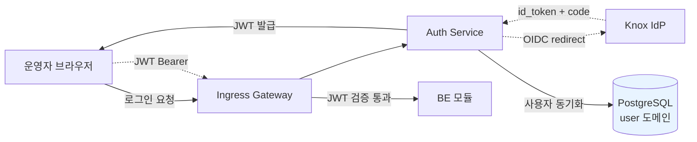

- **Knox OIDC** baseline. 사이트별 다른 IdP (예: Active Directory)는 OIDC 호환 어댑터 교체로 흡수.
- **JWT 발급**: Auth Service가 OIDC 인증 통과 후 자체 JWT 발급. 사용자 정보 + 역할 + 사이트 컨텍스트 포함.
- **JWT 검증**: Ingress Gateway가 1차 검증 (서명 + expiry), BE 모듈이 권한 컨텍스트 추출.
- **세션 만료/갱신**: Refresh Token 패턴. baseline TTL — Access 15분 / Refresh 12시간.

### 권한 모델 (RBAC)

| 역할 | 권한 |
|---|---|
| **운영자 (Operator)** | 모니터링 조회, 이벤트 ACK, 통보 정책 조회 |
| **운영 관리자 (Admin)** | + 룰 등록/수정, Job 등록, 통보 정책 변경, 사용자 관리 |
| **개발자/QA (Validator)** | + Validation 모드 명령 발행 (sandbox), 룰 검증 |
| **시스템 관리자 (Sysadmin)** | + Agent 관리, 사이트 정책 변경, Secret 관리 |
| **시스템 (System)** | 자동 처리 actor (audit-topic 기록용) |

역할은 사이트별 추가/변경 가능. 사용자-역할 매핑은 `user_role` 테이블 (PG).

### 사용자 모델

AMS 단일 테이블 모델 차용 (02 §4.3 결정). Knox 조직도 동기화 결과를 `user` 테이블에 캐시. 사용자 ID는 Knox 사용자 ID와 매핑 + 신규 시스템 내부 `user_id` (UUID).

```
user 도메인:
  user_id (UUID) ← BE 발급
  knox_user_id (Knox 사용자 식별자)
  email, name, dept_id, ...
  status (active / disabled / deleted)
  
user_role:
  user_id, role_id, site_id (사이트별 역할)
```

### 사이트별 권한 정책

사이트별로 역할 종류 / 권한 매핑이 다를 수 있음. **권한 정책 ConfigMap**으로 흡수:

```yaml
rbac:
  site: samsung-hq
  roles:
    - name: Operator
      permissions: [monitoring.read, incident.ack]
    - name: Admin
      permissions: [monitoring.read, ..., rule.write]
  # 외부 사이트에서는 다른 역할 정의 가능
```

### 외부 사이트 — 회원가입 + 승인 (02 §4.1.8 Open)

Knox 미통합 외부 사이트는 자체 회원가입 + 관리자 승인 모델. 사이트별 ConfigMap에 `auth.mode: oidc | self-signup` 결정. self-signup baseline 정책 (관리자 승인 게이트, 이메일 인증 등)은 9.6 사이트 어댑터에서.

---

## 9.2 mTLS / 인증서 관리

### 적용 범위

| 경계 | mTLS 적용 | 인증서 발급 |
|---|---|---|
| Agent ↔ Kafka broker | ● | cert-manager + 사내 PKI |
| Agent ↔ OTel Collector | ● | cert-manager + 사내 PKI |
| 외부 결재 시스템 ↔ Ingress (webhook) | ● (HMAC + IP allowlist 병행) | 결재 시스템 인증서 |
| BE 모듈 ↔ BE 모듈 (Zone 내부) | × (1차) | Service Mesh 도입 시 자동 |
| UI 브라우저 ↔ Ingress | TLS (mTLS 아님) | Let's Encrypt 또는 사내 CA |
| BE → 외부 시스템 (Knox/SMS/Teams) | TLS | 외부 시스템 인증서 |

### Agent 인증서 라이프사이클

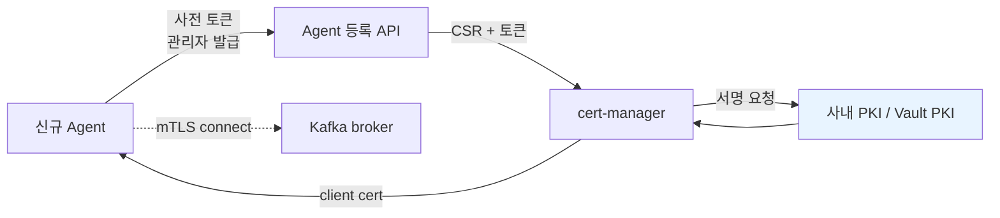

- **사전 토큰**: 관리자가 Agent 배포 시 1회용 토큰 발급. Agent 첫 실행 시 토큰으로 등록 + 인증서 발급 (ADR #11)
- **인증서 갱신**: cert-manager 자동 갱신 (만료 30일 전). Agent는 갱신된 인증서로 재연결
- **인증서 폐기**: Agent 폐기 시 인증서 revoke + Kafka ACL에서 해당 Agent 식별자 제거

### 사내 PKI 미보유 사이트

Vault PKI 자체 운영 baseline. Vault root CA → intermediate CA → Agent client cert. cert-manager가 Vault PKI 백엔드 호출.

---

## 9.3 Secret 관리

### 표준 패턴

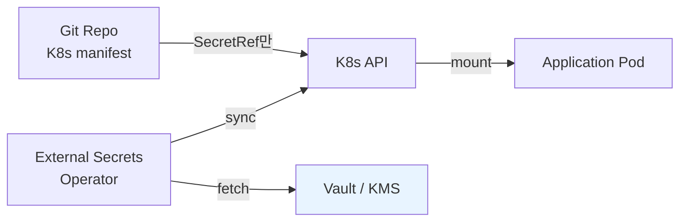

- **Vault (선호)** — 사이트 KMS 보유 시 통합. Vault Operator로 K8s 운영.
- **사내 KMS** — 사이트 표준 KMS 존재 시 External Secrets Operator의 해당 provider 사용.
- **Sealed Secrets (fallback)** — KMS/Vault 없는 사이트. Git에 암호화된 Sealed Secret 보관 → Operator 자동 복호화.

### Secret 종류

| Secret | 보관 | 회전 주기 |
|---|---|---|
| Kafka SASL credentials | Vault | 90일 |
| DB password (PG/OpenSearch/Redis) | Vault | 90일 |
| Knox API token | Vault | 사이트 정책 |
| 외부 시스템 API key (SMS/Teams/메신저) | Vault | 사이트 정책 |
| JWT 서명 키 | Vault | 1년 |
| mTLS root/intermediate CA | Vault PKI | 5년 (root) / 1년 (intermediate) |

Git에는 SecretRef만 (실제 값 없음). 운영자가 Vault UI 또는 CLI로 값 관리.

---

## 9.4 감사 / 컴플라이언스

### 감사 흐름 (04 §6.6 일치)

모든 감사 이벤트는 `audit-topic` 단일 흐름:

- **AGENT actor**: Agent 시작/종료, Job 실행 시도/완료
- **USER actor**: 로그인, 룰 등록/변경, Job 등록, 통보 정책 변경, 사용자 관리, ACK, Validation 실행
- **SYSTEM actor**: 자동 처리 (auto_resolved, scheduled job 발행 등)

Audit Consumer가 OpenSearch audit index에 저장. ILM 정책으로 hot/warm/cold tier 관리.

### 보관 기간 baseline

| Tier | 기간 | Storage |
|---|---|---|
| Hot (실시간 조회) | 30일 | OpenSearch SSD |
| Warm (분기 검색) | 1년 | OpenSearch HDD or cheaper SSD |
| Cold (장기 보관) | 5년 baseline (사이트별 가변) | Object Storage (MinIO/S3) |

산업별 컴플라이언스 요구로 5~7년 [Open question]. 사이트별 보관 기간 정책 ConfigMap.

### 무결성

- 감사 메시지는 **Kafka 직행 + at-least-once** (envelope `x-message-id` 중복 검사 Phase 1)
- Audit Consumer는 OpenSearch write 실패 시 DLQ + alert
- 감사 인덱스는 read-only — 운영자라도 수정 불가, system role만 쓰기

### 컴플라이언스 항목

| 영역 | 요구 |
|---|---|
| **개인정보** | Knox 동기화 사용자 정보 (이름/이메일/부서) — 사이트별 처리 정책 [Open question] |
| **사용자 액션 추적** | 모든 액션 audit-topic 기록, OpenSearch 검색 가능 |
| **권한 변경 추적** | role 변경, Agent 권한 변경, Secret 접근 모두 audit |
| **명령 실행 추적** | 모든 Script 실행이 `JOB_EXECUTED` audit + Agent ID + execution_id |
| **데이터 격리** | 다중 폐쇄망 — Zone 간 데이터 이동 없음 (7.1 (c) 일치) |

---

## 9.5 다중 폐쇄망 보안 경계

### 경계 3종

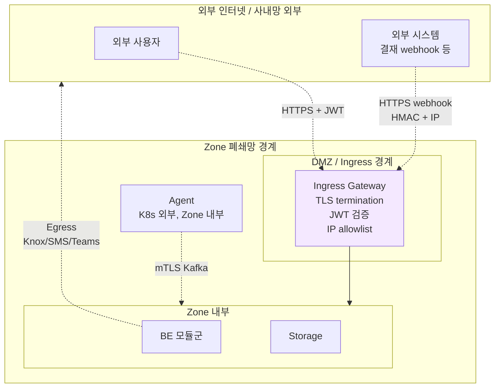

**경계 1 — Ingress**: 외부 사용자 / 외부 시스템 webhook 진입. TLS + JWT 검증 + IP allowlist + Rate limiting. WAF는 사이트별 정책 [Open question].

**경계 2 — Zone 내부 ↔ Edge Agent**: Agent는 K8s 외부지만 Zone 폐쇄망 내부. Kafka broker가 LoadBalancer/NodePort로 Zone 내부에 노출 + mTLS + SASL. Kafka ACL로 Agent 단위 토픽 권한 제한.

**경계 3 — Zone Egress**: 외부 시스템 호출. 사이트별 방화벽 정책으로 허용 IP/포트 제한. **Knox / SMS / Teams / Messenger / 결재 시스템** 각각 사이트 정책 확인 필요 [Open question].

### K8s NetworkPolicy

namespace 간 통신 명시적 허용 (05 §7.3 일치):

| From | To | 허용 |
|---|---|---|
| `ingress` | `monitoring-app` | ● (UI/API/WebSocket) |
| `monitoring-app` | `monitoring-data` | ● (DB/Kafka/Redis) |
| `monitoring-app` | `monitoring-self` | ● (OTLP self) |
| `monitoring-app` | Egress (외부) | ● (Knox/SMS/Teams 등) |
| 그 외 cross-namespace | — | × deny by default |

### Service Mesh 1차 미도입

Zone 내부 pod-to-pod는 평문 (K8s 내부망 신뢰). 다음 조건 충족 시 Phase 2/3 Istio 도입 검토:

- 사이트 보안 정책이 pod-to-pod mTLS 요구
- 다중 사이트 통신 (Phase 3 HQ 통합) 보안 강화 필요
- traffic management / fault injection 운영 도구 필요

---

## 9.6 사이트별 보안 정책 어댑터

사이트별 차이를 4가지 어댑터로 흡수.

| 어댑터 | 사이트 가변성 |
|---|---|
| **IdP 어댑터** | Knox OIDC / Active Directory OIDC / SAML / 자체 OIDC |
| **PKI 어댑터** | 사내 PKI / Vault PKI / 사이트 CA |
| **KMS/Vault 어댑터** | Vault / 사내 KMS / Sealed Secrets fallback |
| **외부 시스템 인증 어댑터** | Knox API token / API key / OAuth2 client credentials / mTLS client cert |

모두 Spring Profile + ConfigMap 활성화. 새 사이트 진입 시 어댑터 추가하고 기존 코드 변경 없음.

---

## 9.7 짚을 점

- **사이트별 보안 정책이 가장 큰 미정 영역**. WAF / IP allowlist / Egress 방화벽 / KMS 표준 / 감사 보관 기간 모두 사이트별. 사이트 정보 입수 후 어댑터 설계 마무리.
- **회원가입 + 승인** (외부 Knox 미통합 사이트) 모델은 02 §4.1.8 Open으로 살아있음. baseline은 self-signup + 관리자 승인 게이트 + 이메일 인증.
- **JWT TTL baseline (15분/12시간)** 은 운영 단계 조정 사안. 너무 짧으면 UX 저하, 너무 길면 탈취 위험.
- **Service Mesh 도입 트리거**가 명확해야 Phase 2/3 진입 의사결정 가능. baseline은 "사이트 보안 정책 + 다중 사이트 통신 시점".

---

# 08. 운영 (자기 관측 · SLO · CI/CD · DR · 장애 대응)

## 결정 요약

- **자기 관측**: OTel SDK + Collector self + VictoriaMetrics self + Jaeger + OpenSearch system log index (04 §6.6 일치)
- **SLO**: UI 응답 < 2초 (95p), 실시간 push < 1초 (95p), 메시지 처리 latency Kafka → Alert < 5초 (95p) — baseline, 운영 측정 후 조정
- **CI/CD**: 단일 Git 모노레포 + GitHub Actions (또는 사내 표준) + Helm Chart 배포 + 환경별 ConfigMap
- **배포 전략**: Rolling Update baseline. Blue/Green은 메시지 처리 컴포넌트만 검토
- **백업**: PostgreSQL pg_basebackup + WAL 아카이브 / OpenSearch snapshot / Object Storage versioning / Redis는 캐시 (백업 불필요)
- **DR**: Zone 단위 복구 (RTO 4시간 / RPO 1시간 baseline)
- **장애 대응**: 5단계 (탐지 → 분류 → 격리 → 복구 → 회고). 자기 모니터링 Alert + 사내 통보 연동
- **사내 표준 카탈로그 일치**: 어댑터로 사내 표준 메트릭 export 가능 (사이트별)

Open question은 13장. 특히 SLO 정량 / DR 목표 / 백업 보관 기간.

---

## 10.1 자기 관측 (Observability)

### 3종 신호

| 신호 | 도구 | 저장 | 사용처 |
|---|---|---|---|
| **메트릭** | OTel SDK (BE/Agent) → Collector self | VictoriaMetrics self | 운영 대시보드, 임계치 alert |
| **트레이스** | OTel SDK + Kafka context propagation | Jaeger | 분산 흐름 디버깅, 지연 분석 |
| **로그** | Logback (Java) / Go slog | OpenSearch `system log` index | 에러 조사, 운영 이력 |

### 표준 메트릭

각 BE 모듈이 emit하는 표준 메트릭 (OTel Semantic Conventions 일치):

| 메트릭 | 단위 | 용도 |
|---|---|---|
| `http.server.duration` | ms (histogram) | UI/API 응답 시간 |
| `messaging.kafka.consumer.lag` | count | Kafka consumer lag |
| `messaging.kafka.process.duration` | ms | 메시지 처리 시간 |
| `db.client.duration` | ms | DB 쿼리 시간 |
| `jvm.memory.used` / `process.runtime.go.mem.heap` | bytes | 런타임 메모리 |
| `app.alert.created` (counter) | count | Alert 생성 횟수 (도메인 메트릭) |
| `app.incident.opened` (counter) | count | Incident 발생 횟수 |
| `app.notification.sent` (counter, by channel) | count | 채널별 통보 발송 |
| `app.notification.failed` (counter, by channel) | count | 채널별 발송 실패 |
| `app.agent.online` (gauge) | count | 현재 ONLINE Agent 수 |

Agent 측 — `agent.heartbeat` (gauge) + `agent.job.duration` (histogram) + `agent.job.failures` (counter).

### 트레이스 범위

- **UI 요청 → BE 모듈 → DB** — HTTP/gRPC 자동 propagation
- **Kafka 발행 → consume → 처리** — envelope `x-trace-id` 수동 propagation (04 §6.8)
- **Job 실행 chain** — `execution_id` + `trace_id`로 명령 → Agent → 결과 → Rule 평가 → Alert → 통보까지 추적 (04 §6.8)

### 핵심 알람 (자기 모니터링)

| Alert | 조건 | 심각도 |
|---|---|---|
| BE 모듈 down | Pod restart 또는 readiness fail > 1분 | Major |
| Kafka consumer lag 증가 | lag > 10000 메시지 (rolling 5분) | Major |
| DB connection 실패 | error rate > 5% (rolling 1분) | Critical |
| OpenSearch cluster red | health red | Critical |
| Disk usage | 80% | Warning, 90% Critical |
| Agent OFFLINE 대규모 | 10대 이상 동시 OFFLINE | Major |
| Alert 생성률 폭증 | rate × 10 of 1시간 평균 | Warning (Dedup 작동 확인) |

자기 모니터링 Alert는 별도 self stack에서 발화. 자기 자신의 Alert를 자기 시스템으로 받지 않게 — 외부 통보 (Teams Webhook 또는 사내 SMS) 직접 발송.

---

## 10.2 SLO / SLI 정의

### SLO baseline (운영 측정 후 조정)

| 영역 | SLI | SLO baseline |
|---|---|---|
| **UI 응답** | HTTP duration 95p | < 2초 |
| **실시간 push** | WebSocket message delivery 95p | < 1초 |
| **메시지 처리 latency** | Kafka publish → Alert 생성 95p | < 5초 |
| **Alert 발화 정확성** | False positive rate | < 5% |
| **Agent 상태 정확성** | Heartbeat → OFFLINE 판정 lag | < 1분 (timeout 30초 + 처리 30초) |
| **시스템 가용성** | BE Query API uptime | > 99.x% (RTO/RPO 미확정) |

각 SLO는 OTel 메트릭에서 자동 계산 → 자기 모니터링 대시보드에 노출.

### Error Budget

- 월 단위 측정. budget 소진 → 신규 기능 배포 일시 중지, 안정화 우선
- SLO 미달 alert는 사내 표준 통보 (Teams)

---

## 10.3 CI / CD

### 구조

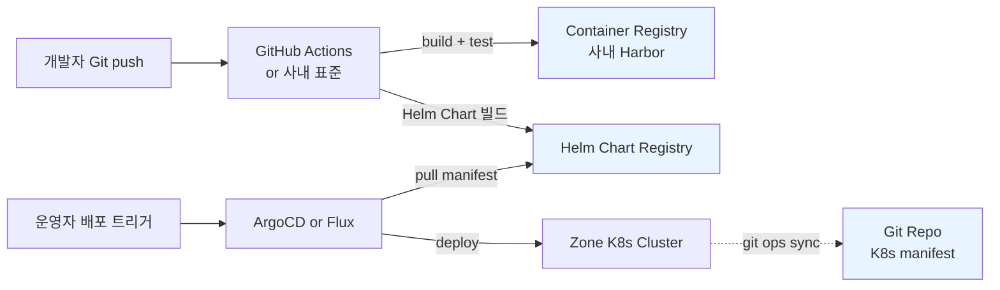

- **Git 모노레포** — BE 모듈러 모놀리스 + 메시지 처리 마이크로서비스 + Agent + Helm Chart 한 저장소. 모듈러 모놀리스 변경 시 단일 PR로 다수 모듈 함께 갱신.
- **CI** — GitHub Actions baseline. 사내 표준 CI (Jenkins 등)가 있으면 어댑터로 교체.
- **컨테이너 레지스트리** — 사내 Harbor / Nexus / Artifactory.
- **CD** — ArgoCD baseline (GitOps). Flux도 동등 옵션.
- **환경별 ConfigMap** — Helm values로 dev / stg / prod / 사이트별 분리.

### 배포 전략

| 컴포넌트 | 전략 |
|---|---|
| 모듈러 모놀리스 (메인 BE) | Rolling Update (maxSurge 25%, maxUnavailable 0) |
| 메시지 처리 마이크로서비스 | Rolling Update + 컨슈머 그룹 재처리 안전성 보장 |
| Rule Engine 인스턴스 | Rolling Update + Drools KieBase warm-up 후 traffic |
| WebSocket Gateway | Rolling Update + connection drain (60초 grace) |
| Script Agent | 사이트 운영 정책 — 무중단 패치 메커니즘 [Open question, ADR #11 후속] |
| Infra Agent | OTel Collector 표준 patch |

Blue/Green은 큰 schema 변경 또는 토픽 변경 시에만 (예: `job-results` → `result-topic-job/log` 분리 같은 v0.7 정정 시).

### 컨테이너 이미지 정책

- 모든 이미지는 **multi-arch (amd64 / arm64)** baseline — Agent 배포 사이트별 아키텍처 차이 대응
- 이미지 보안 스캔 — Trivy / Grype (사내 표준)
- 이미지 서명 — Cosign + Sigstore (Phase 2 옵션)

### 환경 / 사이트 분리

| 환경 | 용도 |
|---|---|
| **dev** | 개발자 통합 테스트, 데모 환경 |
| **staging** | 운영 전 검증 (운영 데이터 일부 복제) |
| **prod (사이트별)** | 각 운영 사이트 Zone — Samsung HQ / 사이트 1 / 사이트 2 ... |

사이트별 prod는 각자 독립 K8s 클러스터. ArgoCD가 사이트별 manifest 디렉토리에서 sync.

---

## 10.4 백업 / 복구 / DR

### 백업 정책 (Zone 단위)

| 저장소 | 백업 방식 | 주기 | 보관 |
|---|---|---|---|
| PostgreSQL | pg_basebackup + WAL 아카이브 (CloudNativePG) | 일 1회 풀 + WAL 5분 단위 | 풀 30일, WAL 7일 |
| OpenSearch | Snapshot Repository → Object Storage | 일 1회 | 90일 (audit 인덱스는 ILM cold tier) |
| MinIO | 자체 erasure coding + Object versioning | 실시간 | 90일 |
| VictoriaMetrics | VM 자체 snapshot | 일 1회 | 30일 |
| Redis | 백업 없음 (캐시 + 휘발성 데이터) | — | — |
| Kafka | 백업 없음 (메시지 큐, replication factor 3으로 내구성) | — | — |
| K8s manifest | Git repo (GitOps) | 실시간 | 영구 |
| Secret (Vault) | Vault 자체 snapshot + 사내 백업 표준 | 일 1회 | 사이트 정책 |

백업 대상 저장은 **Object Storage (MinIO 또는 사이트 storage)**. Zone 내부 백업 baseline. 별도 백업 site로 복제는 Phase 3 옵션 (HQ 통합 시점).

### 복구 목표 (DR)

| 시나리오 | RTO | RPO |
|---|---|---|
| **단일 Pod 장애** | < 1분 (K8s 자동 복구) | 0 |
| **단일 노드 장애** | < 5분 (K8s reschedule) | 0 |
| **Data 노드 장애** | < 30분 (replica failover) | < 5분 (PG WAL lag) |
| **Zone 전체 복구** (재해) | 4시간 baseline | 1시간 (백업 주기 기준) |
| **Site 전체 손실** (Phase 3 옵션 — HQ 백업) | 1일 | 1일 |

RTO/RPO baseline은 미확정 [Open question, NFR 3.2]. 사이트별 DR 요구에 따라 조정.

### 복구 절차

1. **데이터 노드 장애** — Operator 자동 failover (CloudNativePG replica 격상, OpenSearch shard 재분배). 수동 개입 거의 없음.
2. **K8s 클러스터 장애** — Helm Chart + ArgoCD로 재배포. PG/OpenSearch 데이터는 백업에서 복원.
3. **Zone 전체 손실** — 새 K8s 클러스터 구축 + Helm 배포 + Object Storage 백업에서 복원.

---

## 10.5 장애 대응 / 인시던트 매뉴얼

### 5단계 프로세스


1. **탐지** — 자기 모니터링 Alert (10.1) 또는 사용자 신고. 24/7 on-call 운영 (사이트별 정책)
2. **분류** — 심각도 (Critical / Major / Minor) + 영향 범위 (단일 모듈 / Zone 전체 / 사용자 영향)
3. **격리** — 영향 확산 차단. 예: 한 메시지 처리 컴포넌트 장애 → 해당 deployment scale down → 컨슈머 lag 누적 차단
4. **복구** — Runbook에 따라 (10.4 복구 절차 참조). 데이터 복구 필요 시 백업 활용
5. **회고** — 24시간 내 root cause + 예방 조치 정리. 회고록은 사내 위키 또는 별도 저장소

### Runbook 영역

baseline runbook 작성 영역 (각각 1~2 페이지):

- BE 모듈 down
- Kafka broker 장애
- PG primary 장애
- OpenSearch cluster red
- Agent 대규모 OFFLINE
- 외부 시스템 연계 장애 (Knox/SMS/Teams)
- 알람 폭증 (Dedup 미작동 의심)
- 배포 후 회귀 장애 (Rollback)

각 runbook은 진단 절차 + 격리 조치 + 복구 절차 + 검증 + 회고 템플릿.

### On-call 정책

- Critical: 즉시 (15분 내 응답)
- Major: 1시간 내 응답
- Minor: 영업일 처리
- 사이트별 운영팀 분리 (각 Zone 독립 운영, 7.1 (c) 일치)

---

## 10.6 사내 표준 모니터링 카탈로그 일치

NFR 3.5 Open. 신규 시스템 자체가 사내 표준 모니터링 대상이 되어야 함.

### 일치 방식

사내 표준 모니터링이 어떤 형식 (Prometheus pull / OTLP push / 자체 API) 받는지에 따라 어댑터:

| 사내 표준 receive 형식 | 어댑터 |
|---|---|
| Prometheus scrape | VictoriaMetrics가 Prometheus 호환 endpoint 제공 — scrape 가능 |
| OTLP push | self OTel Collector에 export pipeline 추가 |
| 자체 REST API | 별도 exporter 모듈 (Spring Boot, scheduled job) |

사이트별로 표준이 다르므로 **사내 표준 카탈로그 어댑터** 추가. Zone 내부 self-monitoring 데이터를 사이트 표준 형식으로 export.

### 카탈로그 항목 매핑

[Open question, NFR 3.5] — 사내 표준 카탈로그가 요구하는 메트릭 명세 입수 후 매핑. baseline은 10.1 표준 메트릭 + 도메인 메트릭 일부.

---

## 10.7 짚을 점

- **SLO baseline은 추정치** — 운영 데이터 입수 후 SMS 트래픽 규모 + 사이트 운영 요구 반영해 조정 [Open question, NFR 3.1]
- **RTO/RPO baseline 미확정** — 사이트별 DR 요구에 따라 조정. 1시간 RPO는 백업 주기와 직결 [Open question, NFR 3.2]
- **Agent 무중단 패치** [Open question, ADR #11 후속] — Script Agent가 OS 호스트에 설치되어 패치 시 영향. baseline은 사이트 운영 정책 의존
- **자기 모니터링 Alert를 자기 시스템에서 받으면 안 됨** — self stack은 별도 통보 채널 (외부 SMS / Teams 직접). 자기 자신 장애 시 자기 자신으로 알림 안 옴

---

# 09. 마이그레이션 + 데이터 이관

## 결정 요약

- **전략**: **점진 baseline + 사이트별 cutover**. 일괄(big-bang) 안 함. 사이트마다 자체 일정으로 신규 진입
- **순서**: 데모 검증 사이트 → Samsung 사내 HQ → 외부 사이트 점진. 사이트별 6개월~1년 일정 가능
- **병행 운영**: 모든 cutover는 **이중 운영 1~3개월** 필수 (레거시 + 신규 동시 + 데이터 비교)
- **데이터 이관**: SMS/AMS 도메인별 ETL. 룰/Job/사용자/통보 그룹은 마이그레이션. 시계열·이벤트 이력은 옵션 (사이트 정책)
- **롤백**: cutover 후 1~3개월간 레거시 hot standby 유지. 신규 장애 시 즉시 레거시 복귀
- **Phase 진입과 일치**: 데모(Phase 0) → 본개발 완료(Phase 1) → 첫 사이트 cutover → 점진 확장
- **AMS 분석 가정 검증**이 마이그레이션 전 결정에 영향 — 사용자 잠정 확정 + 팀 리뷰 재검증(게이트=ETL 설계 착수 전) 결과 반영

Open question은 13장. 특히 SMS 운영 데이터 규모 / AMS 결재 모델 검증 / 사이트별 cutover 일정.

---

## 11.1 마이그레이션 전략 — 점진 + 사이트별 cutover

### 핵심 원칙

- **사이트 단위 cutover.** 한 사이트의 SMS+AMS 한꺼번에 신규 진입. 사이트 간 cutover 일정 독립.
- **도메인 부분 cutover 안 함.** "SMS 룰만 신규, AMS Job은 레거시" 같은 부분 cutover는 운영 복잡도 폭증 → 안 함. 한 사이트는 한 번에 통째 전환.
- **이중 운영 의무.** cutover 직후 1~3개월 레거시 + 신규 동시 운영 + 데이터 비교. 안정성 확인 후 레거시 종료.
- **점진**. 사이트별로 다른 시점에 cutover. 첫 사이트의 운영 학습이 다음 사이트의 일정에 반영.

### 사이트별 cutover 순서

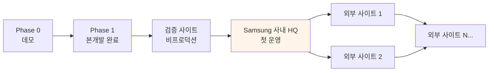

| 단계 | 대상 | 목표 | 기간 (추정) |
|---|---|---|---|
| 검증 사이트 | 비프로덕션 환경 | 신규 시스템 전체 검증 | 1~2개월 |
| Samsung HQ | 사내 프로덕션 | 첫 운영 — 운영 부담 검증 | 3~6개월 (병행 포함) |
| 외부 사이트 1~N | 사이트별 프로덕션 | 점진 확장 | 사이트당 3~6개월 |

전체 마이그레이션 완료까지 1~2년 예상 [추정, 사이트 수 + 운영 일정 의존].

---

## 11.2 SMS 마이그레이션 — 도메인별

### 마이그레이션 항목

| SMS 영역 | 신규 시스템 위치 | 마이그레이션 방식 |
|---|---|---|
| **표준 모니터링 룰** | Rule Engine 룰 정의 (PG) | SMS 룰 → Drools DRL 변환 ETL |
| **메트릭 임계치** | Rule Engine 임계치 룰 | 같이 ETL |
| **사용자 / 권한** | Auth Service + user 도메인 | 일괄 ETL (Knox 동기화 + 자체 그룹) |
| **통보 그룹** | Notification 통보 그룹 도메인 | ETL + Knox 조직도 재동기화 |
| **통보 정책** | Notification 정책 (PG) | ETL |
| **로그 정규식 정책** (mxpLOG) | Rule Engine 로그 룰 (PG) | ETL — 단 옵션 A 채택으로 BE 측에서 평가 |
| **모니터링 대상 자산** | Agent 등록 + Asset Adapter | Agent 재배포 + BCMS 어댑터 (사이트별) |
| **시계열 메트릭 이력** | VictoriaMetrics | **옵션** — 사이트 정책 (이관 vs 폐기) |
| **이벤트 이력** | OpenSearch alert/incident index | **옵션** — 사이트 정책 (보존 기간 + 이관 비용) |

### SMS Performance DB 이중 구조 (perf_raw + perf_stats)

v0.6 4.1.2의 SMS 답습 안 함 결정 — 신규는 VictoriaMetrics native downsampling. 이력 데이터 이관 시:

- perf_raw — 너무 큼, 이관 안 함 baseline (옵션)
- perf_stats — VictoriaMetrics에 통계 보관 형태로 이관 (사이트 정책)

---

## 11.3 AMS 마이그레이션 — 도메인별

AMS 분석 가정 검증(사용자 잠정 확정 + 팀 리뷰 재검증 — 게이트=마이그레이션/ETL 설계 착수 전) 이후 결정 정확도 ↑. 일부 항목은 가정 변경 시 마이그레이션 방식 갱신.

| AMS 영역 | 신규 시스템 위치 | 마이그레이션 방식 |
|---|---|---|
| **Job 정의** (Shell/SQL/Log/HTTP/gRPC) | Job Service + Object Storage | 스크립트 본문 + 메타데이터 ETL |
| **Schedule** | Quartz Clustered + PG | Schedule 메타데이터 ETL, Quartz JobStore 재등록 |
| **결재 정의** | Approval Adapter + 외부 결재 시스템 | 결재 시스템 통합 사이트별 — AMS 자체 결재인지 외부인지 검증 필요 `[AMS 분석 가정]` |
| **룰 (Drools 7.x)** | Rule Engine (Drools 8.x) | **재작성 (7.x → 8.x KIE API 차이)**. v0.7 8장 결정 일치 |
| **복합 이벤트 룰** | Rule Engine 복합 이벤트 | 복합 이벤트 메커니즘 검증 후 ETL `[AMS 분석 가정]` |
| **이벤트 등급 / 라이프사이클** | Alert/Incident 도메인 | AMS Daily reset → 자동 해제 + ACK 분리 (v0.7 결정), 이력 재구성 필요 |
| **표준 모니터링 항목** | Rule Engine + 카탈로그 | AMS의 표준 모니터링 차별화 기능을 신규에 통합 |
| **모니터링 대상** | Agent 등록 (KMC 기반) `[AMS 분석 가정]` | OpenITSM/MSP+ 의존도 검증 후 결정 |
| **사용자 / 권한** | Auth Service + user 도메인 | AMS 단일 테이블 모델 차용 — ETL 단순 |
| **통보 그룹 / 정책** | Notification 도메인 | SMS와 통합 ETL |
| **이벤트 이력** | OpenSearch | **옵션** — 보존 기간 사이트별 |
| **Job 실행 이력** | OpenSearch result index | **옵션** — 동일 |
| **KDB** | placeholder | 1차 이관 안 함, AI 트랙에서 향후 채움 |
| **AI 요약·분석 (F09)** | 향후 (1차 제외) | 1차에 별도 트랙. v0.6 5.4 KDB AI placeholder 일치 |
| **표준 모니터링 (F10)** | Rule Engine + 카탈로그 | 차별화 기능, 신규에 흡수 |

### AMS Drools 7.x → 8.x 재작성 비용

KIE API가 크게 달라 단순 업그레이드 불가. **DRL 룰을 8.x 호환 형태로 재작성** 필요. baseline은 룰 자동 변환 도구 + 수동 검증.

---

## 11.4 데이터 이관 방향

### 도메인별 이관 방식

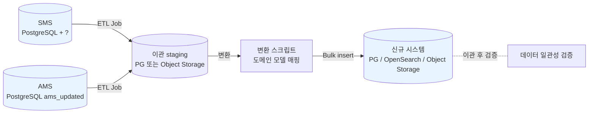

### ETL 도구

- **baseline = 도메인별 ETL 스크립트** (Python 또는 Spring Boot batch). 도메인이 명확하고 1회성 작업이라 무거운 ETL 플랫폼(Apache NiFi 등) 도입 안 함.
- **staging** — PG 임시 스키마 또는 Object Storage CSV/Parquet. 변환 중간 결과 보관.
- **변환** — SMS/AMS 도메인 모델 → 신규 도메인 모델 매핑 (v0.x 02 §4.2 일치). prefix 이원화 흡수 (AMS `TB_` vs `ams_` → 단일 prefix).

### 시계열 / 이력 데이터 이관 — 옵션

| 데이터 | 이관 비용 | 옵션 |
|---|---|---|
| SMS Performance DB | 큼 | 1차 이관 안 함, perf_stats만 옵션 |
| AMS 이벤트 이력 | 중간 | 사이트 정책 (1년만 이관 등) |
| AMS Job 실행 이력 | 큼 | 옵션 |
| 감사 로그 (SMS/AMS) | 컴플라이언스 필수 | 1년 hot tier로 이관 baseline |

### 일관성 검증

각 ETL 작업마다 row count + sample 데이터 spot check + 도메인 무결성 (FK 등) 검증. 이중 운영 기간에 신규 데이터 vs 레거시 데이터 daily 비교.

---

## 11.5 병행 운영 (Parallel Run)

### 패턴

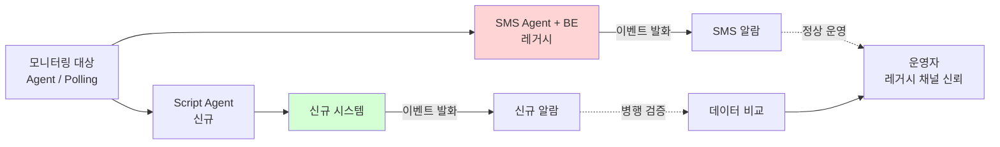

### 운영 정책

- **레거시가 primary** — 운영자 알람은 레거시 시스템에서 수신. 신규는 silent run.
- **신규는 shadow** — 모든 처리 수행하되 통보는 비활성화 (또는 별도 채널로만 — 검증용)
- **데이터 비교** — daily 또는 hourly 일관성 검사 (Alert 수 / Incident 수 / 통보 발송 수)
- **불일치 발견 시** — root cause 분석. 신규 설정 미흡인지, 레거시 결함인지 판단. 후자면 신규의 우위.

### 기간

- baseline 1~3개월 (사이트별 가변)
- 짧은 사이트: 운영 안정성 확인 후 신규 primary 전환
- 긴 사이트: 컴플라이언스 요구로 6개월까지 가능

### 종료 조건

- 알람 정확도 (precision/recall) > 95% (vs 레거시 기준선)
- 누락된 이벤트 0건 (1주일 연속)
- 잘못된 통보 발송 0건 (1주일 연속)
- 운영자 신뢰 (정성 평가)

---

## 11.6 Cutover 절차

### 1) 사전 준비 (D-2주)

- 신규 시스템 운영 검증 완료 (병행 운영 1~3개월 종료 조건 충족)
- 데이터 마이그레이션 완료 + 일관성 검증
- 운영팀 교육 / Runbook 학습 / 알람 채널 검증
- 사이트별 외부 시스템 어댑터 검증 (Knox / 결재 / 통보)
- DR/백업 절차 검증

### 2) Cutover Day

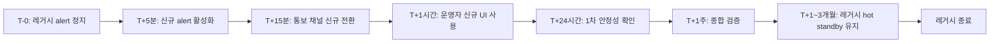

- **즉시 cutover 안 함** — 단계별 전환. 알람 정지 → 신규 활성화 → 통보 전환 → UI 전환.
- **각 단계마다 검증** — 신규 알람이 정상 발화하는지, 통보가 정상 발송되는지.

### 3) Cutover 후

- 레거시는 hot standby (데이터 계속 받음, 알람 발화 안 함). 신규 장애 시 1시간 내 복귀 가능.
- 1~3개월 모니터링 — 추가 정정 사항 갱신.
- 운영 안정성 확인 → 레거시 종료 (DB/디스크 archive 후 폐기).

---

## 11.7 롤백 전략

### 트리거

- Critical 장애 — 신규 시스템 전체 down 또는 데이터 손실
- 알람 정확도 < 80% (cutover 직후 측정)
- 통보 실패율 > 10%
- 운영팀 신뢰 상실 (정성 판단)

### 절차


- 롤백은 cutover의 역순. **레거시 hot standby가 살아있는 1~3개월 동안만 가능**.
- 1~3개월 이후 롤백 시도 시 데이터 동기화 필요 (신규 → 레거시 reverse ETL) — 비용 큼, 사실상 불가.

### 데이터 일관성 보장

- 이중 운영 기간 동안 신규에 쌓인 데이터(Alert/Incident/통보 이력)는 롤백 시 신규 시스템에 보관 (archive). 레거시로 reverse migration 안 함.
- 사용자 액션 (룰 등록 등)이 신규에서만 발생했으면 cutover 후라 롤백 시 일부 손실 가능. 사용자에게 수동 재등록 안내.

---

## 11.8 짚을 점

- **사이트별 마이그레이션 일정 결정자** — 사이트별 운영팀이 결정. 본 산출물에 일정 baseline 없음. 사이트 진입 시 별도 계획서 작성.
- **AMS 분석 가정 검증이 마이그레이션 비용 직접 영향** — 결재 모델 / Drools 룰 복잡도 / 표준 모니터링 차별화 기능이 검증되어야 ETL 비용 정확. **팀 리뷰 재검증 게이트가 ETL 설계 착수 전에 선행**돼야 함.
- **시계열 / 이력 데이터 이관 옵션화는 사이트 합의 필요** — 컴플라이언스 요구 사이트는 이관 필수, 일반 사이트는 옵션. 비용 차이 큼.
- **AMS Drools 7.x → 8.x 재작성**이 마이그레이션 단일 항목 중 가장 큰 비용. 자동 변환 도구 + 수동 검증 필요.
- **데모(Phase 0) → Phase 1 전환 = 본개발의 마이그레이션** — 데모는 별도 환경이므로 사이트 cutover와 무관. 본개발 진입 시 데모 코드 ↔ Phase 1 코드 분리 일치 (04 §6.9 데모 일관성 매트릭스).

---

# 13. Open Questions — 단일 집중

**Open question의 단일 목록은 이 장이다** — 카테고리(§A~§J)별 누적, 각 항목은 본문 어느 절에서 식별되었는지 표시. 본문 표기 규칙: 7~12장은 인라인 `[Open question]` 마커만 사용하고, 6장은 각 절 끝의 Open question 절을 유지하되 **해소된 항목은 ~~취소선~~ + 해소 출처(cross-ref)로 표시**한다. (v0.12 위상 정리 — v0.8의 "본문 절 제거" 선언은 6장에서 미집행 상태가 길어져 현실에 맞게 완화. 외부 기준 문서가 6장 Open 절 번호를 직접 인용(`docs/envelope.md`→6.8.6, `adr/0002`→6.7.5)하므로 절 유지가 안전.)

---

## A. 운영 환경 정보 입수 사안

baseline 결정 보류, 정보 입수 후 재검토.

- 1차 운영 사이트 분포 — Samsung 사내 vs 사내+외부 사이트 (05 §7.1)
- Zone 간 데이터 격리 요구 정확한 수준 (05 §7.1)
- SMS 트래픽 규모 — 노드 사이징 + NFR 3.1 재추산 입력 (05 §7.3, 08 §10.2)
- Kafka broker 외부 노출 사이트별 보안 정책 (05 §7.3, §7.5.3 재고 입력)
- 결재 webhook 사이트별 보안 정책 — HMAC vs IP allowlist (05 §7.6, 07 §9.5)
- 사이트별 storage 인프라 — MinIO 자체 vs 활용 (05 §7.3)
- 사이트별 KMS / Vault 표준 (05 §7.6, 06 §8.2, 07 §9.3)
- 사이트별 사내 PKI 보유 여부 (07 §9.2)
- ITOSS / OASIS / RAPIDANT / SmartITSM 사이트별 어댑터 우선순위 (02 §4.1.10, 05 §7.6)
- Knox 조직도 동기화 — webhook 지원 사이트별 (04 §6.5)
- Samsung 사내 보안 정책 구체 항목 (01 §3.3, §3.4, 07 §9)
- 사내 표준 모니터링 카탈로그 파일 형식/갱신 주기/충돌 처리 (01 §3.5, 08 §10.6)
- 사내 표준 모니터링 메트릭과 신규 메트릭 일치화 (01 §3.5, 08 §10.6)
- 사내 표준 CI 시스템 (08 §10.3)
- 사이트별 외부 IdP — Knox 외 Active Directory 등 (07 §9.1)
- 사이트별 외부 사이트 권한 모델 — 회원가입 + 승인 (07 §9.1, 02 §4.1.8)
- 사이트별 WAF 정책 (07 §9.5)
- 사이트별 마이그레이션 일정 (09 §11.1)
- 사이트별 시계열·이력 데이터 이관 범위 (09 §11.4)
- 사이트별 감사 로그 보관 기간 (5~7년 가변) (07 §9.4)

## B. 운영 단계 검증/측정 사안

운영 시작 후 실측, baseline 조정.

- `__consumer_offsets` 운영 부담 실측 — 7.5.3 (a) Kafka 직접 채택 일치 (05 §7.5)
- `alert-topic` hot partition 모니터링 — 발생 시 키 정책 변경 또는 hot 토픽 분리 (05 §7.5)
- 노드 사이징 baseline 실측 검증 (05 §7.3)
- raw 로그 OpenSearch 보관 기간 (운영팀 결정 사안) (04 §6.3)
- 단순 이중 write 일관성 이슈 — 발생 시 Outbox/CDC 도입 (04 §6.4, §6.5)
- heartbeat 주기 / timeout baseline (10초/30초) 운영 검증 (04 §6.7)
- Agent OFFLINE Alert severity baseline (Warning vs Major) (04 §6.7)
- Dedup TTL 윈도우 baseline (5분) 운영 검증 (04 §6.4)
- 재시도 정책 baseline (5회 / 백오프 간격) (04 §6.5)
- 메트릭 label 카디널리티 정책 (04 §6.1)
- Script stdout 크기 상한 임계값 운영 단계 조정 (1MB baseline) (04 §6.2)
- JWT TTL baseline (15분/12시간) 운영 조정 (07 §9.1, §9.7)
- SLO baseline 정량 — UI 2초 / push 1초 / Kafka→Alert 5초 (08 §10.2)
- 알람 정확도 (precision/recall) 측정 — 병행 운영 시 (09 §11.5)
- 이중 운영 기간 — 1~3개월 사이트별 조정 (09 §11.5)

## C. 협의 필요 사안

외부 의사결정자 협의 후 결정.

- **BE 모듈 분리 정책 — (β) 모듈러 모놀리스 + 메시지 처리 분리 vs (γ) 풀 MSA** (05 §7.2.6). 협의 입력 8개 — K8s 운영 인력 / CI/CD 성숙도 / 자체 관측성 / 팀 구조 / 운영 규모 / Phase 1 일정 / 독립 진화 / 장애 격리 요구
- LEGO 호환 PoC 결과 → LEGO 확정 또는 대안 (Vue/React) (06 §8.4, 01 §2.4 +4~6 MM)
- 데모 코드 패키지 경계가 모듈러 모놀리스 분해와 일치하는지 (05 §7.2.4)
- 사내 표준 CI 도구 — GitHub Actions vs 사내 표준 (08 §10.3)

## D. Phase 진입 시 결정 사안

후속 Phase 진입 트리거.

- (γ) MSA 협의 결과에 따른 Script Agent ↔ BE 통신 (7.5.3) 재검토
- Service Mesh (Istio/Linkerd) Phase 2/3 도입 시점 — 보안 요구 강화 (05 §7.3, 06 §8.2, 07 §9.5)
- Phase 3 HQ 통합 진입 트리거 — 운영 사이트 증가 + 통합 요구 명확 (05 §7.4.4)
- WebSocket Gateway 자체 Spring Boot vs 모놀리스 내 모듈 — 운영 부하 측정 후 (05 §7.2)
- Alert Processor + Incident Service 묶음 vs 분리 (05 §7.2)
- Phase 0 → Phase 1 마이그레이션 항목들 (04 §6.9 "데모 정정 대상" 11개, 09 §11.8)
- Agent 무중단 패치 메커니즘 (ADR #11 후속) (08 §10.3, §10.7)
- 이미지 서명 (Cosign) Phase 2 도입 (08 §10.3)

## E. 후속 결정 카드 (재검토)

baseline 결정됨, Phase 진행에 따라 재고.

- Schema Registry 도입 시점 — 컨슈머 다양성 / schema 변경 빈도 (06 §8.2)
- 트레이스 백엔드 Tempo 전환 — Grafana 생태계 통합 니즈 (06 §8.2)
- WebSocket → SSE 부분 전환 — 단방향 push 부하 격리 (06 §8.2)
- VictoriaMetrics 단일 → cluster 모드 — Zone 부하 증가 시 (05 §7.5)
- result-topic-log 부하 격리 추가 분리 — 인스턴스 분리만으로 부족 시 (05 §7.5)
- Knox 조직도 동기화 polling fallback — webhook 불가 사이트 (04 §6.5)
- 별도 백업 site로 복제 — Phase 3 HQ 통합 시점 (08 §10.4)
- *(v0.12 등재 — §7.5 baseline 결정의 재검토 카드. 본문 6장 Open 절에서 결정됐으나 이 장에 미등재였던 항목들. 신규 결정 아님)*
- Agentless polling 합류 단일 `metrics-topic` — 사이트별 polling 주기 차이가 큰 경우 별도 토픽 분리 재검토 (04 §6.1, §7.5 결정)
- Validation 임시 store Redis 단기 TTL (04 §6.2, §7.5 결정)
- Rule Engine stateless + Alert Processor Redis state machine (04 §6.4, §7.5 결정)
- Incident 그룹핑 시간 윈도우 + 룰 그룹 (04 §6.4, §7.5 결정)
- 통보 정책 평가 엔진 단순 규칙 매칭(PG 정책 + Java) (04 §6.5, §7.5 결정)
- 다중 폐쇄망 통보 발송 위치 Zone 자체 (04 §6.5, §7.5 결정)
- 시스템 자체 OpenSearch 인덱스 분리만 (04 §6.6, §7.5 결정)

## F. 범위 / 방향성

큰 그림 결정 보류.

- 신규 시스템 가칭 (01 §1.2)
- "SMS 표준 모니터링 4종" 카탈로그 정의 (01 §1.2)
- 신규 Job 유형 (HTTP/gRPC/TCP) 도입 우선순위 (02 §4.1.5)
- 외부 사이트 권한 모델 (02 §4.1.8)
- 위젯 커스터마이징 범위 (02 §4.1.9)
- 회원가입+승인 사이트별 적용 (02 §4.1.8, 07 §9.1)
- 토폴로지 후속 단계 부활 가능성 (02 §4.1.9)
- 실시간 갱신 부하 한계 (02 §4.1.9)
- 이벤트/통보/리포트 이력 보관 기간 (02 §4.1.4, §4.1.6, §4.1.9, 07 §9.4)
- 결재 프로세스 사내 활용도 (02 §4.1.5)
- BCMS/CMDB 외부 사이트 적용 가능성 (02 §4.1.10)
- AI 대체 (KDB 채움) — 별도 트랙 (05 §7.4)

## G. NFR / 비기능

정량 미확정.

- RTO/RPO 구체 목표 (01 §3.2, 08 §10.4)
- 모니터링 데이터 손실 허용 여부 (01 §3.2)
- 응답 시간 목표 정량화 (01 §3.1, 08 §10.2)
- 감사 로그 보관 기간 + ILM 정책 (01 §3.4, 07 §9.4)
- 트레이스 context propagation 범위 (04 §6.6)
- 개인정보 처리 — Knox 사용자 정보 (07 §9.4)

## H. 운영팀 의견 필요

운영 적합성 검증.

- 이벤트 라이프사이클 — 자동 해제 + ACK 분리 운영 적합성 (02 §4.1.4)
- Agent 자동 복구 실용성 (02 §4.1.7)
- AMS 부서 책임 분산 해결 방향 (02 §4.1.7)
- 원격 명령 화이트리스트 운영자 자율성 (02 §4.1.7)
- Validation 권한 분리의 운영상 영향 (02 §4.1.5)
- Agentless 메타데이터 시크릿 관리 (02 §4.1.7)
- 이벤트 등급 명칭 (ITU X.733) 운영 적합성 (02 §4.1.4)
- On-call 정책 사이트별 (08 §10.5)

*(v0.12 재분류: "Agentless polling 결과 합류 — 단일 토픽 vs 별도 토픽"은 §7.5에서 단일 `metrics-topic` baseline이 결정돼 §E 재검토 카드로 이동 — 미결이 아니라 결정+재검토 공존)*

## I. GMES / SMS 운영 확인 필요 (참고용)

1차 결정 기준 아님. 확인되면 v0.x 일부 정정 가능.

- SMS LM 미사용 이유 (02 §4.1.3)
- SMS 디스커버리 활용도 (02 §4.1.1)
- SMS Class Policy Mgmt 활용도 (02 §4.1.4)
- SMS KDB 활용도 (02 §4.1.4)
- SMS Performance DB 이중 구조 운영 부담 (02 §4.1.2, 09 §11.2)
- SMS RabbitMQ 사용 이유 (02 §4.4)
- SMS Backend 구체 버전 / Spring 사용 여부 (02 §4.5)
- SMS/AMS 통보 이력 운영 활용도 (02 §4.1.6)
- SMS mxpLOG 정규식 정책 운영 방식 — Agent별 push vs 중앙 등록 (04 §6.3)

## J. `[AMS 분석 가정 — 검증 필요]` (사용자 잠정 확정 + 팀 리뷰 재검증)

마이그레이션 비용에 직접 영향 (09 §11.8). 구 "5단계 AMS 실무자 피드백" 채널 부재로 **사용자 잠정 확정(pull — 차단 시점별 묶음) + 팀 리뷰 재검증** 방식으로 전환(2026-06-13). **현재 잠정 확정 0건 — 아래 14항목 전부 미확정 상태 그대로다**(전환된 것은 검증 방식이지 항목의 답이 아님). 항목별 분류·차단 Track·역전 비용은 `handoff/ams-assumption-baseline/ams-assumption-baseline-000-decision-packet.md` §3~§4, 잠정 확정 기록은 `handoff/decisions/ams-assumption-decisions.md`.

- 원격 쉘 실행 권한 모델 (01 §3.3)
- 서브시스템 모델의 OpenITSM/MSP+ 의존도 (02 §4.1.1)
- Log Job 동작 모델 / Log raw 저장 / Windows Event Log (02 §4.1.3)
- Drools 7.x 룰 복잡도 (02 §4.1.4, 09 §11.3)
- 복합 이벤트 메커니즘 (02 §4.1.4, 09 §11.3)
- Job 결재 활용도 / Validation 부하 (02 §4.1.5)
- AMS 결재 모델이 외부 시스템 통합인지 자체 결재인지 (04 §6.2, 09 §11.3)
- Knox Portal Mail 연계 (02 §4.1.6)
- Agent 부서 책임 분산 / 자동 복구 (02 §4.1.7)
- Manager 프로파일 변경 차단 (02 §4.1.8)
- ACS 역할 (02 §4.1.10)
- AMS 이벤트 테이블 스키마 (02 §4.2)
- AMS 사용자 테이블 단일화 모델 (02 §4.2)
- AMS 표준 모니터링 차별화 기능 (02 §4.1.10)

---

# 변경 이력

| 버전 | 일자 | 주요 변경 |
|---|---|---|
| v0.1 | 2026-05-07 | 최초 작성 (0~3장) |
| v0.2 | 2026-05-07 | OS 전체 커버, SCP 도입, multi-cloud, 사내 표준 카탈로그 (0.4 / 1.2 / 1.4 / 2.1 / 2.2 / 3.5) |
| v0.3 | 2026-05-07 | 사내 표준 카탈로그 외부 파일 import → 내부 운영으로 정정 (0.4 / 1.2 / 2.2 / 13) |
| v0.4 | 2026-05-07 | 4.1 매트릭스 10개 영역 신설. 토폴로지 1차 배제. mySingle = Knox 구버전 (0.4 / 0.5 / 1.4 / 4.0 / 4.1.1~4.1.10 / 13) |
| v0.5 | 2026-05-07 | 공수산정 v6 반영 — Agent 분화, Kafka 토픽, 4종 저장소, Alert/Incident, cert-manager, LEGO, K8s, Drools 8.x 재작성, Teams Webhook, GMES 1차 제외 명확화 |
| v0.6 | 2026-05-07 | SMS BE Java 명시, GMES 마이그레이션 1.3에서 삭제, Kafka 토픽 5개 톤다운, 관측성 정정(Prometheus/AlertManager OSS 미사용 → 자체 BE 모듈), FE 22→25 MM 조정, 실시간 푸시 WebSocket 의미 본문 설명. **5장(포함/제외/변형/신규) 신규 작성**. Open Questions 재정리 (1.3 / 2.4 / 3.5 / 4.4 / 4.5 / 5장 / 13) |
| v0.7 | 2026-05-24 | **OS 1단계 Windows/Linux 한정** (Solaris/AIX/HP-UX 추후 확장, +3~5 MM 제거). **이벤트 처리 위치 옵션 A 확정** (BE-side 통일, raw 보존 baseline). **Kafka 토픽 5개 → 8개** (result-topic-job/log 분리 + heartbeats + notification, envelope/메시지 키 컬럼 보강). **6장 데이터 흐름 신설** (9개 절: 메트릭 / Job / 로그 / 이벤트 / 통보 / 감사·관측 / Heartbeat / envelope+ID / 데모 일관성 매트릭스). 데모(spec v0.2.1) 학습 흡수. Open Questions 카테고리 재편 (1.2 / 2.4 / 4.1.2 / 4.1.3 / 4.1.4 / 4.4.1 / 5.7 / 6장신설 / 13) |
| v0.8 | 2026-05-24 | **7장 시스템 아키텍처 신설** (토폴로지 (c) Zone 독립 baseline + (b) Phase 3 옵션, (β) 모듈러 모놀리스 + 메시지 처리 분리 잠정 baseline + (γ) MSA 협의 보류, K8s namespace 4개 + Operator 표준 + 노드 baseline 15~18대, Phase 0~3 진화, 6장 보류 결정 20개 풀기, 외부 시스템 어댑터 패턴 + ConfigMap). **8장 기술 스택 + ADR 정렬 신설** (Schema Registry 1차 미도입 / Jaeger / Go Agent / LEGO / WebSocket / Service Mesh 미도입 / Maven multi-module / ADR 18개 1:1 매핑). **분할 구조 도입** — 단일 파일 1940라인 → 9개 파일 분할, 각 파일 결정 요약 박스 추가, Open question 13장 단일 집중, CHANGELOG 분리, v0.7→v0.8 diff 별도 |
| v0.9 | 2026-05-24 | **9장 보안 신설** (인증/인가 RBAC + Knox OIDC, mTLS + cert-manager + 사내 PKI/Vault, Secret 관리 External Secrets + Vault/KMS, 감사 + 컴플라이언스, 다중 폐쇄망 네트워크 경계 3종, 사이트별 보안 어댑터 4종). **10장 운영 신설** (자기 관측 3종 신호, SLO baseline, CI/CD GitHub Actions + ArgoCD + Rolling Update, 백업/복구 + DR RTO 4h/RPO 1h baseline, 5단계 장애 대응, 사내 표준 카탈로그 일치 어댑터). **11+12장 마이그레이션·데이터 이관 신설** (점진 사이트별 cutover, SMS+AMS 도메인별 ETL, 1~3개월 병행 운영, hot standby 롤백). 본개발 진입 준비 완료. v0_9_diff 별도 |
| v0.10 | 2026-06-11 | **표기 전용 릴리스 — 내용·결정 무변경.** β/γ 첫 등장부 의미 병기(인덱스·§7.2 결정 요약), 식별자 범례 안내(docs/phase1/ID-GLOSSARY.md) 1줄 추가, [Open] 마커를 작성 규칙 표준 [Open question]으로 통일(정보 꼬리표 보존). 파일명 `통합본_v0_9.md` 유지(안정 앵커), 내부 버전만 v0.10 |
| v0.11 | 2026-06-12 | **stale 결정 backfill — 내용 변경 릴리스(신규 결정 0, 기존 결정의 반영만 — v0.10 표기 전용과 구분).** ① heartbeat protobuf 전환(ADR #2, `adr/0002` Accepted 2026-05-31) 완료형 반영 — §6.7 본문·mermaid·§6.9.2·§6.9.5·§8.3·§4.4.1. ② 토픽 명명(ADR #5, `adr/0005` Accepted 2026-06-06) 반영 — `command-topic` 단일 물리 토픽 확정(zone 전개=다중 zone 진입 시 미래 트리거), `heartbeats-topic` 복수형 명시 예외 기록, 토픽 재명명(T4-1) 완료 반영 — §4.4.1·§6.2·§6.8·§6.9.2·§6.9.5·§8.3. ③ 분가 기준 문서 anchor 추가(`docs/kafka-payloads.md`·`docs/envelope.md`·`adr/`·`docs/features/`) — 인덱스·§6.8·§8.3. ④ 인덱스 현행화 — 분할 파일 표 폐기 반영, 깨진 상대 링크 11곳 → 내부 § 참조, "분할=source of truth" 단락 정정. §7.2/D-2(β/γ) 관련 절은 동료 자료 검토 진행 중이라 범위 제외. **파일명 `통합본_v0_9.md` → `docs/master-design.md` rename**(v0.10 때 예고한 후속 결정 발동 — 버전 없는 영어 파일명, 이후 버전은 내부 표기로만 관리). 구 경로 redirect stub은 형제 repo 3건(hub·script-agent·infra) 컷오버 완료 확인(2026-06-12 사용자 보고 + meta grep 재검증 + e2e 60/0/0) 후 제거 — 근거 `handoff/spec-backfill/spec-backfill-000-impact.md` §적용 현황. 작업 기록 `handoff/spec-backfill/` |
| v0.12 | 2026-06-13 | **Open 위상 정리 릴리스 — 결정 0(기존 §7.5 baseline 결정·§8.2 결정의 위상 표시만).** ① 6장 Open 절 8개 중 기해소 항목 ~~취소선~~+해소 출처 표시(§6.1.2·§6.2.5·§6.4.9·§6.5.4·§6.6.5·§6.7.5 — §6.3.2·§6.8.6은 순수 미결이라 무변경). ② 13장 §E에 §7.5 결정 재검토 카드 7건 등재(고아 6건 + §H Agentless 재분류 — "미결"이 아니라 "결정+재검토 공존"으로 정정). ③ 13장 도입 선언 현실화(v0.8 "본문 절 제거" 미집행 → 6장 절 유지+취소선 규칙으로 완화, 외부 앵커 보호). ④ Open 사안의 실제 답은 어디서도 결정하지 않음 — Agentless 별도 분리·Knox 사이트별 지원(§A)·WebSocket 배포 형태(§D) 등 미결 유지. 결정 기록 `handoff/open-alignment/`(사람 결정 D1~D4, 2026-06-13) |
| v0.13 | 2026-06-13 | **AMS 분석 가정 검증 프로세스 전환 — 가정의 실제 답은 무변경.** 구 "5단계 AMS 피드백"(외부 실무자 채널 전제)이 채널 부재로 **사용자 잠정 확정(pull — 차단 시점별 묶음) + 팀 리뷰 재검증 게이트(마이그레이션/ETL 설계 착수 전·늦어도 본개발 진입 전)** 방식으로 전환(2026-06-13 사람 결정 D1~D4 — `handoff/ams-assumption-baseline/`). 태그 전환 형식 도입: 잠정 확정 시 `[AMS 분석 가정 — 사용자 잠정 확정 YYYY-MM-DD, 팀 리뷰 재검증]`(§0.3·§01·다음 단계 1번·§11.1·§11.3·§11.8·13장 §J 헤더 — "5단계 피드백" 문구 7곳 재서술). §J 14항목의 태그·내용은 무변경(전부 미확정 상태 유지) |
